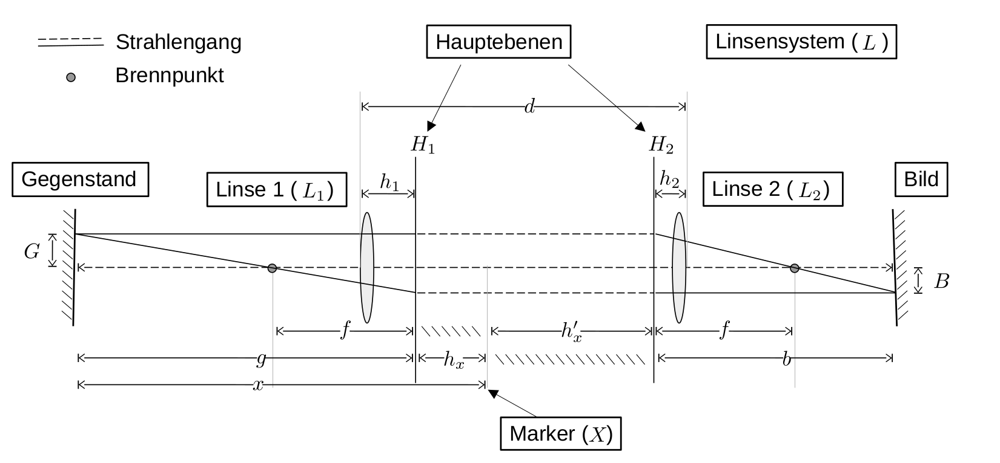

# Fakultät für Physik

## Physikalisches Praktikum P1 für Studierende der Physik

Versuch P1-40, 41, 42 (Stand: Dezember 2022)

[Raum F1-13](http://www-ekp.physik.uni-karlsruhe.de/~simonis/praktikum/layoutobjekte/Lageplan_P1.png)

# Geometrische Optik

## Motivation

Mit diesem Versuch machen Sie sich mit den Grundlagen der [geometrischen Optik](https://de.wikipedia.org/wiki/Geometrische_Optik) vertraut. Diese zeichnet sich dadurch aus, dass hier alle geometrischen Abmessungen groß gegen die Wellenlänge des beobachteten Lichts sind. Die Wellennatur des Lichts tritt in diesem Fall also nicht offen zu Tage und die Ausbreitung des Lichts kann mit Hilfe geradliniger Strahlen beschrieben werden. Das Wissen darum, dass sich Licht (in diesem Fall) geradlinig ausbreitet ist bereits durch [Euklid](https://de.wikipedia.org/wiki/Euklid) überliefert, der um 300 v. Chr. in Alexandria lebte. Von [Claudius Ptolemäus](https://de.wikipedia.org/wiki/Claudius_Ptolem%C3%A4us), der von ca. 100–160 n. Chr. ebenfalls in Alexandria lebte, sind erste Formulierungen des Zusammenhangs zwischen Einfalls- und Brechungswinkel und eine Beschreibung der Lichtbrechung in der Atmosphäre bekannt. 

Beschränkt man sich in der geometrischen Optik weiterhin auf rotationssymmetrische optische Systeme und auf Strahlen, die nahe und parallel oder unter nur sehr kleinen Winkeln relativ zu deren jeweiliger [optischer Achse](https://de.wikipedia.org/wiki/Optische_Achse_(Optik)) verlaufen, liegt die sogenannte [paraxiale Optik](https://de.wikipedia.org/wiki/Paraxiale_Optik) vor, für die man geschlossene mathematische Abbildungsgleichungen angeben kann.

Seit Jahrhunderten wenden Menschen die Gesetze der paraxialen Optik zum Bau technischer Hilfsmittel und Geräte, wie Brillen, Teleskope und Mikroskope an. Bis in die heutige Zeit spielen optische Bauelemente, wie Linsen, Blenden, Spiegel und Filter, eine zentrale Rolle an vielen Stellen in Wissenschaft und Technik. Offensichtlich ist dies z.B. in der Laserphysik, bei der Untersuchung der Quanteneigenschaften des Lichts, oder in der Astronomie. Die Gesetze der paraxialen Optik oder analoge Gesetzmäßigkeiten kommen aber auch beim Nachweis und der Untersuchung von Graviatationswellen oder in der Ionenoptik und Beschleunigerphysik zur Anwendung.  

## Anmerkungen zum Versuch Geometrische Optik

Wir listen im Folgenden die wichtigsten **Lernziele** auf, die wir Ihnen mit dem Versuch **Geometrische Optik** vermitteln möchten: 

- Sie üben den gewissenhaften, praktischen und planvollen Umgang mit optischen Bauelementen, wie Linsen, Blenden und Filtern. 
- Sie haben die Möglichkeit die in der Vorlesung zum Teil abstrakt vermittelten Begriffe und Gesetze der geometrischen Optik mit anschaulichen Experimenten zu verknüpfen.
- Sie erkennen, wie die Messung von Differenzen an Stelle von oft nur schlecht bestimmbaren, absoluten Größen signifikant zur Verringerung von Messunsicherheiten beitragen kann. 
- Sie lernen mit dem [Bessel-](https://de.wikipedia.org/wiki/Bessel-Verfahren) und dem [Abbe-Verfahren](https://de.wikipedia.org/wiki/Abbe-Verfahren) zwei klassische Methoden zur technischen Vermessung der Eigenschaften von Linsen kennen.
- Sie untersuchen [Abbildungsfehler](https://de.wikipedia.org/wiki/Abbildungsfehler), wie die sphärische und chromatische Abberation. 
- Sie erleben ein praktisches Beispiel dafür, wie man mit dem abstrakten Prinzip der [Hauptebene](https://de.wikipedia.org/wiki/Hauptebene_(Optik)) ein Zweilinsensystem auf die [Linsengleichung](https://de.wikipedia.org/wiki/Linsengleichung) für eine Linse zurückführen und so theoretisch Systeme aus beliebig vielen Linsen beschreiben kann.  
- Sie bauen mit einfachen Mitteln die historischen Teleskope von [Kepler](https://de.wikipedia.org/wiki/Johannes_Kepler) und [Galilei](https://de.wikipedia.org/wiki/Galileo_Galilei), ein Mikroskop und einen Diaprojektor nach und machen qualitative Untersuchungen mit diesen Geräten. 

## Versuchsaufbau

Der Versuch umfasst zwei optische Bänke und eine Reihe optischer Bauelemente. Im Folgenden sind die wichtigsten Informationen der verwendeten Aufbauten kurz zusammengefasst. Für die Auswertung der Versuche benötigen Sie keine weiteren Angaben, die Sie nicht selbst im Versuch abschätzen werden.

### Bestimmung der Brennweite einer einzelnen Linse

Auf einer Führungsschiene von etwa $2\,\mathrm{m}$ Länge lassen sich zwischen einer Lichtquelle und einem Schirm mit Millimeterskala verschiedene optische Bauelemente in verschiedenen Abständen montieren. Alle Bauelemente, die für die Vermessung der Eigenschaften einer einzelnen Linse von Relevanz sein können sind im Folgenden aufgelistet: 

- Große optische Bank mit Reitern; 
- Glühlampe ($6\,\mathrm{V}$; $5\,\mathrm{A}$) im Gehäuse und mit Netzgerät;
- [Kondensor](https://de.wikipedia.org/wiki/Kondensor);
- Sammellinsen mit verschiedenen Brennweiten ($f=4,\,5,\,7,\,9,\,10,\,15,\,20,\,30,\,50,\,100\,\mathrm{cm}$, evtl. weicht die Zusammenstellung der Linsen von diesen Angaben leicht ab);
- Zerstreuungslinsen mit verschiedenen Brennweiten ($f=-5,\,-10\,\mathrm{cm}$);
- Verstellbarer Spalt
- Irisblende
- Loch- und Scheibenblende (jeweils auf die Linsen aufsteckbar); 
- Rot- und Blaufilter;
- Mehrere Diapositive;
- Verschiedene Halter für die Filter, Blenden und Linsen;
- Mattscheibenschirm mit Millimeterpapier.

### Bestimmung der Brennweite eines Zweilinsensystems

Für diesen Versuchsteil steht Ihnen zusätzlich zu den oben aufgeführten Bauelementen ein in einem Messingrohr fest integriertes Zweilinsensystem zur Verfügung. Jede Linse lässt sich mit Hilfe der in der obigen Abbildung gezeigten roten Schieberegler innerhalb des Messingrohrs bewegen. 

### Aufbau einfacher optischer Geräte

Für diesen Versuchsteil steht Ihnen zusätzlich zu den oben aufgeführten Bauelementen eine kleine optische Bank zur Verfügung. Im gezeigten Bild ist auf diese optische Bank eine Irisblende montiert. 

## Anmerkungen zu den Versuchen

- **Achtung:** Vermeiden Sie direkt in den Strahl der Glühlampe hinein zu blicken. Sie laufen sonst Gefahr sich zu blenden. 
- Bei allen Versuchen, bei denen beleuchtete Objekte abgebildet werden, müssen Sie zur erfolgreichen Durchführung des jeweiligen Versuchs die Justierung aller optischen Bauelemente, einschließlich des Beleuchtungssystems, sehr sorgfältig vornehmen. Fertigen Sie bei der Vorbereitung auf jeden der folgenden Aufgabenteile jeweils einen Strahlengang an, in dem das Beleuchtungssystem nicht fehlen darf.
- Gehen Sie außerdem sorgfältig mit dem Zubehör um, das leicht soweit beeinträchtigt werden kann, dass der Versuch nicht mehr durchführbar ist.

## Aufgabe 1: Methoden zur Bestimmung der Brennweite

### Aufgabe 1.1: Naive Bestimmung der Brennweite

Parallel in eine dünne [Sammellinse](https://de.wikipedia.org/wiki/Sammellinse) einfallende Lichtstrahlen kreuzen sich im Brennpunkt ([Fokus](https://de.wikipedia.org/wiki/Fokus)) der Linse. Als [Brennweite](https://de.wikipedia.org/wiki/Brennweite) bezeichnet man den Abstand zwischen der [Hauptebene](https://de.wikipedia.org/wiki/Hauptebene_(Optik)) der Linse und ihrem Brennpunkt. 

Kontrollieren Sie, mit Hilfe eines Maßstabes und eines Schirms, die angegebene Brennweite einer dünnen Sammellinse, die Sie aus dem Ihnen zur Verfügung stehenden Sortiment auswählen können. Fertigen Sie zur Vorbereitung einen Strahlengang einschließlich Lichtquelle an. Wie ist sicher gestellt, dass die einfallenden Strahlen der Lichtquelle parallel in die Linse einfallen? Versuchen Sie den Brennpunkt so genau wie möglich zu bestimmen. Messen Sie den Abstand zwischen der Hauptebene der Linse und dem Brennpunkt mehrmals und bestimmen Sie das [Stichprobenmittel](https://de.wikipedia.org/wiki/Stichprobenmittel) und die Standardabweichung aus der Wurzel der (korrigierten) [Stichprobenvarianz](https://de.wikipedia.org/wiki/Stichprobenvarianz_(Sch%C3%A4tzfunktion)) der ermittelten Werte. Diskutieren Sie die Unsicherheiten der Messung und mögliche Fehlerquellen.

### Aufgabe 1.2: [Bessel-Verfahren](https://de.wikipedia.org/wiki/Bessel-Verfahren)

Bestimmen Sie die Brennweite der gleichen Linse mit Hilfe des [Bessel-Verfahrens](https://de.wikipedia.org/wiki/Bessel-Verfahren) und untersuchen Sie die sphärische und chromatische [Aberration](https://de.wikipedia.org/wiki/Abbildungsfehler) der Linse. Fertigen Sie zur Vorbereitung einen Strahlengang einschließlich Lichtquelle an. Gehen Sie für die Messung wie folgt vor: 

- Leuchten Sie mit der Lichtquelle eines der zur Verfügung stehenden Diapositive (Gegenstand $G$) aus. Montieren Sie den Schirm, auf dem das Bild $B$ dargestellt werden soll in einem geeigneten Abstand $a>4\,f$ zwischen $G$ und $B$, wobei $f$ der angegebenen und nachzumessenden Brennweite der Linse entspricht. Bewegen Sie für Ihre Messungen die Linse zwischen Lichtquelle und Schirm. Es gibt zwei Linsenstellungen, mit denen Sie $B$ jeweils scharf und entweder vergrößert oder verkleinert auf den Schirm abbilden können. Betrachten Sie $B$ zur Beurteilung der Schärfe des Bildes nötigenfalls mit einer Lupe. 
- Bestimmen Sie die **chromatische Abberation** jeweils mit einem vor die Lichtquelle geschalteten Rot- bzw. Blaufilter. Verwenden Sie hierzu die vor die Linse aufgesteckte Lochblende, um den Effekt der sphärischen Abberation zu minimieren. Vergleichen Sie Ihre Messungen mit einer Messung ohne Farbfilter. 
- Bestimmen Sie die **sphärische Abberation** mit der vor die Linse aufgesteckten Scheibenblende. Wählen Sie entweder den Rot- oder den Blaufilter, um den Effekt der chromatischen Abberation auszuschalten. Vergleichen Sie Ihre Messung mit einer Messung ohne Farbfilter und beschreiben Sie was Sie sehen. Sie dürfen Ihrer Auswertung auch gerne ein Photo von $B$ anhängen.  
- Führen Sie jede Bestimmung von $f$ mehrmals durch und bestimmen Sie das [Stichprobenmittel](https://de.wikipedia.org/wiki/Stichprobenmittel)  und die Standardabweichung aus der Wurzel der (korrigierten) [Stichprobenvarianz](https://de.wikipedia.org/wiki/Stichprobenvarianz_(Sch%C3%A4tzfunktion)) der ermittelten Werte. Diskutieren Sie die Unsicherheiten der Messung und mögliche Fehlerquellen und vergleichen Sie diese mit Aufgabe 1.1.   

Beachten Sie hierzu die Fragen aus Anmerkung 1.1.

### Aufgabe 1.3: [Abbé-Verfahren](https://de.wikipedia.org/wiki/Abbe-Verfahren)

Mit Hilfe des in der folgenden Skizze eingezeichneten Strahlengangs kann ein System aus zwei Linsen $L_{1}$ und $L_{2}$ mit den Brennweiten $f_{1}$ und $f_{2}$ wie eine einzige hypothetisch angenommene dicke Linse $L$ mit den Hauptebenen $H_{1}$ und $H_{2}$ und der Brennweite $f$ behandelt werden. (Alle weiteren Variablennamen können der Skizze entnommen werden.)

Für $f$ gilt die Formel von [Allvar Gullstrand](https://de.wikipedia.org/wiki/Allvar_Gullstrand): 
$$
\frac{1}{f} = \frac{1}{f_{1}} + \frac{1}{f_{2}} - \frac{d}{f_{1}f_{2}},
$$
wobei $d$ der Abstand zwischen $L_{1}$ und $L_{2}$ (gemessen von den jeweiligen Scheiteln von $L_{1}$ und $L_{2}$) ist. 

Die Konstruktion erfolgt dabei z.B. wie folgt: 

- Der ungebrochene Strahl verläuft entlang der geometrischen Achse von $L$.

- Der gebrochene Strahl durch $L_{1}$ verläuft von $G$ durch den in der Zeichnung linken Brennpunkt von $L$ bis $H_{1}$ (obere durchgezogene Linie). 

- Der Strahl wird von $H_{1}$ nach $H_{2}$ parallel verschoben (obere gestrichelte Linie).

- Von $H_{2}$ aus wird der Strahl durch den in der Zeichnung rechten Brennpunkt von $L$ verlängert, bis sich der gebrochene und der ungebrochene Strahl in einem Punkt treffen. Dort entsteht $B$.  

- Für die Vergößerung des Bildes gilt die Beziehung: 
  $$
  \gamma = \frac{B}{G} = \frac{b}{g}
  $$

Dies entspricht der Konstruktion eines Bildes für eine einzelne, dicke Linse mit der Brennweite $f$.  

Sind $f_{1}$ und $f_{2}$ bekannt lassen sich die Lagen von $H_{1}$ und $H_{2}$ aus 
$$
h_{1} = \frac{f\,d}{f_{1}}; \quad h_{2}=-\frac{f\,d}{f_{2}}
$$
berechnen. Dabei sind $h_{1}$ und $h_{2}$ von den Scheiteln der Linsen aus zu messen. 

Im Fall dieses Versuchs besteht die Herausforderung darin, dass $f_{1}$ und $f_{2}$ und damit auch die Lagen von $H_{1}$ und $H_{2}$ zunächst unbekannt sind. Die Größen $f$, $f_{1}$, $f_{2}$, sowie die Lagen von $H_{1}$ und $H_{2}$ lassen sich jedoch mit Hilfe des Abbé-Verfahrens, wie in Anmerkung 1.2 beschrieben, ermitteln.

Die Brennweiten rechts und links des Linsensystems können grundsätzlich verschieden sein. Für das hier verwendete Linsensystem ist dies jedoch nicht der Fall. 

#### Aufgabe 1.3.1

Bestimmen Sie, mit Hilfe des [Abbé-Verfahrens](https://de.wikipedia.org/wiki/Abbe-Verfahren), für mindestens drei Abstände $d$ der Linsen des im Messingrohr montierten Zweilinsensystems die Brennweite $f$, die Lagen $h_{x}$ und $h_{x}^{\prime}$ und den Abstand $a=h_{x}+h_{x}^{\prime}$ der Hauptebenen $H_{1}$ und $H_{2}$. Gehen Sie dazu wie folgt vor: 

Führen Sie für einen festen Wert von $d$ eine Messreihe für mindestens sechs verschiedene Werte von $x$, bei fest vorgegebenem $X$ durch. Wählen Sie für $G$ das Diapositiv einer geeigneten Skala. Bestimmen Sie $B$ auf dem Schirm mit dem Millimeterpapier. Wählen Sie geeignete Unsicherheiten für $G$ und $B$ und pflanzen Sie sie entsprechend fort. Alle Bezeichnungen sind aus Anmerkung 1.2 entnommen.

#### Aufgabe 1.3.2

Bestimmen Sie aus den in Aufgabe 1.3.1 bestimmten Werten die Brennweiten $f_{1}$ und $f_{2}$ der einzelnen Linsen. Wählen Sie hierfür eine der beiden Vorgehensweisen, die sich aus Anmerkung 1.2 ergeben: 

- **Methode 1:** Bestimmen Sie $f_{1}$ und $f_{2}$ aus den von Ihnen bestimmten Werten von $f$ als Funktion von $d$ mit Hilfe von Gleichung (1). 
- **Methode 2:** Bestimmen Sie $f_{1}$ und $f_{2}$ aus den von Ihnen bestimmten Werten $a$ als Funktion von $f$ mit Hilfe von Gleichungen (9) aus Anmerkung 1.3. 

Führen Sie in jedem der beiden Fälle eine entsprechende Anpassung an die von Ihnen bestimmten Wertepaare $(d,\,f)$ oder $(f,\,a)$ durch. Beachten Sie hierzu die Anmerkungen 1.4 und 1.5.

## Anmerkungen zu Aufgabe 1

### Anmerkung 1.1

Beantworten Sie für sich vor oder während der Durchführung des Versuchs die folgenden Fragen: 

- Warum muss $a>4\,f$ gewählt werden? Was passiert, wenn dies nicht der Fall ist? 
- Wie ändert sich Ihre Messanordnung, wenn Sie $a$ vergrößern? Warum ist es ggf. von Nachteil, wenn Sie das Verhältnis $a/f$ zu groß wählen?
- Warum ist beim Bessel-Verfahren $B$ einmal kleiner und einmal gößer als $G$?

### Anmerkung 1.2 – Abbé-Verfahren mit zwei Linsen 

Wir beschreiben zunächst die Bestimmung von $f$ und der Lage von $H_{1}$. 

Da in der obigen Skizze die Lage von $H_{1}$ nicht als bekannt vorausgesetzt werden kann bestimmen wir den Abstand von $G$ relativ zu einem von uns bestimmten, **festen** Bezugspunkt $X$, den Sie frei wählen können. Für die Skizze haben wir $X$ zwischen $L_{1}$ und $L_{2}$ gewählt. Aus praktischen Gründen bietet es sich an $X$ genau in der Mitte des Messingzylinders zu wählen. Den Abstand Von $G$ zu $X$ bezeichnen wir als
$$
x = g+h_{x},
$$
wobei $h_{x}$ den unbekannten Abstand von $X$ zu $H_{1}$ bezeichnet. Nach der Linsengleichung besteht zwischen $g$, $b$, $f$ die Beziehung: 
$$
\frac{1}{f} = \frac{1}{g} + \frac{1}{b}
$$
mit der Vergrößerung $\gamma$ aus Gleichung (2) lässt sich Gleichung (5) wie folgt umformen: 
$$
\frac{1}{f} = \frac{1}{g}\left(1+\frac{1}{\gamma}\right)
$$
Unter Verwendung der Gleichungen (4) und (6) lässt sich somit der folgende funktionale Zusammenhang herstellen: 
$$
x(f, h_{x}) = f\left(1+\frac{1}{\gamma}\right)+h_{x}
$$

Die Bestimmung von $f$ und $h_{x}$ läuft nun wie folgt ab: 

- Variieren Sie den Abstand $x$. Dabei variieren Sie effektiv $g$, während $h_{x}$ durch die feste Wahl von $X$ immer gleich bleibt.
- Justieren Sie zu jedem gewählten Wert von $x$ den Abstand des Schirms, bis er $B$ scharf abbildet. 
- Bestimmen Sie die Vergößerung $\gamma$ zu gegebenem $x$.

Zwar sind $g$ und $b$ nicht bekannt, $\gamma$ kann jedoch aus $G$ und $B$ bestimmt werden. Trägt man $x(f, h_{x})$ als Funktion von $(1+1/\gamma)$ auf sollte sich ein linearer Zusammenhang ergeben, aus dem sich $f$ als Steigung und $h_{x}$ als Achsenabschnitt ablesen lassen. 

Wenn Sie das Linsensystem auf der Führungsschiene um 180° drehen, so dass der Strahlengang der obigen Skizze von rechts nach links verlaufen würde, lässt sich $h_{x}^{\prime}$ entsprechend bestimmen. Sowohl $h_{x}$ als auch $h_{x}^{\prime}$ können sowohl positive als auch negative Werte annehmen, je nachdem ob sich die entsprechende Hauptebene links oder rechts von $X$ befindet. Aus $h_{x}$ und $h_{x}^{\prime}$ lässt sich leicht der Abstand der Hauptebenen $a$ bestimmen, der von $X$ unabhängig ist. 

### Anmerkung 1.3

Aus der obigen Skizze ergibt sich unter Verwendung von Gleichung (3): 
$$
\begin{split}
\vphantom{\left(\frac{1}{f} - \frac{1}{f_{1}} - \frac{1}{f_{2}}\right)}
a 
&
\vphantom{\left(\frac{1}{f} - \frac{1}{f_{1}} - \frac{1}{f_{2}}\right)}
= h_{x} + h_{x}^{\prime} = d - h_{1} + h_{2} \\
&= d - \frac{d\,f}{f_{1}} - \frac{d\,f}{f_{2}} \\
&= d\left(1 - \frac{f}{f_{1}} - \frac{f}{f_{2}}\right) \\
\end{split}
$$
Einsetzen von Gleichung (1) führt auf: 
$$
\begin{split}
a &
\vphantom{\left(\frac{1}{f} - \frac{1}{f_{1}} - \frac{1}{f_{2}}\right)}
= \frac{d}{f_{1}f_{2}}
\Bigl(f_{1}f_{2} - f\,f_{2} - f\,f_{1}\Bigr) \\
&=
\vphantom{\left(\frac{1}{f} - \frac{1}{f_{1}} - \frac{1}{f_{2}}\right)}
\Bigl(\frac{1}{f_{1}} + \frac{1}{f_{2}} - \frac{1}{f}\Bigr)
\Bigl(f_{1}f_{2} - f\,f_{2} - f\,f_{1}\Bigr)\\
&=
\vphantom{\left(\frac{1}{f} - \frac{1}{f_{1}} - \frac{1}{f_{2}}\right)}
f_{2} - \frac{f\,f_{2}}{f_{1}} - f + f_{1} - f - \frac{f\,f_{1}}{f_{2}} - \frac{f_{1}f_{2}}{f} + f_{2} + f_{1} \\
&=
\vphantom{\left(\frac{1}{f} - \frac{1}{f_{1}} - \frac{1}{f_{2}}\right)}
-\Bigl(\frac{f_{2}}{f_{1}}-\frac{f_{1}}{f_{2}}-2\Bigr)\,f+2\,f_{2}f_{1}-\frac{f_{1}f_{2}}{f}
\end{split}
$$
### Anmerkung 1.4 – Hinweis zur Anpassung an die Daten

Für die Auswertung der Messreihen zu Aufgabe 1.3.1 empfiehlt sich eine simultane Anpassung an beide Messreihen mit Hilfe der in der Software-Bibliothek [kafe2](https://etpwww.etp.kit.edu/~quast/kafe2/htmldoc/) implementierten [Multifit](https://etpwww.etp.kit.edu/~quast/kafe2/htmldoc/parts/beginners_guide.html#multifit)-Klasse, wie sie im Jupyter-Tutorial [Fehlerrechnung.ipynb](https://www-ekp.physik.uni-karlsruhe.de/~quast/jupyter/Fehlerrechnung.ipynb) (Abschnitt 3.5) beschrieben ist. Damit können Sie die starke Korrelation zwischen $h_{x}$ und $h_{x}^{\prime}$ korrekt bestimmen, die Sie andernfalls gesondert abschätzen müssten.

### Anmerkung 1.5 – Hinweis zu Methode 2 in Aufgabe 1.3.2

Für die Bestimmung von $f_{1}$ und $f_{2}$ ist es in diesem Fall besonders wichtig, die starken Korrelationen zwischen $f$, $h_{x}$ und $h_{x}^{\prime}$ zu berücksichtigen, um korrekte Unsicherheiten für die Einzelbrennweiten $f_1$ und $f_2$ zu erhalten. Wegen der großen Anzahl an Parametern können Sie dies nicht mit einer einfachen Funktionsanpassung erreichen. Verwenden Sie daher die Klasse [Indexed Fit](https://etpwww.etp.kit.edu/~quast/kafe2/htmldoc/parts/beginners_guide.html#indexed-fit) der Software-Bibliothek [kafe2](https://etpwww.etp.kit.edu/~quast/kafe2/htmldoc/). Mit dieser Klasse lassen sich die Ergebnisse von Anpassungen weiterverarbeiten. Zum Beispiel können Sie Umparametrisierungen der Form $(f, h_{x}, h_{x}^{\prime}) \rightarrow (f_{1}, f_{2}, d)$, sowie auch Mittelwerte über mehrere Messreihen durchführen. Als Eingabedaten akzeptiert die Klasse [Indexed Fit](https://etpwww.etp.kit.edu/~quast/kafe2/htmldoc/parts/beginners_guide.html#indexed-fit) beliebige Messgrößen mit Kovarianzmatrix. Diese können wiederum Abhängigkeiten voneinander haben und zusätzlich Funktionen anderer Parameter sein. Als Maß für die Übereinstimmung zwischen Eingabedaten und den parametrisierten Ergebnissen wird die $\chi^2$-Kostenfunktion verwendet. Diese Klasse ist ebenfalls im Jupyter-Tutorial [Fehlerrechnung.ipynb](https://www-ekp.physik.uni-karlsruhe.de/~quast/jupyter/Fehlerrechnung.ipynb) (Abschnitt 4.1) beschrieben.

## Lösung:

*Sie können Ihre Lösung/Ihr Protokoll direkt in dieses Dokument einfügen. Wenn Sie dieses Dokument als Grundlage für ein [Jupyter notebook](https://jupyter.org/) verwenden wollen können Sie die Auswertung, Skripte und ggf. bildliche Darstellungen mit Hilfe von [python](https://www.python.org/) ebenfalls hier einfügen. Löschen Sie hierzu diesen kursiv gestellten Text aus dem Dokument.*

## Aufgabe 2: Aufbau optischer Instrumente

Im Rahmen dieser Aufgabe bauen Sie einige z.T. historische optische Geräte nach und überprüfen ihre Eigenschaften. Überlegen Sie sich im Vorfeld des Versuchs welche optischen Bauelemente Sie für den Bau des entsprechenden Geräts benötigen und wie diese anzuordnen sind, um die ggf. vorgegebenen Spezifikationen zu erfüllen. **Zeichnen Sie für jedes der Geräte einen entsprechenden Strahlengang**, der im Fall von Aufgabe 2.3 die Lichtquelle beinhalten soll. Machen Sie sich bereits in der Vorbereitung auf diesen Versuch mit den entsprechenden Strahlengängen vertraut.

### Aufgabe 2.1: [Keplersches (astronomisches) Fernrohr](https://de.wikipedia.org/wiki/Fernrohr#Kepler-Fernrohr)

Bauen Sie ein Keplersches (astronomisches) Fernrohr mit mindestens sechsfacher Vergrößerung und betrachten Sie damit entfernte Gegenstände. Bauen Sie die Linsenkombination auf der ‘kleinen optischen Bank’ auf. Messen Sie auf einfache Weise die Vergrößerung und vergleichen Sie sie mit dem von Ihnen berechneten Wert.

### Aufgabe 2.2: [Galileisches Fernrohr](https://de.wikipedia.org/wiki/Fernrohr#Galilei-Fernrohr)

Bauen Sie ein Galileisches Fernrohr auf und überprüfen Sie seine Funktion.

### Aufgabe 2.3: [Projektor](https://de.wikipedia.org/wiki/Projektor)

Bauen Sie einen Projektor, der $24\times36\,\mathrm{mm}^{2}$-Diapositive ausleuchtet und in etwa $1,5\,\mathrm{m}$ Entfernung eine etwa zehnfache Vergrößerung aufweist. Projizieren Sie Diapositive und vergleichen Sie das Ergebnis mit Ihrer Voraussage. Zeichnen Sie den prinzipiellen Strahlengang (mit Konstruktionslinien für die Beleuchtung und für die Abbildung, und mit Lichtbündeln).

### Aufgabe 2.4: [Mikroskop](https://de.wikipedia.org/wiki/Mikroskop)

Bauen Sie ein Mikroskop mit mindestens zwanzigfacher Vergrößerung und vergleichen Sie die näherungsweise gemessene Vergrößerung mit dem berechneten Wert. Skizzieren Sie den Strahlengang. Warum macht es keinen Sinn, bei einem Mikroskop die Vergrößerung durch Einsatz von Linsen mit immer kleineren Brennweiten in der Hoffnung zu steigern, dann auch eine immer bessere Auflösung zu erreichen?

## Lösung:

*Sie können Ihre Lösung/Ihr Protokoll direkt in dieses Dokument einfügen. Wenn Sie dieses Dokument als Grundlage für ein [Jupyter notebook](https://jupyter.org/) verwenden wollen können Sie die Auswertung, Skripte und ggf. bildliche Darstellungen mit Hilfe von [python](https://www.python.org/) ebenfalls hier einfügen. Löschen Sie hierzu diesen kursiv gestellten Text aus dem Dokument.*

