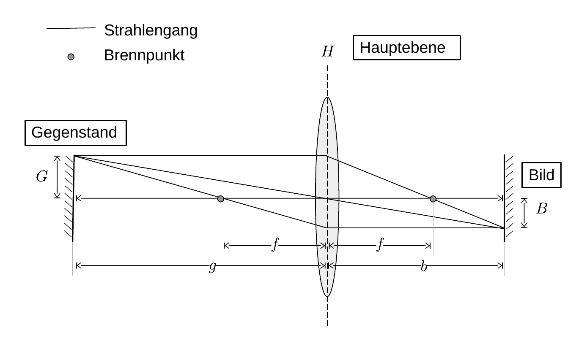
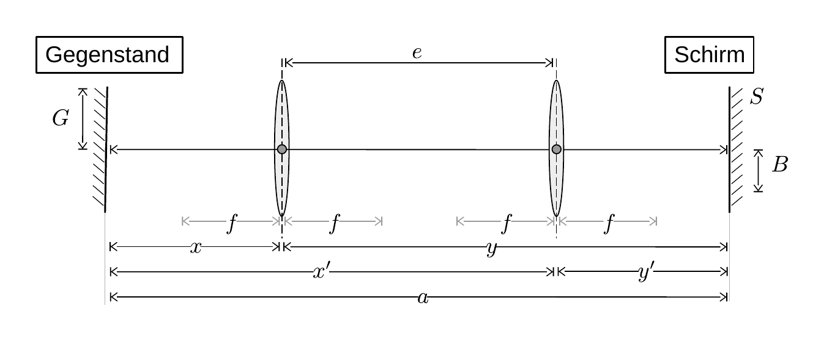

# Hinweise für den Versuch Geometrische Optik

## Aufgabe 1: Bestimmung der Brennweite einer einzelnen Linse

### Grundbegriffe der paraxialen Optik

Die [paraxiale Optik](https://de.wikipedia.org/wiki/Paraxiale_Optik) beschäftigt sich mit rotationssymmetrischen optischen Systemen (v.a. Linsen und (Hohl-)Spiegeln) die von Lichtstrahlen, nahe der Symmetrieachse, durchlaufen werden. Für diesen Fall ist die Beschreibung der Abbildungseigenschaften mit Hilfe geschlossener analytischer Formeln möglich. Die Symmetrieachse heißt [optische Achse](https://de.wikipedia.org/wiki/Optische_Achse_(Optik)). 

Eines der wichtigsten optischen Systeme ist die **dünne [Sammellinse](https://de.wikipedia.org/wiki/Sammellinse)**. Zu ihrer Beschreibung dient die [Hauptebene](https://de.wikipedia.org/wiki/Hauptebene_(Optik)) $H$. Den Schnittpunkt der Hauptebene mit der optischen Achse bezeichnet man als Hauptpunkt. Wir verwenden im Folgenden $H$ sowohl für die Hauptebene als auch für den Hauptpunkt. 

Zueinander parallele und senkrecht zu $H$ einfallende Lichtstrahlen kreuzen sich im Brennpunkt der Linse (auch [Fokus](https://de.wikipedia.org/wiki/Fokus) genannt). Als [Brennweite](https://de.wikipedia.org/wiki/Brennweite) $f$ bezeichnet man den Abstand zwischen Brennpunkt und $H$. Eine Linse bildet einen Gegenstand $G$ in ein Bild $B$ ab, wie in Skizze 1 dargestellt: 



Skizze 1 (Definition von Brenn-, Bild- und Gegenstandsweite)

Wir verwenden $G$ ($B$) sowohl für den Gegenstand (das Bild) selbst, als auch für dessen Größe. Der Abstand von $G$ zu $H$ heißt [Gegenstandsweite](https://de.wikipedia.org/wiki/Gegenstandsweite) $g$, der Abstand von $B$ zu $H$ [Bildweite](https://de.wikipedia.org/wiki/Bildweite) $b$. Das Verhältnis 

```math
\begin{equation}
\beta = \frac{B}{G}
\end{equation}
```

wird als [Abbildungsmaßstab](https://de.wikipedia.org/wiki/Abbildungsma%C3%9Fstab) bezeichnet. Die Beziehung zwischen $b$, $g$ und $f$ für ein scharfes Bild ist durch die [Linsengleichung](https://de.wikipedia.org/wiki/Linsengleichung) (oder Abbildungsgleichung)  

```math
\begin{equation}
\frac{1}{f} = \frac{1}{g} + \frac{1}{b}
\label{eq:Linsengleichung}
\end{equation}
```

gegeben.  In der obigen Skizze wird der (reelle) Gegenstand $G$ in ein umgekehrtes [reelles Bild](https://de.wikipedia.org/wiki/Reelles_Bild) $B$ abgebildet. Da der Strahlengang umkehrbar ist, wird $B$ als reelles Bild wiederum in $G$ zurück abgebildet.

### Bessel-Verfahren

Für die Bestimmung von $f$ nach dem [Bessel-Verfahren](https://de.wikipedia.org/wiki/Bessel-Verfahren) wird ein Schirm $S$ in *hinreichend* großem Abstand $a$ von $G$ aufgestellt, so dass ein reelles Bild darauf entstehen kann. Bewegt man die Linse entlang ihrer optischen Achse zwischen $G$ und $S$ ergeben sich **zwei Positionen** von $H$, für die auf $S$ ein scharfes relles Bild $B$ entsteht, wie in Skizze 2 dargestellt:



Skizze 2 (Lage der Punkte in denen die Linse $G$ scharf abbildet)

Dabei ist aufgrund der Umkehrbarkeit des Lichtstrahls $x'=y$ und $y'=x$. In einer Position von $H$ ist $B$ größer als $G$ (d.h. $\beta>1$) in der anderen kleiner. Ein scharfes reelles Bild entsteht nur dann, wenn Gleichung ($\ref{eq:Linsengleichung}$) erfüllt ist (siehe Skizze 1), was in beiden Positionen von $H$ erfüllt werden kann, wenn $x=g,\,y=b$ oder $x=b,\,y=g$. Wir drücken in Gleichung ($\ref{eq:Linsengleichung}$) $b$ und $g$ durch $x$ aus und lösen nach $x$ auf:

```math
\begin{equation}
\begin{split}
&\frac{1}{f} = \frac{1}{x} + \frac{1}{a-x}; \qquad \frac{1}{f} = \frac{a}{x(a-x)}; \\
&\\
&\frac{a\,x-x^{2}}{a} = f; \qquad x^{2} - a\,x + a\,f = 0; \\
&x_{1/2} = \frac{a}{2}\pm\frac{\sqrt{a^{2}-4\,a\,f}}{2}
\end{split}
\label{eq:BesselVerfahren}
\end{equation}
```

Wie aus Gleichung ($\ref{eq:BesselVerfahren}$) ersichtlich ergeben sich zwei scharfe Bilder nur dann, wenn die Bedingung

```math
\begin{equation*}
a>4\,f
\end{equation*}
```

erfüllt ist, womit die anfängliche Aussage "hinreichen" groß für die Wahl von $a$ konkretisiert wird. Aus Skizze 1 und Gleichung ($\ref{eq:BesselVerfahren}$) wird deutlich, wie diese Bedingung zustande kommt und was eine geschickte Wahl für $a$ ist. Aus dem Abstand der beiden Punkte, in denen ein scharfes Bild auf $S$ entsteht lässt sich $f$ berechnen: 

```math
\begin{equation*}
\begin{split}
&e= \left|g - b\right| \\
&\hphantom{e}= \left|x_{1} - x_{2}\right| = \sqrt{a^{2}-4\,a\,f} \\
&\\
&f = \frac{a^{2}-e^{2}}{4\,a}
\end{split}
\end{equation*}
```

### Hinweise zur Durchführung

- Führen Sie jede Bestimmung von $f$ mindestens 5 mal durch und bestimmen Sie das [Stichprobenmittel](https://de.wikipedia.org/wiki/Stichprobenmittel) und die Standardabweichung aus der Wurzel der (korrigierten) [Stichprobenvarianz](https://de.wikipedia.org/wiki/Stichprobenvarianz_(Sch%C3%A4tzfunktion)) der ermittelten Werte. Diskutieren Sie die Unsicherheiten der Messung und mögliche Fehlerquellen und vergleichen Sie Ihre Ergebnisse aus den einzelnen Aufgabenteilen.
- Leuchten Sie für Aufgabe 1.2 mit der Lichtquelle eines der zur Verfügung stehenden Diapositive, als $G$, aus. Montieren Sie $S$, woauf $B$ dargestellt werden soll in einem geeigneten Abstand $(a>4\,f)$ zu $G$. Bewegen Sie für Ihre Messungen die Linse zwischen $G$ und $S$. Betrachten Sie $B$ zur Beurteilung der Schärfe des Bildes ggf. mit einer Lupe. 
- Bestimmen Sie die **[chromatische Abberation](https://de.wikipedia.org/wiki/Chromatische_Aberration)** mit einem vor die Lichtquelle geschalteten Rot- und Blaufilter. Verwenden Sie hierzu die vor die Linse aufgesteckte Lochblende, um den Effekt der sphärischen Abberation zu minimieren. Mit welcher Signifikanz können Sie den Effekt nachweisen?
- Bestimmen Sie die **[sphärische Abberation](https://de.wikipedia.org/wiki/Abbildungsfehler#Sph%C3%A4rische_Aberration)** mit der vor die Linse aufgesteckten Scheiben- und Lochblende. Wählen Sie entweder den Rot- oder den Blaufilter, um den Effekt der chromatischen Abberation auszuschalten. Mit welcher Signifikanz können Sie den Effekt nachweisen?

