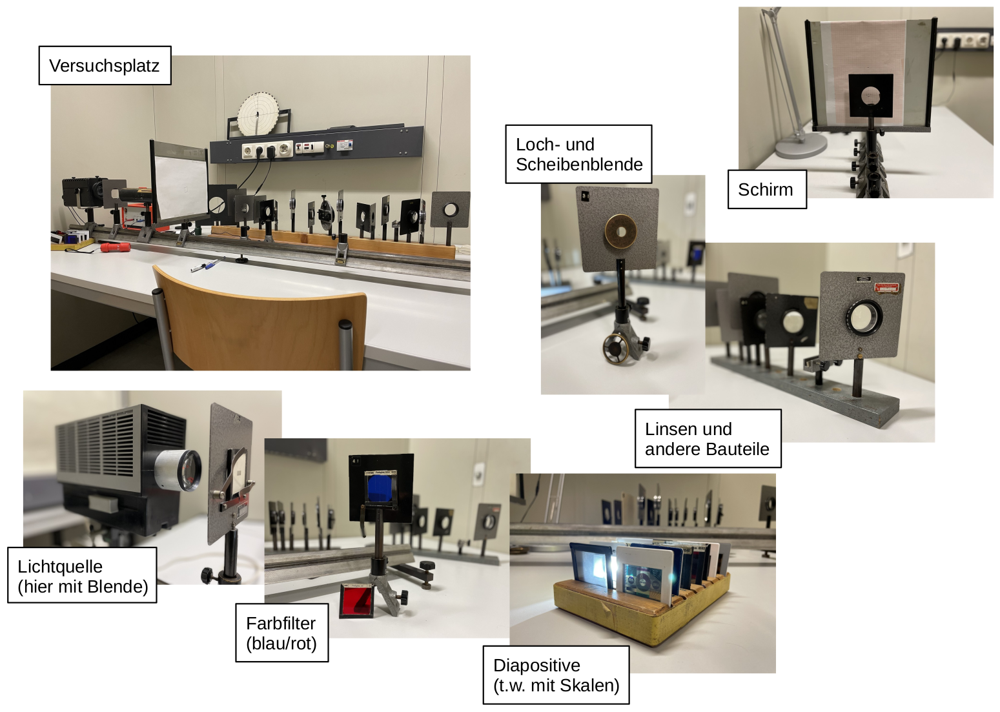
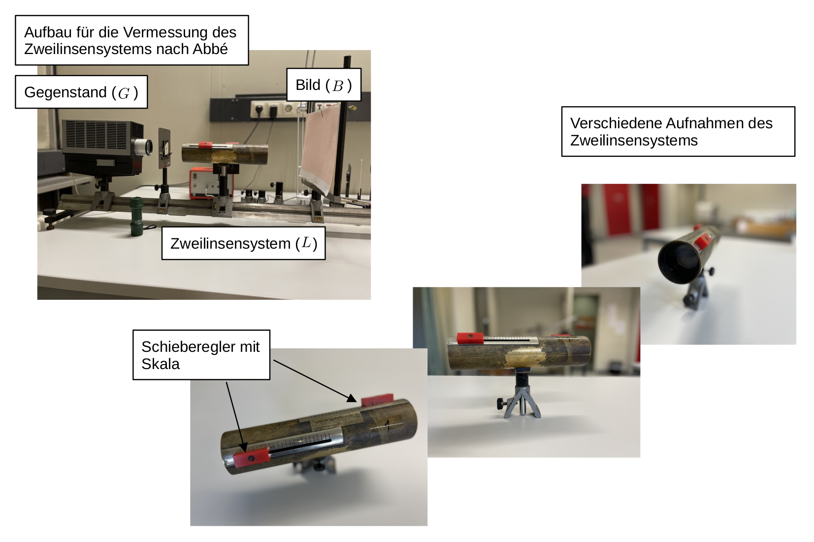
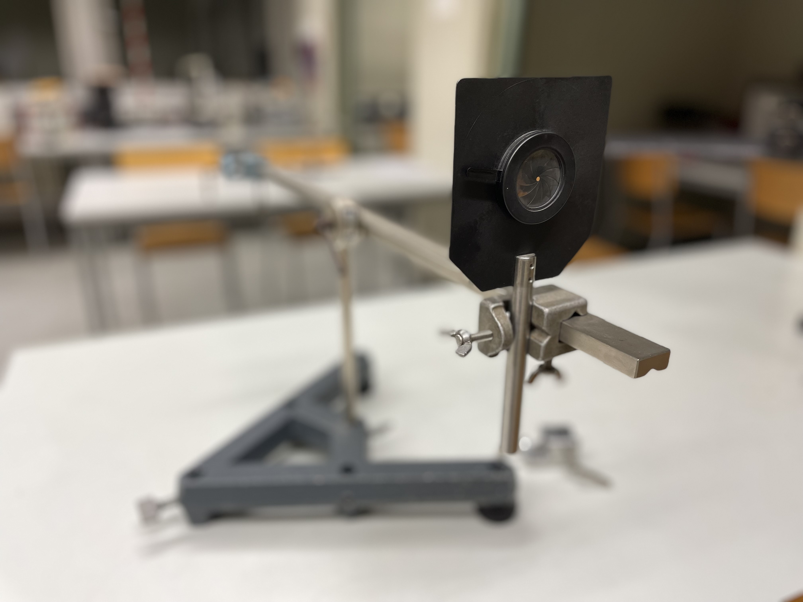

# Fakultät für Physik

## Physikalisches Praktikum P1 für Studierende der Physik

Versuch P1-43, 44, 45 (Stand: November 2022)

[Raum F1-13](http://www-ekp.physik.uni-karlsruhe.de/~simonis/praktikum/layoutobjekte/Lageplan_P1.png)

# Geometrische Optik

## Motivation

Mit diesem Versuch machen Sie sich mit den Grundlagen der [geometrischen Optik](https://de.wikipedia.org/wiki/Geometrische_Optik) vertraut, wo alle geometrischen Abmessungen groß gegen die Wellenlänge des Lichts sind. Die Wellennatur des Lichts tritt daher nicht offen zu Tage und seine Ausbreitung kann mit Hilfe geradliniger Strahlen beschrieben werden. Die Erkenntnis, dass sich Licht geradlinig ausbreitet ist bereits durch [Euklid](https://de.wikipedia.org/wiki/Euklid) überliefert. Von [Claudius Ptolemäus](https://de.wikipedia.org/wiki/Claudius_Ptolem%C3%A4us) sind erste Formulierungen des Zusammenhangs zwischen Einfalls- und Brechungswinkel und eine Beschreibung der Lichtbrechung in der Atmosphäre bekannt. Beschränkt man sich in der geometrischen Optik auf rotationssymmetrische Systeme und Strahlen, die nahe und parallel oder unter nur kleinen Winkeln zur [optischen Achse](https://de.wikipedia.org/wiki/Optische_Achse_(Optik)) verlaufen, lassen sich geschlossene mathematische Abbildungsgleichungen angeben. Man bezeichnet diesen Bereich der Optik als [paraxiale Optik](https://de.wikipedia.org/wiki/Paraxiale_Optik).

Seit Jahrhunderten wenden Menschen die Gesetze der paraxialen Optik zum Bau technischer Hilfsmittel und Geräte, wie Brillen, Teleskope und Mikroskope an. Bis in die heutige Zeit spielen Linsen, Blenden, Spiegel und Filter, eine zentrale Rolle an vielen Stellen in Wissenschaft und Technik. Offensichtlich ist dies z.B. in der Laserphysik, Quantenoptik, oder Astronomie. Analoge Gesetzmäßigkeiten kommen aber auch bei der Untersuchung von Graviatationswellen oder in der Beschleunigerphysik zur Anwendung. Auch im [P1](https://labs.physik.kit.edu/64.php) werden Sie die [Linsengleichung](https://de.wikipedia.org/wiki/Linsengleichung), als zentrales Element zur Messung der Lichtgeschwindigkeit nach der Drehspiegelmethode, beim Versuch "[Lichtgeschwindigkeit](https://git.scc.kit.edu/etp-lehre/p1-for-students/-/tree/main/Lichtgeschwindigkeit)" wiederfinden. 

## Lernziele

Wir listen im Folgenden die wichtigsten **Lernziele** auf, die wir Ihnen mit dem Versuch **Geometrische Optik** vermitteln möchten: 

- Sie lernen Begriffe, wie optische Achse, [Bild-](https://de.wikipedia.org/wiki/Bildweite), [Gegenstands-](https://de.wikipedia.org/wiki/Bildweite) und [Brennweite](https://de.wikipedia.org/wiki/Brennweite) und das Konzept der [Hauptebene](https://de.wikipedia.org/wiki/Hauptebene_(Optik)) im Experiment kennen. 
- Sie machen sich mit wichtigen Gesetzen der paraxialen Optik, wie der [Linsengleichung](https://de.wikipedia.org/wiki/Linsengleichung) oder der Gullstrand-Formel vertraut. 
- Sie üben sich, vom [Bessel-](https://de.wikipedia.org/wiki/Bessel-Verfahren) oder [Abbe-Verfahren](https://de.wikipedia.org/wiki/Abbe-Verfahren), zur geschickten Vermessung optischer Systeme, bis zum grundsätzlichen Aufbau eines Mikroskops, Projektors oder verschiedener Teleskope, im Aufbau optischer Systeme und Strahlengänge. Dabei arbeiten Sie sich schrittweise von einfachen zu komplexen Systemen vor.
- Beim Bessel- und Abbe-Verfahren übersetzen Sie mathematische Modelle in Messvorschriften, aus denen Sie durch Messung wiederum Modellparameter bestimmen.
- Sie untersuchen mit Hilfe des Bessel-Verfahrens [Abbildungsfehler](https://de.wikipedia.org/wiki/Abbildungsfehler), wie die sphärische und chromatische Abberation.
- Für die Datenanalyse bietet dieser Versuch eine gute Möglichkeit die erlernten Methoden zur Parameterschätzung und Fehlerabschätzung weiter einzuüben.  

## Versuchsaufbau

Der Versuch umfasst zwei optische Bänke und eine Reihe optischer Bauelemente. Im Folgenden sind die verwendeten Aufbauten kurz beschrieben. Eine Auflistung der für ihre Auswertung wichtigen Bauelemente und deren Eigenschaften finden Sie in der Datei Datenblatt.md.

### Bestimmung der Brennweite $f$ einer einzelnen Linse

Auf der großen Führungsschiene (von etwa $2\,\mathrm{m}$ Länge) lassen sich zwischen einer Lichtquelle und einem Schirm $S$ optische Bauelemente in verschiedenen Abständen montieren. Für das Bessel-Verfahren bewegen Sie, zur Bestimmung der Brennweite $f$ einer zu untersuchenden Linse, die Linse zwischen einem ausgeleuchteten Diapositiv (als Gegenstand $G$) und $S$ auf der Schiene hin und her, bis in zwei ausgezeichneten Positionen auf $S$ ein scharfes Bild $B$ entsteht. Aus dem Abstand $e$ dieser beiden Punkte und dem Abstand zwischen $G$ und $B$ lässt sich $f$ bestimmen. 

### Vermessung eines Zweilinsensystems $L$

In diesem Versuchsteil vermessen Sie ein in ein Messingrohr integriertes Zweilinsensystem $L$. Jede der darin verbauten Linsen lässt sich mit Hilfe der in der obigen Abbildung gezeigten roten Schieberegler innerhalb des Messingrohrs bewegen, so dass Sie den Abstand $d$, den die Linsen zueinander einnehmen verändern können. Das System $L$ kann mit Hilfe der Hauptebenen $H_{1}$ und $H_{2}$, und der Brennweite $f$ beschrieben werden. 

Mit Hilfe des Abbe-Verfahrens sollen Sie die Lagen von $H_{1}$ und $H_{2}$ relativ zu einem Bezugspunkt $X$ auf dem Messingrohr, $f$ und die Brennweiten $f_{1}$ und $f_{2}$ der im Messingrohr verbauten Linsen bestimmen. Dazu montieren Sie ein Diapositiv ($G$), $L$ und $S$ (mit Milimeterpapier) auf der großen Führungsschiene, verändern schrittweise den Abstand von $G$ zu $X$, justieren $S$ jeweils nach, so dass ein scharfes Bild $B$ entsteht und bestimmen den Abbildungsmaßstab $\beta$. Durch einen geschickten Messvorgang lässt sich $L$ auf diese Weise vollständig vermessen.  

### Aufbau optischer Instrumente

Für diesen Versuchsteil können Sie auf einer kleinen optischen Bank ein [Mikroskop](https://de.wikipedia.org/wiki/Mikroskop), einen [Projektor](https://de.wikipedia.org/wiki/Projektor), ein [Kepler-](https://de.wikipedia.org/wiki/Fernrohr#Kepler-Fernrohr) oder ein [Gallilei-Fernrohr](https://de.wikipedia.org/wiki/Fernrohr#Galilei-Fernrohr) nachbauen und einfache qualitative Messungen damit durchführen. Im gezeigten Bild ist auf der Bank eine Irisblende montiert. 

## Wichtige Hinweise zu den verwendeten Versuchsaufbauten

- Vermeiden Sie direkt in den Strahl der Glühlampe hinein zu blicken. Sie laufen sonst **Gefahr sich zu blenden**. 
- Bei allen Versuchen, bei denen beleuchtete Objekte abgebildet werden, müssen Sie die Justierung, einschließlich des Beleuchtungssystems, **sehr sorgfältig** vornehmen.

# Navigation

- Wichtige Hinweise zur Vorbereitung und Durchführung von Aufgabe 1 finden Sie in der Datei [Hinweise-Aufgabe-1.md](https://git.scc.kit.edu/etp-lehre/p1-for-students/-/blob/main/Geometrische_Optik/doc/Hinweise-Aufgabe-1.md).
- Wichtige Hinweise zur Vorbereitung und Durchführung von Aufgabe 2 finden Sie in der Datei [Hinweise-Aufgabe-2.md](https://git.scc.kit.edu/etp-lehre/p1-for-students/-/blob/main/Geometrische_Optik/doc//Hinweise-Aufgabe-2.md).
- Wichtige Hinweise zur Vorbereitung und Durchführung von Aufgabe 3 finden Sie in der Datei [Hinweise-Aufgabe-3.md](https://git.scc.kit.edu/etp-lehre/p1-for-students/-/blob/main/Geometrische_Optik/doc/Hinweise-Aufgabe-3.md).
- Wichtige technische Daten zum Versuch finden Sie in der Datei [Datenblatt.md](https://git.scc.kit.edu/etp-lehre/p1-for-students/-/blob/main/Geometrische_Optik/Datenblatt.md).  
