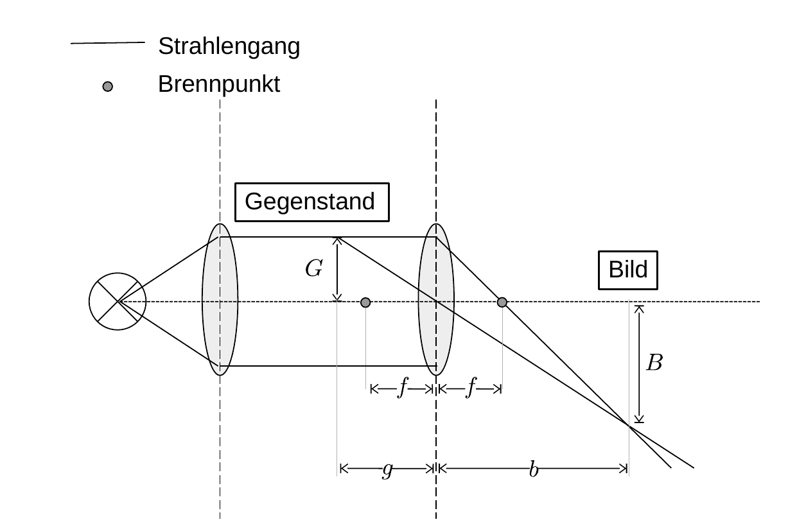

# Hinweise für den Versuch Geometrische Optik

## Aufgabe 3: Aufbau optischer Instrumente (3/3)

### Strahlengang eines Projektors

Der Strahlengang eines [Durchlichtprojektors](https://de.wikipedia.org/wiki/Projektor#Durchlichtprojektion) ist ein einfaches Beispiel für die Anwendung der Linsengleichung. Ein solcher Strahlengang ist in **Skizze 6** gezeigt. 



**Skizze 6** (Strahlengang eines Durchlichtprojektors)

---

Die Strahlen einer Lampe (links) werden durch einen [Kondensor](https://de.wikipedia.org/wiki/Kondensor) in ein paralleles Lichtbündel abgebildet, das den Gegenstand $G$ (z.B. ein Dia) möglichst gleichmäßig ausleuchtet. Der Gegenstand $G$ befindet sich im Abstand $g$ von der Linse mit Brennweite $f$. Die Linse bildet $G$ in das reelle Bild $B$ ab. Für den Abbildungsmaßstab gilt: 

```math
\begin{equation*}
\frac{B}{G} = \frac{b}{g}
\end{equation*}
```

Wird $G$ scharf in $B$ abgebildet gilt weiterhin die Linsengleichung

```math
\begin{equation*}
\frac{1}{f}=\frac{1}{g}+\frac{1}{b}
\end{equation*}
```

### Hinweise zur Durchführung

- Der Abbildungsmaßstab und der Abstand $d$ vom Projektor in dem $B$ entstehen soll, geben $g$ und $b$ vor. 
- Wählen Sie $f$ geeignet. 

# Navigation

[Zurück](https://git.scc.kit.edu/etp-lehre/p1-for-students/-/blob/main/Geometrische_Optik/doc/Hinweise-Aufgabe-3-a.md) | [Main](https://git.scc.kit.edu/etp-lehre/p1-for-students/-/tree/main/Geometrische_Optik)

