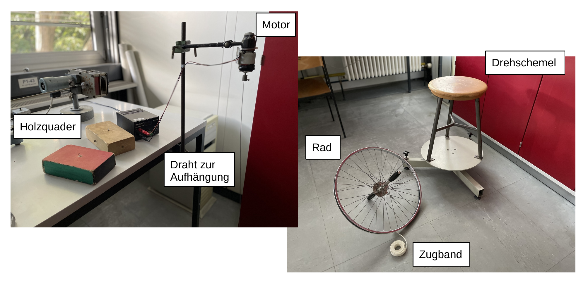
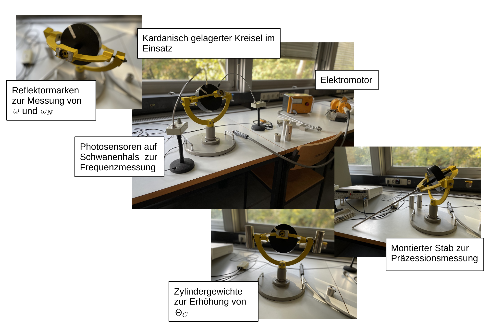
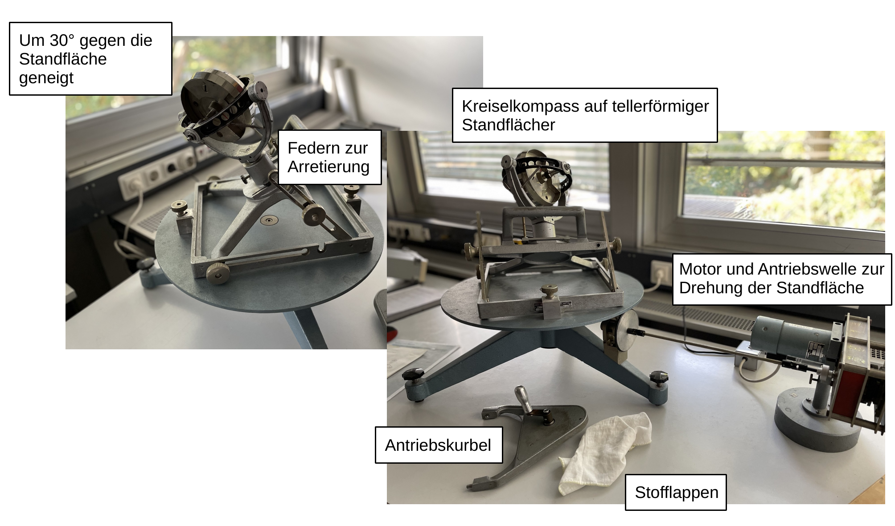

# Fakultät für Physik

## Physikalisches Praktikum P1 für Studierende der Physik

Versuch P1-26, 27, 28 (Stand: Oktober 2023)

[Raum F1-15](https://labs.physik.kit.edu/img/Praktikum/Lageplan_P1.png)

# Kreisel

## Motivation

Die uns umgebende Natur ist i.a. weder geradlinig noch punktförmig, wie in der Schule oder den ersten Einführungsvorlesungen der Mechanik oft vorausgesetzt. Physikalische Körper bewegen sich im dreidimensionalen Raum und haben eine endliche Ausdehnung. Als erste Konsequenz erfolgt die Beschreibung der Bewegung physikalischer Körper nicht allein mit der Hilfe [skalarer](https://de.wikipedia.org/wiki/Skalar_(Mathematik)) Größen, wie der Masse $m$, sondern zusätzlich mit der Hilfe von [Vektoren](https://de.wikipedia.org/wiki/Vektor), mehr-komponentigen mathematischen Darstellungen, wie dem Ortsvektor $\vec{r}$, mit einem fest vorgegebenen Verhalten unter Transformationen im Raum. Ausgedehnte Körper, bei denen einzelne Punkte im Raum in festen Beziehungen zueinander stehen werden zudem mit Hilfe von [Tensoren](https://de.wikipedia.org/wiki/Tensor) beschrieben. Die Welt der [analytischen Geometrie](https://de.wikipedia.org/wiki/Analytische_Geometrie) wird durch komplizierte Verknüpfungen wie das [innere](https://de.wikipedia.org/wiki/Skalarprodukt), [äußere](https://de.wikipedia.org/wiki/Kreuzprodukt) oder das [Tensorprodukt](https://de.wikipedia.org/wiki/Tensorprodukt) bestimmt. Wichtige mathematische Gebilde, wie der [Hilbertraum](https://de.wikipedia.org/wiki/Hilbertraum), sind der Natur abgeschaut. 

Ausgedehnte Körper können manchmal nicht-intuitive, zum Teil verrückt anmutende Bewegungen ausführen, die durch die Sprache der analytischen Geometrie genau beschrieben und vorhergesagt werden können. Gerade aufgrund seiner bemerkenswerten Bewegungsformen ist der Kreisel vielen von Ihnen, als *physikalisches* Spielzeug, seit Kindesbein wohl bekannt. In der Physik ist der Kreisel ein niemals langweiliges Studienobjekt, um die manchmal nicht-intuitive Erfahrungswelt der uns umgebenden Realität mit der manchmal nicht besonders anschaulichen Welt der Mathematik in Verbindung zu bringen. Mit dem Versuch Kreisel, geben wir Ihnen Gelegenheit hierzu.   

## Lehrziele

Wir listen im Folgenden die wichtigsten **Lehrziele** auf, die wir Ihnen mit dem Versuch **Kreisel** vermitteln möchten: 

- Sie vergegenwärtigen sich die Bedeutung von Skalaren, Vektoren und Tensoren. 
- Mit dem [Trägheitstensor](https://de.wikipedia.org/wiki/Tr%C3%A4gheitstensor) $\boldsymbol{\Theta}$ beschäftigen Sie sich mit einer der experimentell zugänglichsten Tensorgrößen in der klassischen Physik. Dabei haben Sie die Möglichkeit mathematisch abstrakte Konzepte, wie [Eigenwert](https://de.wikipedia.org/wiki/Eigenwerte_und_Eigenvektoren), [Eigenvektor](https://de.wikipedia.org/wiki/Eigenwerte_und_Eigenvektoren) oder [Hauptachsentransformation](https://de.wikipedia.org/wiki/Hauptachsentransformation), die Sie aus der [linearen Algebra](https://de.wikipedia.org/wiki/Lineare_Algebra) kennen physikalisch mit Leben zu füllen. [Eigenwertprobleme](https://de.wikipedia.org/wiki/Verallgemeinertes_Eigenwertproblem) sind von entscheidender Bedeutung bei der Beschreibung stationärer Zustände in der Physik. 
- Sie untersuchen wichtige, nicht-alltägliche und zunächst nicht-intuitiv anmutende Eigenschaften des [symmetrischen Kreisels](https://de.wikipedia.org/wiki/Symmetrischer_Kreisel), wie [Nutation](https://de.wikipedia.org/wiki/Nutation_(Physik)) und [Präzession](https://de.wikipedia.org/wiki/Pr%C3%A4zession) und bestimmen daraus die [Trägheitsmomente](https://de.wikipedia.org/wiki/Tr%C3%A4gheitsmoment) $\Theta_{i}$ entlang der [Hauptträgheitsachsen](https://de.wikipedia.org/wiki/Haupttr%C3%A4gheitsachse) eines [kardanisch gelagerten](https://de.wikipedia.org/wiki/Kardanische_Aufh%C3%A4ngung) Kreisels. 
- Als historische Anwendung diskutieren Sie die Funktionsweise des [Kreiselkompass](https://de.wikipedia.org/wiki/Kreiselkompass).  

## Versuchsaufbau

Dieser Versuch ist dreigeteilt. Im Folgenden sind die verwendeten Aufbauten kurz beschrieben. Eine Auflistung der für ihre Auswertung wichtigen Bauteile und deren Eigenschaften finden Sie in der Datei [Datenblatt.md](https://git.scc.kit.edu/etp-lehre/p1-for-students/-/blob/main/Kreisel/Datenblatt.md).

### Physik starrer Körper

Im ersten Versuchsteil machen Sie ganz persönliche Erfahrungen mit der Physik starrer Körper, bei denen z.T. *Sie selbst* das Versuchsobjekt sind. 

Hierzu stehen Ihnen die folgenden Utensilien zur Verfügung: 

- Ein Drehschemel und ein Rad mit Zugband und Griffen.
- Eine Sammlung von Holzquadern, die Sie in ihren Schwerpunkten zu jeder Grundfläche an einem Draht aufhängen können. Der Draht kann mit Hilfe eines externen Elektromotors in Drehung versetzt werden, so dass Sie das Verhalten der Holzquader bezüglich jeder Ihrer Hauptachsen untersuchen können. 

### Kardanisch gelagerter Kreisel

Im zweiten Versuchsteil nehmen Sie Untersuchungen an einem kardanisch gelagerten Kreisel vor, den Sie mit Hilfe eines externen Elektromotors antreiben können. 

Der Rotor des Kreisels wird durch zwei Kardanrahmen gehalten. An den äußeren Kardanrahmen lassen sich (beidseitig) zwei Zylinder oder (einseitig) ein Metallstab, als zusätzliche Gewichte anbringen. Mit Hilfe der symmetrisch zu montierenden Zylinder erhöhen Sie das Trägheitsmoment entlang einer der Hauptträgheitsachsen des Kreisels. Mithilfe des Stabs sorgen Sie dafür, dass ein resultierendes Drehmoment auf den Kreisel wirkt, der dadurch nicht mehr momentenfrei lagert und in Präzession versetzt wird. Frequenzmessungen nehmen Sie mit Hilfe von Photosensoren mit eingebauten Lichtquellen vor, die zur flexiblen Handhabe auf sog. Schwanenhälsen montiert sind. Aus den durchgeführten Messungen können Sie auf geschickte Weise die Trägheitsmomente entlang der Hauptträgheitsachsen des Kreisels experimentell bestimmen und die Masse des Rotors abschätzen.

### Kreiselkompass 

Der dritte Versuchsteil ist, so wie der erste Versuchsteil, qualitativer Natur. Hier können Sie anhand eines Modells die Funktionsweise des Kreiselkompass studieren und diskutieren. 

Der Kreisel lässt sich gegen seine tellerförmige Standfläche kippen. Der Winkel zwischen dem äußeren Kardanrahmen des Kreisels und der Standfläche ist auf 30° voreingestellt, was einer Position auf dem 30. Breitengrad der Erde entspricht. Der innere Kardanrahmen ist mit Schraubenfedern in der angenommenen Tangential- (Horizontal-)ebene auf diesem Breitengrad fixiert. Der Rotor des Kreisels kann mit Hilfe einer aufsetzbaren Antriebskurbel in Rotation versetzt werden. Die Standplatte kann mit Hilfe eines externen Elektromotors in eine langsame gleichmäßige Rotation versetzt werden, um die Drehung die Revolution der Erde zu simulieren. 

## Wichtige Hinweise zum Versuch

- Rotierende Körper können sehr viel Energie aufnehmen, die man ihnen zunächst nicht ansieht. **Lassen Sie daher im Umgang mit den Kreiseln besondere Vorsicht walten.** Achten Sie z.B. darauf, dass sich lange Haare nicht im Kreisel verfangen. 
- Bei den Apparaturen handelt es sich z.T. um sehr teure Spezialanfertigungen zu pädagogischen Zwecken. Verwenden Sie zum Abbremsen der Kreisel die bereitliegenden Stofflappen und gehen Sie achtsam mit den Gerätschaften um. 

# Navigation

Das P1 befindet sich derzeit in der Umstellung zu verbesserten Anleitungen, die alle notwendigen Informationen zur Vorbereitung auf den Versuch beinhalten. 

**Dieser Versuch wird vorläufig noch nach der alten Anleitung durchgeführt.** 

- Abbildungen zum Versuch finden Sie im Verzeichnis [`figures`](https://gitlab.kit.edu/kit/etp-lehre/p1-praktikum/students/-/tree/main/Kreisel/figures). 
- Informationen zur Vorbereitung auf den Versuch nach der alten Anleitung finden Sie im Verzeichnis [`doc`](https://gitlab.kit.edu/kit/etp-lehre/p1-praktikum/students/-/tree/main/Kreisel/doc). 

Im Verzeichnis [`doc`](https://gitlab.kit.edu/kit/etp-lehre/p1-praktikum/students/-/tree/main/Kreisel/doc) finden Sie auch die originale Version der alten Anleitung, die z.T. noch etwas mehr Information enthält, als die Jupyter-notebook Version. In einigen Fällen weichen Nummerierungen und Reihenfolge der Versuchsteile in den alten Anleitungen von der jeweiligen Version in Jupyter-notebook ab. In diesen Fällen ist die jeweilige Version der **Durchführung in Jupyter-notebook** für Sie maßgeblich! 
