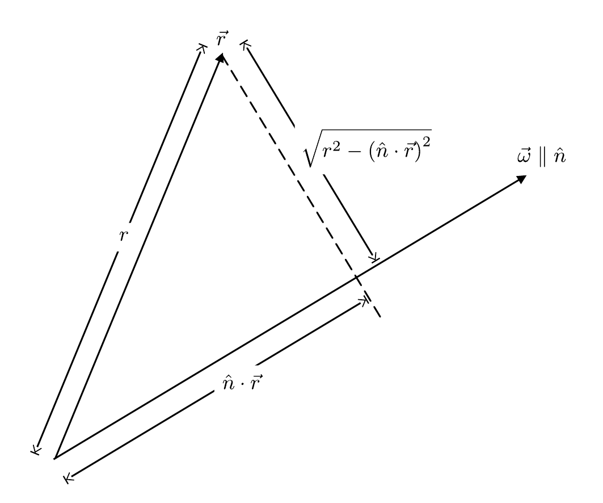
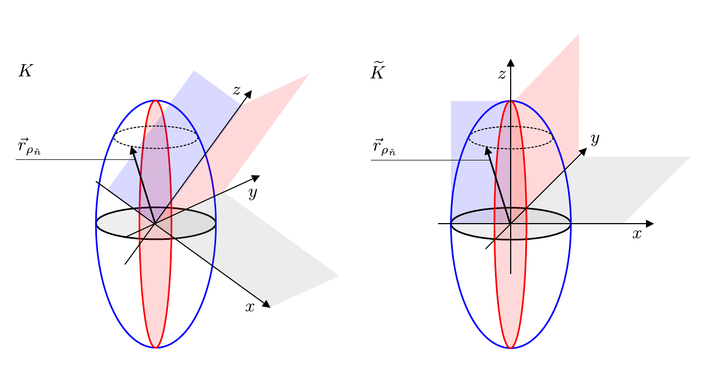

# Hinweise für den Versuch Kreisel

## Aufgabe 1: Physik starrer Körper [1/3]

### Bestimmung von $\theta_{i}$ aus $\boldsymbol{\Theta}$

Es macht nur Sinn von einem Trägheitsmoment $\theta_{\hat{n}}$ eines starren Körpers bezüglich einer (zunächst beliebigen) Achse $\hat{n}$ zu sprechen, um die der Körper rotiert. Beim Trägheitstensor $\boldsymbol{\Theta}$ handelt es sich um eine lineare Abbildung von $\vec{\omega}$ auf $\vec{L}$, die i.a. als $3\times3$-Matrix dargestellt wird. Beim Trägheitsmoment $\theta_{\hat{n}}$ handelt es sich um eine Zahl.  Aus $\boldsymbol{\Theta}$ erhält man $\theta_{\hat{n}}$ aus der beidseitigen Multiplikation von $\boldsymbol{\Theta}$ mit $\hat{n}$:
$$
\begin{equation*}
\begin{split}
\theta &= \mathrm{d} m \, n_{i}\left(r^{2}\delta_{ij}-r_{i}r_{j}\right)n_{j} \\
&\\
&=\mathrm{d} m\,\left(r^{2}n_{i}^{2} - \big(n_{i}\, r_{i}\big)\big(n_{j}\,r_{j}\big)\right) \\
&\\
&=\mathrm{d} m\,\left(r^{2}\hat{n}^{2} - \big(\hat{n}\cdot\vec{r}\big)^{2}\right) \\
&\\
&=\mathrm{d} m\,\left(r^{2} - \big(\hat{n}\cdot\vec{r}\big)^{2}\right) \\
\end{split}
\end{equation*}
$$
Auch dieses Ergebnis hat eine anschauliche Bedeutung, wie in **Skizze 1** dargestellt:

**Skizze 1** (Anschauliche Bedeutung des Trägheitsmoments $\theta_{\hat{n}}$)

---

Das Trägheitsmoment $\theta_{\hat{n}}$ jedes Massenelements $\mathrm{d}m$ eines starren Körpers berechnet sich aus dessen Abstand $r_{\perp}$ senkrecht zu $\hat{n}$.

### Trägheitsellipsoid

Um das Trägheitsmoment um eine beliebige Achse $\hat{n}$ eines ausgedehnten Körpers zu berechnen ist über alle Massenelemente $\mathrm{d}m$ zu integrieren. Wir beschreiben hierzu die Lage von $\hat{n}$ in einem körperfesten Koordinatensystem $K$, dessen Ursprung im Schwerpunkt des Körpers liegt, mit den drei Winkeln $\alpha$, $\beta$ und $\gamma$ mit
$$
\begin{equation*}
\hat{n} = 
\left(
\begin{array}{c}
\cos\alpha \\
\cos\beta \\
\cos\gamma \\
\end{array}
\right)
\end{equation*}
$$
Diese drei Winkel sind nicht unabhängig voneinander, denn es soll weiterhin $|\hat{n}|=1$ gelten. Man überzeugt sich z.B. leicht, dass in 2 Dimensionen $\beta=\pi/2-\alpha$ gelten würde. Für die Berechnung von $\theta_{\hat{n}}$ gilt damit
$$
\begin{equation}
\begin{split}
\theta_{\hat{n}} &= \int r_{\perp}^{2}\,\mathrm{d}m  = \int \left|\vec{r}\times\hat{n}\right|^{2}\,\mathrm{d}m \\
&\\
& = \int \left(\left(y\cos\gamma-z\cos\beta\right)^{2}+
\left(z\cos\alpha-x\cos\gamma\right)^{2}+
\left(x\cos\beta-y\cos\alpha\right)^{2}\right)\mathrm{d}m \\
&\\
&=\cos^{2}\alpha\underbrace{\int\left(y^{2}+z^{2}\right)\,\mathrm{d}m} + 
\cos^{2}\beta\underbrace{\int\left(x^{2}+z^{2}\right)\,\mathrm{d}m} + 
\cos^{2}\gamma\underbrace{\int\left(x^{2}+y^{2}\right)\,\mathrm{d}m}\\
&\hphantom{\alpha\,\,\int\left(x^{2}+y^{2}\right)}=\theta_{x}
\hphantom{\int\left(x^{2}+y^{2}\cos^{2}\alpha\right)\,}=\theta_{y}
\hphantom{\int\left(x^{2}+y^{2}\cos^{2}\alpha\right)\,\,}=\theta_{z}\\
&\\
&\hphantom{=}
-2\cos\alpha\cos\beta\underbrace{\int x\,y\,\mathrm{d}m}
-2\cos\beta\cos\gamma\underbrace{\int y\,z\,\mathrm{d}m}
-2\cos\alpha\cos\gamma\underbrace{\int x\,z\,\mathrm{d}m}. \\
&\hphantom{-2\cos\alpha\beta\int x\,y\,\mathrm{d}m}=\Theta_{xy}
\hphantom{-2\int x\,\cos\alpha+\,}=\Theta_{yz}
\hphantom{-2\int x\,\cos\alpha+\,\,\,}=\Theta_{xz}
\end{split}
\end{equation}
$$
Die $\{\theta_{i}\}$ sind die **Trägheitsmomente**, die $\{\Theta_{ij}\}$ die **Deviationsmomente** in den Koordinaten von $K$. Ist $K$ beliebig gewählt sind die $\{\Theta_{ij}\}$ ungleich 0. Nach Hauptachsentransformation (ins Koordinatensystem $\widetilde{K}$) gilt 
$$
\begin{equation*}
\Theta_{ij}=0 \qquad \forall\,i,j=x, \,y, \,z \text{ und }i\neq j
\end{equation*}
$$
Und die $\{\theta_{i}\}$ sind die Hauptträgheitsmomente. Aus Gleichung **(1)** ist zu erkennen, dass die bilinearen Deviationsmomente verschwinden, wenn sich eine Rotationsachse $\hat{n}$ finden lässt bezüglich derer die Massenbelegung des Körpers symmetrisch ist, weshalb für homogene, symmetrische Körper die Hauptträgheitsachsen mit den Figurenachsen der Körper zusammenfallen.

Trägt man den sog. Trägheitsmodul entlang der Achse $\hat{n}$ als
$$
\begin{equation}
\rho_{\hat{n}} = \sqrt{\frac{m}{\theta_{\hat{n}}}}\qquad\text{mit:}\qquad m=\int\mathrm{d}m
\end{equation}
$$
entlang der Richtung von $\hat{n}$ ab, und definiert die Endpunkte dieser Vektoren als
$$
\begin{equation*}
\vec{r}_{\rho_{\hat{n}}} = 
\left(
\begin{array}{c}
x_{\hat{n}}\\y_{\hat{n}}\\z_{\hat{n}}
\end{array}
\right) = \rho_{\hat{n}}\,
\left(
\begin{array}{c}
\cos\alpha\\\cos\beta\\\cos\gamma
\end{array}
\right),
\end{equation*}
$$
dann bilden die Endpunkte der $\vec{r}_{\hat{n}}$ das sog. [Trägheitsellipsoid](https://de.wikipedia.org/wiki/Tr%C3%A4gheitsellipsoid), dessen allgemeine analytische Form 
$$
\begin{equation}
\theta_{\hat{}n} = \frac{1}{\rho_{\hat{n}}^{2}}\left(x_{\hat{n}}^{2}\,\theta_{x} + y_{\hat{n}}^{2}\,\theta_{y} + z_{\hat{n}}^{2}\,\theta_{z} -2\left(x_{\hat{n}}y_{\hat{n}}\Theta_{xy} + y_{\hat{n}}z_{\hat{n}}\Theta_{yz} + 
x_{\hat{n}}z_{\hat{n}}\Theta_{xz}\right)\right)
\end{equation}
$$
man durch Einsetzen in Gleichung **(1)** erhält.  Das Trägheitsellipsoid besitzt drei Hauptachsen. Durch Gleichung **(3)** wird die Lage des Ellipsoids in einem allgemeinen Koordinatensystem $K$, wie in Skizze 2 gezeigt,

**Skizze 2** ((Links) Allgemeine Lage des Trägheitsellipsoids im Raum und (rechts) Trägheitsellipsoid nach Hauptachsentransformation)

---

beschrieben. Nach Hauptachsentransformation fallen die Hauptachsen des Trägheitsellipsoids mit den Koordinatenachsen $\widetilde{K}$ zusammen und Gleichung **(3)** erhält die sog. Normalform
$$
\begin{equation*}
\begin{split}
&\theta_{\hat{n}} = \frac{1}{\rho_{\hat{n}}^{2}}\left(x_{\hat{n}}^{2}\,\theta_{x} + y_{\hat{n}}^{2}\,\theta_{y} + z_{\hat{n}}^{2}\,\theta_{z}\right) \\
&\\
&\text{mit:}\quad\theta_{\hat{n}}=\frac{m}{\rho_{\hat{n}}^{2}};\quad \theta_{i}=\frac{m}{\rho_{i}^{2}};\\
&\\
&1=\left(\frac{x_{\hat{n}}^{2}}{\rho_{x}^{2}} + \frac{y_{\hat{n}}^{2}}{\rho_{y}^{2}} + \frac{z_{\hat{n}}^{2}}{\rho_{z}^{2}}\right). 
\end{split}
\end{equation*}
$$
Die (kleinste) größte Hauptachse des Trägheitsellipsoids entspricht dabei dem (größten) kleinsten Hauptträgheitsmoment.

# Navigation

[Zurück](https://gitlab.kit.edu/kit/etp-lehre/p1-praktikum/students/-/tree/main/Kreisel/coc/Hinweise_Aufgabe_1.md) | [Main](https://gitlab.kit.edu/kit/etp-lehre/p1-praktikum/students/-/tree/main/Kreisel) | [Weiter](https://gitlab.kit.edu/kit/etp-lehre/p1-praktikum/students/-/tree/main/Kreisel/doc/Hinweise-Aufgabe-1-a.md)
