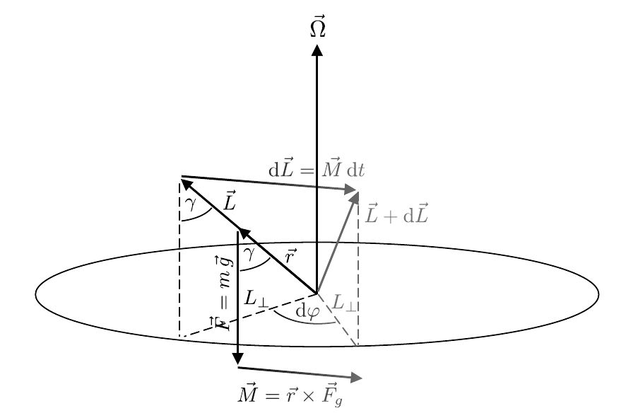
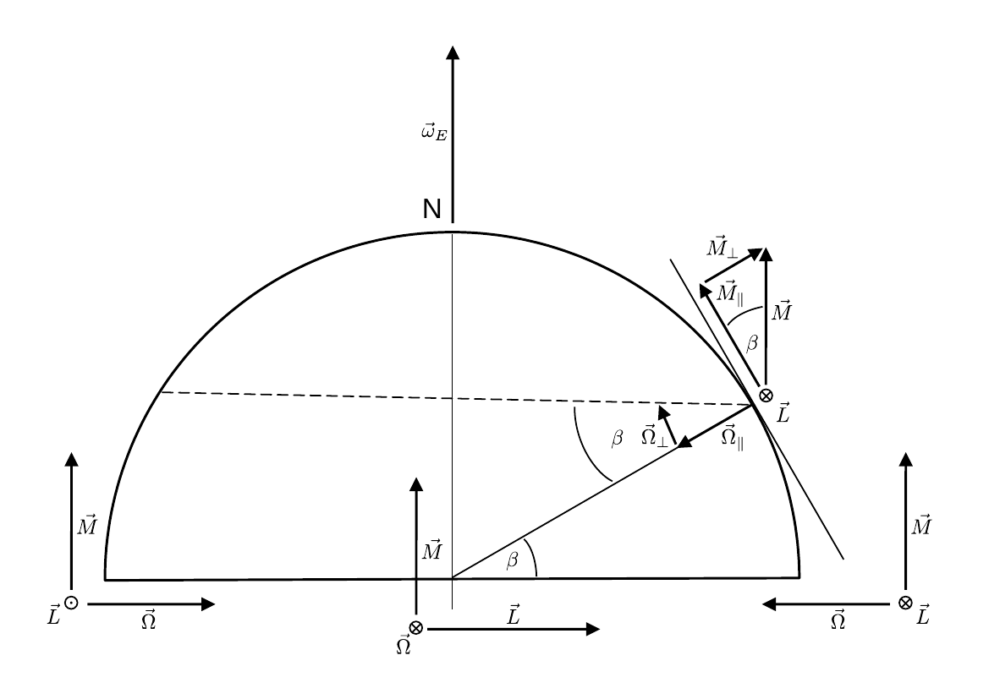

# Hinweise für den Versuch Kreisel

## Aufgabe 2: Kardanisch gelagerter Kreisel

Die obigen Betrachtungen gelten für einen einfachen symmetrischen Kreisel. Im Fall des in (**Abbildung 1** [hier](https://gitlab.kit.edu/kit/etp-lehre/p1-praktikum/students/-/blob/main/Kreisel/doc/Hinweise-Aufgabe-2.md)) gezeigten, kardanisch gelagerten Kreisels, wie er im Praktikum zum Einsatz kommt, müssen die Trägheitsmomente der *massiven* Kardanrahmen bei der Beschreibung der Kreiselbewegung berücksichtigt werden. Bei Drehungen um $\hat{x}$ dreht sich der innere, bei Drehungen um $\hat{y}$ sowohl der innere, als auch der äußere Kardanrahmen mit. Für die Trägheitsmomente gilt daher: 
$$
\begin{equation*}
\begin{split}
&\theta_{x}^{\prime} = \theta_{x} + \theta_{x}^{\mathrm{K,i}}; \\
&\theta_{y}^{\prime} = \theta_{y} + \theta_{y}^{\mathrm{K,i}} + \theta_{y}^{\mathrm{K,a}}; \\
&\theta_{z}^{\prime} = \theta_{z}, \\
\end{split}
\end{equation*}
$$
wobei $\theta_{x}=\theta_{y}$ die Trägheitsmomente des Rotors, $\theta_{x,y}^{\mathrm{K,i}}$ die Trägheitsmomente des inneren und $\theta_{x,y}^{\mathrm{K,a}}$ die Trägheitsmomente des äußeren Kardanrahmens sind. Unter diesen Voraussetzungen ergibt sich für kleine Werte von $\beta$
$$
\begin{equation}
\omega_{N} = \frac{\theta_{z}^{\prime}}{\sqrt{\theta_{x}^{\prime}\,\theta_{y}^{\prime}}}
\end{equation}
$$

### Präzession

Zur Diskussion der Präzession betrachten wir einen symmetrischen Kreisel, der mit der Winkelgeschwindigkeit $\vec{\omega}$ um die Figurenachse $\hat{z}$ rotiert. Die zugehörige Geometrie zu diesen Betrachtungen ist in **Skizze 6** gezeigt. Da der Kreisel um die Figurenachse rotiert gilt $\vec{L}=\theta_{z}\,\vec{\omega}$.  Im Abstand $\vec{r}=r\hat{z}$ soll ein zusätzliches Gewicht dazu führen, dass auf den Kreisel ein resultierendes Drehmoment 
$$
\begin{equation}
\vec{M} = \vec{r}\times\vec{F}_{g}; \qquad M=m\,g\,r\sin\gamma
\end{equation}
$$
wirkt.

**Skizze 6** (Geometrie eines präzedierenden Kreisels)

---

Nach einem Zeitabschnitt $\mathrm{d}t$ führt $\vec{M}$ zu einer Änderung
$$
\begin{equation*}
\mathrm{d}\vec{L} = \vec{M}\,\mathrm{dt}.
\end{equation*}
$$
Da $\vec{L}$ per Konstruktion parallel zu $\vec{r}$ verläuft, gilt nach Gleichung **(2)** $\vec{M}\perp\vec{L}$, d.h. $\mathrm{d}\vec{L}$ ändert die Richtung, nicht aber den Betrag von $\vec{L}$. Diese Änderung führt zu einer Drehung von $\vec{L}$ um den Winkel
$$
\begin{equation*}
\mathrm{d}\varphi = \frac{\mathrm{d}L}{L_{\perp}} = \frac{M\,\mathrm{d}t}{L\sin\gamma}
\end{equation*}
$$
und damit zu einer Rotation des Kreisels mit der Winkelgeschwindigkeit
$$
\begin{equation*}
\Omega = \frac{\mathrm{d}\varphi}{\mathrm{d}t} = \frac{M}{L\sin\gamma} = \frac{m\,g\,r\,\sin\gamma}{\theta_{z}\,\omega\,\sin\gamma} = \frac{m\,g\,r}{\theta_{z}\,\omega}.
\end{equation*}
$$
Unter Berücksichtigung der Vektorstruktur ergibt sich
$$
\begin{equation*}
\vec{M}=\vec{\Omega}\times\vec{L}.
\end{equation*}
$$

#### Kreiselkompass

Der Kreiselkompass, wie er im P1 zu Demonstrationszwecken verwendet wird, ist ebenfalls kardanisch gelagert, jedoch ist der innere Kardanrahmen durch Schraubenfedern an den äußeren Kardanrahmen gebunden. Die Funktionsweise eines Kreiselkompasses ist in **Skizze 7** gezeigt, in der die Nordhalbkugel der Erde schematisch dargestellt ist:

**Skizze 7** (Geometrie zur Diksussion des Kreiselkompasses)

---

Die folgende Diskussion erfordert wie wiederholte Anwendung der "Rechten-Hand-Regel". 

Die Erde dreht sich mit der Winkelgeschwindigkeit $\vec{\omega}_{E}$. Ein Kreiselkompass, der auf Höhe des Äquators, in Ost-West-Richtung ausgerichtet ist erfährt durch die Drehung der Erde das Drehmoment $\vec{M}$. Dies führt zur Präzession mit der Winkelgeschwindigkeit $\vec{\Omega}$, die die Figurenachse des Kreisels in Nord-Süd-Richtung ($\vec{L}$ im Bild nach unten) und damit parallel zu $\vec{\omega}_{E}$ ausrichtet. Dieser Umstand ist, in drei Positionen auf der Erde, in den unteren drei Achsen aus $\vec{L}$, $\vec{\Omega}$ und $\vec{M}$ dargestellt. 

Für die weiteren Betrachtungen ist zu berücksichtigen, dass sich der Kreisel nur in horizontaler Richtung bewegen kann, während er in vertikaler Richtung *gebunden* ist. Wäre der Kreisel nicht in vertikaler Richtung gebunden, würde er sich $\vec{L}$ im Bild wierdeum nach oben und damit damit parallel zu $\vec{\omega}_{E}$ ausrichten. Durch die Bindung ist es erforderlich $\vec{M}$ in zwei Komponenten $\vec{M}_{\parallel}$ (horizontal) und $\vec{M}_{\perp}$ (vertikal) aufzuspalten. Der Anteil $\vec{M}_{\parallel}$ führt zur Präzession mit $\vec{\Omega}_{\parallel}$, die wiederum dazu führt, dass sich der Kreisel innerhalb der Horizontalen in Nord-Süd-Richtung (im Bild richtet sich $\vec{L}$ nach unten rechts aus) ausrichtet. Der Anteil $\vec{M}_{\perp}$ würde zur Präzession mit der Winkelgeschwindigkeit $\vec{\Omega}_{\perp}$ führen, die den Kreisel aus der Horizontalen in die Vertikale (im Bild richtet sich $\vec{L}$ nach unten aus) auslenken würde. Dieser Anteil der Präzession ist durch die Bindung an den entsprechenden Kardanrahmen jedoch unterbunden. Im Vergleich zum Äquator ist der Effekt der Präzession um den Faktor $\cos\beta$ reduziert.  

Am Nordpol findet keine Einstellung des Kreisels in Nord-Süd-Richtung statt. Der Kreisel würde sich senkrecht in die Vertikale drehen. Diese Drehung ist jedoch durch die Bindung an den Kardanrahmen unterbunden. 

# Navigation

[Zurück](https://gitlab.kit.edu/kit/etp-lehre/p1-praktikum/students/-/blob/main/Kreisel/doc/Hinweise-Aufgabe-2.md) | [Main](https://gitlab.kit.edu/kit/etp-lehre/p1-praktikum/students/-/tree/main/Kreisel)
