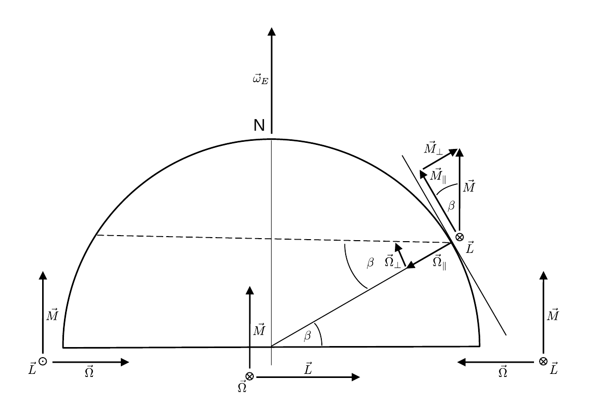

# Hinweise für den Versuch Kreisel

## Aufgabe 2: Kardanisch gelagerter Kreisel

#### Kreiselkompass

Der Kreiselkompass, wie er im P1 zu Demonstrationszwecken verwendet wird, ist ebenfalls kardanisch gelagert, jedoch ist der innere Kardanrahmen durch Schraubenfedern an den äußeren Kardanrahmen gebunden. Die Funktionsweise eines Kreiselkompasses ist in **Skizze 7** gezeigt, in der die Nodhalbkugel der Erde schematisch dargestellt ist:

**Skizze 7** (Geometrie zur Diksussion des Kreiselkompasses)

---

Die folgende Diskussion erfordert wie wiederholte Anwendung der "Rechten-Hand-Regel". 

Die Erde dreht sich mit der Winkelgeschwindigkeit $\vec{\omega}_{E}$. Ein Kreiselkompass, der auf Höhe des Äquators, in Ost-West-Richtung ausgerichtet ist erfährt durch die Drehung der Erde das Drehmoment $\vec{M}$. Dies führt zur Präzession mit der Winkelgeschwindigkeit $\vec{\Omega}$, die die Figurenachse des Kreisels in Nord-Süd-Richtung ($\vec{L}$ im Bild nach unten) und damit parallel zu $\vec{\omega}_{E}$ ausrichtet. Dieser Umstand ist, in drei Positionen auf der Erde, in den unteren drei Achsen aus $\vec{L}$, $\vec{\Omega}$ und $\vec{M}$ dargestellt. 

Für die weiteren Betrachtungen ist zu berücksichtigen, dass sich der Kreisel nur in horizontaler Richtung bewegen kann, während er in vertikaler Richtung *gebunden* ist. Wäre der Kreisel nicht in vertikaler Richtung gebunden, würde er sich $\vec{L}$ im Bild wierdeum nach oben und damit damit parallel zu $\vec{\omega}_{E}$ ausrichten. Durch die Bindung ist es erforderlich $\vec{M}$ in zwei Komponenten $\vec{M}_{\parallel}$ (horizontal) und $\vec{M}_{\perp}$ (vertikal) aufzuspalten. Der Anteil $\vec{M}_{\parallel}$ führt zur Präzession mit $\vec{\Omega}_{\parallel}$, die wiederum dazu führt, dass sich der Kreisel innerhalb der Horizontalen in Nord-Süd-Richtung (im Bild richtet sich $\vec{L}$ nach unten rechts aus) ausrichtet. Der Anteil $\vec{M}_{\perp}$ würde zur Präzession mit der Winkelgeschwindigkeit $\vec{\Omega}_{\perp}$ führen, die den Kreisel aus der Horizontalen in die Vertikale (im Bild richtet sich $\vec{L}$ nach unten aus) auslenken würde. Dieser Anteil der Präzession ist durch die Bindung an den entsprechenden Kardanrahmen jedoch unterbunden. Im Vergleich zum Äquator ist der Effekt der Präzession um den Faktor $\cos\beta$ reduziert.  

Am Nordpol findet keine Einstellung des Kreisels in Nord-Süd-Richtung statt. Der Kreisel würde sich senkrecht in die Vertikale drehen. Diese Drehung ist jedoch durch die Bindung an den Kardanrahmen unterbunden. 

# Navigation

[Zurück](https://gitlab.kit.edu/kit/etp-lehre/p1-praktikum/students/-/blob/main/Kreisel/doc/Hinweise-Aufgabe-2.md) | [Main](https://gitlab.kit.edu/kit/etp-lehre/p1-praktikum/students/-/tree/main/Kreisel)
