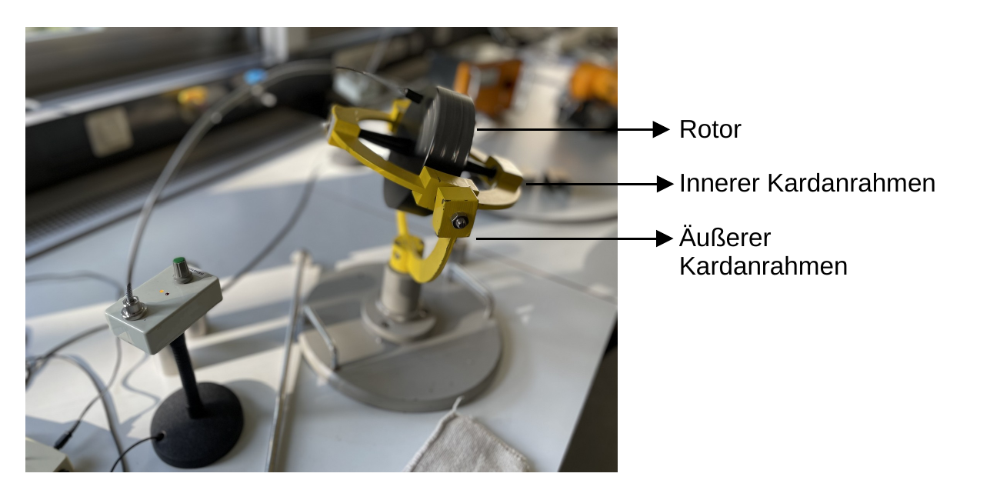
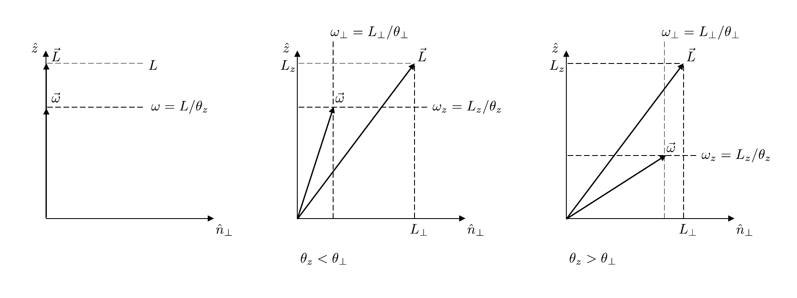

# Hinweise für den Versuch Kreisel

## Aufgabe 2: Kardanisch gelagerter Kreisel

Im Rahmen dieser Aufgabe führen Sie quantitative Untersuchungen an einem kardanisch gelagerten Kreisel durch. Wie dieser Kreisel genau aussieht ist in **Abbildung 1** gezeigt:   

**Abbildung 1** (Kardanisch gelagerter Kreisel im P1)

---

Er besteht aus einem **Rotor**, der in seiner Figurenachse drehbar an einem **inneren Kardanrahmen** befestigt ist. Senkrecht zur Figurenachse des Rotors ist der innere wiederum drehbar an einem **äußeren Kardanrahmen** befestigt. Der äußere Kardanrahmen ist drehbar mit einer **Bodenplatte** verbunden. Im Bild sind der Rotor schwarz, die Kardanrahmen gelb und die Bodenplatte grau zu sehen. Auf diese Weise kann sich der Rotor grundsätzlich frei im Raum drehen. 

### Nutation

Wir diskutieren das Phänomen der [Nutation](https://de.wikipedia.org/wiki/Nutation_(Physik)) ohne Einschränkung der Allgemeinheit am Beispiel eines kräftefrei gelagerten Kreisels, für den Richtung und Betrag von $\vec{L}$ zeitlich konstant sind. Verläuft $\vec{L}$ entlang einer der Hauptträgheitsachsen sind auch Richtung und Betrag von $\vec{\omega}$ zeitlich konstant und nach Gleichung (**(5)** [hier](https://gitlab.kit.edu/kit/etp-lehre/p1-praktikum/students/-/tree/main/Kreisel/doc/Hinweise-Aufgabe-1.md)) gilt $\vec{\omega}\parallel\vec{L}$, wie in **Skizze 3** (links) gezeigt. Wir legen unseren Betrachtungen weiterhin das Modell eines symmetrischen Kreisels, mit der Figurenachse $\hat{z}$ zugrunde.

**Skizze 3** (Lage von $\vec{L}$ und $\vec{\omega}$ für einen symmetrischen Kreisel, (links) für den Fall, dass $\vec{L}$ entlang der Figurenachse $\hat{z}$ verläuft, und (mittig und rechts) für den Fall, dass dies nicht zutrifft)

---

Verläuft $\vec{L}$ nicht entlang einer der Hauptträgheitsachsen, ändert $\vec{\omega}$ die Richtung und der Kreisel vollzieht eine Nick- oder Nutationsbewegung, wie in **Skizze 4** gezeigt:

Im raumfesten Bezugssystem $K$ umläuft die momentane Drehachse $\vec{\omega}(t)$ den (in $K$ ruhenden) Drehimpulsvektor $\vec{L}$ auf dem **Rastpolkegel** (rot). Im körperfesten Bezugssystem $\widetilde{K}$ umläuft $\vec{\omega}$ zur gleichen Zeit (die in $\widetilde{K}$ ruhende Figurenachse) $\hat{z}$ auf dem den **Gangpolkegel** (blau). Die resultierende Bewegung lässt sich durch ein schlupffreies Abrollen des Gangpolkegels auf dem Rastpolkegel in $K$ beschreiben. Auf der Berührlinie der beiden Kegel liegt $\vec{\omega}(t)$. Die Figurenachse $\hat{z}$ des Kreisels beschreibt dabei den **Nutationskegel** (schwarz) in $K$, dessen Kegelachse mit $\vec{L}$ zusammenfällt.  

# Navigation

[Main](https://gitlab.kit.edu/kit/etp-lehre/p1-praktikum/students/-/tree/main/Kreisel) | [Weiter](https://gitlab.kit.edu/kit/etp-lehre/p1-praktikum/students/-/blob/main/Kreisel/doc/Hinweise-Aufgabe-2-a.md)
