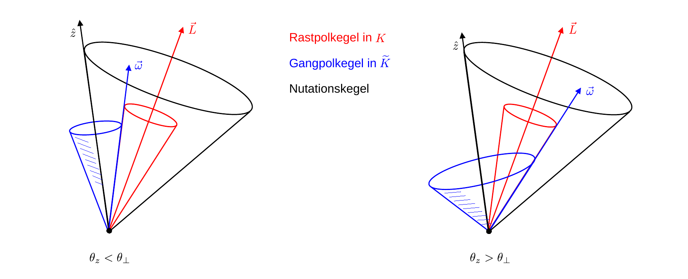
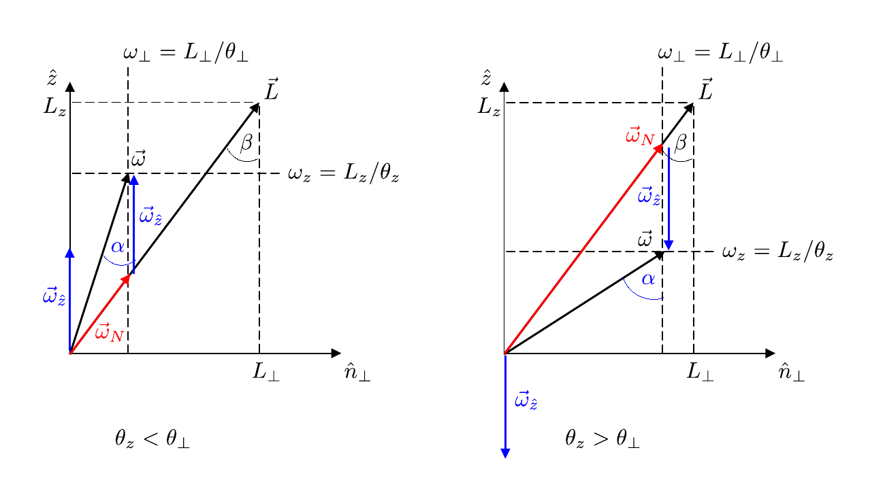

# Hinweise für den Versuch Kreisel

## Aufgabe 2: Kardanisch gelagerter Kreisel

Im Rahmen dieser Aufgabe führen Sie quantitative Untersuchungen an einem kardanisch gelagerten Kreisel durch. Wie dieser Kreisel genau aussieht ist in **Abbildung 1** gezeigt:   

**Abbildung 1** (Kardanisch gelagerter Kreisel im P1)

---

Er besteht aus einem **Rotor**, der in seiner Figurenachse drehbar an einem **inneren Kardanrahmen** befestigt ist. Senkrecht zur Figurenachse des Rotors ist der innere wiederum drehbar an einem **äußeren Kardanrahmen** befestigt. Der äußere Kardanrahmen ist drehbar mit einer **Bodenplatte** verbunden. Im Bild sind der Rotor schwarz, die Kardanrahmen gelb und die Bodenplatte grau zu sehen. Auf diese Weise kann sich der Rotor grundsätzlich frei im Raum drehen. 

### Nutation

Wir diskutieren das Phänomen der [Nutation](https://de.wikipedia.org/wiki/Nutation_(Physik)) ohne Einschränkung der Allgemeinheit am Beispiel eines kräftefrei gelagerten Kreisels, für den Richtung und Betrag von $\vec{L}$ zeitlich konstant sind. Verläuft $\vec{L}$ entlang einer der Hauptträgheitsachsen sind auch Richtung und Betrag von $\vec{\omega}$ zeitlich konstant und nach Gleichung (**(5)** [hier](https://gitlab.kit.edu/kit/etp-lehre/p1-praktikum/students/-/tree/main/Kreisel/doc/Hinweise-Aufgabe-1.md)) gilt $\vec{\omega}\parallel\vec{L}$, wie in **Skizze 3** (links) gezeigt. Wir legen unseren Betrachtungen weiterhin das Modell eines symmetrischen Kreisels, mit der Figurenachse $\hat{z}$ zugrunde.

**Skizze 3** (Lage von $\vec{L}$ und $\vec{\omega}$ für einen symmetrischen Kreisel, (links) für den Fall, dass $\vec{L}$ entlang der Figurenachse $\hat{z}$ verläuft, und (mittig und rechts) für den Fall, dass dies nicht zutrifft)

---

Verläuft $\vec{L}$ nicht entlang einer der Hauptträgheitsachsen, ändert $\vec{\omega}$ die Richtung und der Kreisel vollzieht eine Nick- oder Nutationsbewegung, wie in **Skizze 4** gezeigt:

Im raumfesten Bezugssystem $K$ umläuft die momentane Drehachse $\vec{\omega}(t)$ den (in $K$ ruhenden) Drehimpulsvektor $\vec{L}$ auf dem **Rastpolkegel** (rot). Im körperfesten Bezugssystem $\widetilde{K}$ umläuft $\vec{\omega}$ zur gleichen Zeit (die in $\widetilde{K}$ ruhende Figurenachse) $\hat{z}$ auf dem den **Gangpolkegel** (blau). Die resultierende Bewegung lässt sich durch ein schlupffreies Abrollen des Gangpolkegels auf dem Rastpolkegel in $K$ beschreiben. Auf der Berührlinie der beiden Kegel liegt $\vec{\omega}(t)$. Die Figurenachse $\hat{z}$ des Kreisels beschreibt dabei den **Nutationskegel** (schwarz) in $K$, dessen Kegelachse mit $\vec{L}$ zusammenfällt.  

Der genaue Ablauf dieser Bewegung hängt von der Beschaffenheit des Kreisels ab: 

- Für den prolaten Kreisel ($\theta_{z}\lt\theta_{\perp}$, **Skizze 3** mittig, **Skizze 4** links) liegt $\vec{\omega}$ zwischen $\hat{z}$ und $\vec{L}$; der *äußere* Mantel des Gangpolkegels rollt auf dem äußeren Mantel des Rastpolkegels ab; in $K$ kreisen $\vec{\omega}$ und $\hat{z}$ in Phase um $\vec{L}$.  
- Für den oblaten Kreisel ($\theta_{z}\gt\theta_{\perp}$, **Skizze 3** rechts, **Skizze 4** rechts) liegt $\vec{L}$ zwischen $\hat{z}$ und $\vec{\omega}$; der *innere* Mantel des Gangpolkegels rollt auf dem äußeren Mantel des Rastpolkegels ab; in $K$ kreisen $\vec{\omega}$ und $\hat{z}$ gegenphasig um $\vec{L}$. 

**Skizze 4** (Bewegungsablauf des Kreisels für den (links) prolaten und (rechts) oblaten symmetrischen Kreisel)

---

Um die Nutation quantitativ besser zu verstehen empfiehlt es sich $\vec{\omega}$ in einen Anteil $\vec{\omega}_{\hat{z}}$ parallel zu $\hat{z}$ und einen Anteil $\vec{\omega}_{N}$ parallel zu $\vec{L}$ zu zerlegen:
$$
\begin{equation*}
\vec{\omega} = \vec{\omega}_{N} + \vec{\omega}_{\hat{z}},
\end{equation*}
$$
wie in **Skizze 5** dargestellt. Ebenfalls in die Skizze eingetragen sind der Öffnungswinkel des Gangpolkegels $\alpha$ und der Öffnungswinkel des Nutationskegels $\beta$. 

**Skizze 5** (Definitionen zum quantitativen Verständnis der Nutation)

---

Mit diesen Definitionen ergeben sich die folgenden Zusammenhänge: 
$$
\begin{equation*}
\begin{split}
& \tan\alpha = \frac{\omega_{\perp}}{\omega_{z}};\qquad\tan\beta = \frac{L_{\perp}}{L_{z}} = \frac{\theta_{\perp}\,\omega_{\perp}}{\theta_{z}\,\omega_{z}} = \frac{\theta_{\perp}}{\theta_{z}}\tan\alpha; \\
&\\
& \sin\alpha = \frac{\omega_{\perp}}{\omega};\qquad \sin\beta = \frac{\omega_{\perp}}{\omega_{N}} \\
&\\
& \omega_{N} = \frac{\omega_{\perp}}{\sin\beta} = \frac{\omega}{\sin\beta}\,\sin\alpha = \frac{\omega}{\sin\beta}\,\sqrt{\frac{\tan^{2}{\alpha}}{1+\tan^{2}\alpha}}\\
&\\
&\text{mit:}\\
&\\
&\tan\alpha = \frac{\theta_{z}}{\theta_{\perp}}\tan\beta \\
&\\
&\omega_{N} = \frac{\omega}{\sin\beta}\,\sqrt{\frac{1}{1/\tan^{2}\alpha+1}} = \omega\,\sqrt{\frac{\theta_{z}^{2}}{\theta_{\perp}^{2}\cos^{2}\beta+\theta_{z}^{2}\sin^{2}\beta}}.
\end{split}
\end{equation*}
$$
 Für kleine Werte von $\beta$ ergibt dies:
$$
\begin{equation}
\omega_{N} = \omega\,\sqrt{\frac{\theta_{z}^{2}}{\theta_{\perp}^{2}\cos^{2}\beta+\theta_{z}^{2}\sin^{2}\beta}} \approx \omega\,\frac{\theta_{z}}{\theta_{\perp}}
\end{equation}
$$
Wie aus Gleichung **(1)** ersichtlich gilt für den oblaten (prolaten) Kreisel $\omega_{N}\gt\omega$ ($\omega_{N}\lt\omega$).

Die obigen Betrachtungen gelten für einen einfachen symmetrischen Kreisel. Im Fall des in **Abbildung 1** gezeigten, kardanisch gelagerten Kreisels, wie er im Praktikum zum Einsatz kommt, müssen die Trägheitsmomente der *massiven* Kardanrahmen bei der Beschreibung der Kreiselbewegung berücksichtigt werden. Bei Drehungen um $\hat{x}$ dreht sich der innere und bei Drehungen um $\hat{y}$ sowohl der innere, als auch der äußere Kardanrahmen mit. Für die Trägheitsmomente gilt daher: 
$$
\begin{equation*}
\begin{split}
&\theta_{x}^{\prime} = \theta_{x} + \theta_{x}^{\mathrm{K,i}}; \\
&\theta_{y}^{\prime} = \theta_{y} + \theta_{y}^{\mathrm{K,i}} + \theta_{y}^{\mathrm{K,a}}; \\
&\theta_{z}^{\prime} = \theta_{z}, \\
\end{split}
\end{equation*}
$$
wobei $\theta_{x}=\theta_{y}$ die Trägheitsmomente des Rotors, $\theta_{x,y}^{\mathrm{K,i}}$ die Trägheitsmomente des inneren und $\theta_{x,y}^{\mathrm{K,a}}$ die Trägheitsmomente des äußeren Kardanrahmens sind. Unter diesen Voraussetzungen ergibt sich für kleine Werte von $\beta$
$$
\begin{equation}
\omega_{N} = \frac{\theta_{z}^{\prime}}{\sqrt{\theta_{x}^{\prime}\,\theta_{y}^{\prime}}}
\end{equation}
$$

# Navigation

[Main](https://gitlab.kit.edu/kit/etp-lehre/p1-praktikum/students/-/tree/main/Kreisel) | [Weiter](https://gitlab.kit.edu/kit/etp-lehre/p1-praktikum/students/-/blob/main/Kreisel/doc/Hinweise-Aufgabe-2-a.md)
