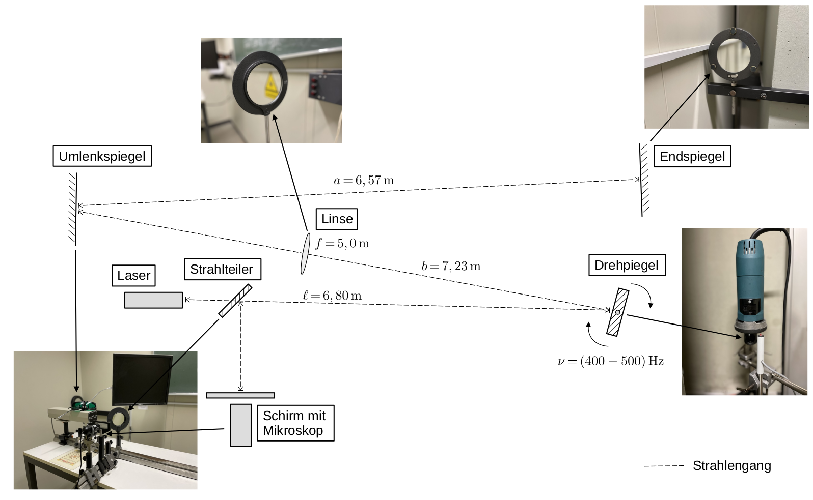
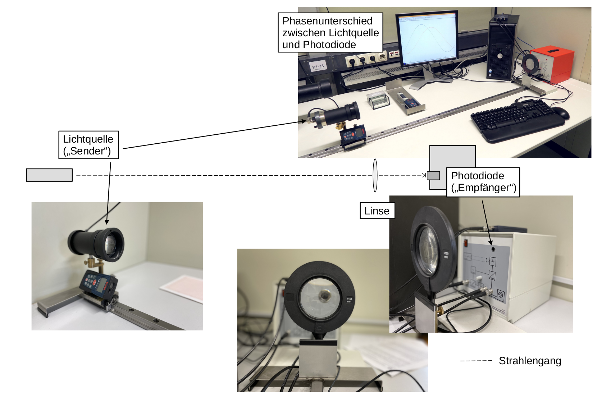

# Fakultät für Physik

## Physikalisches Praktikum P1 für Studierende der Physik

Versuch P1-43, 44, 45 (Stand: November 2022)

[Raum F1-12](http://www-ekp.physik.uni-karlsruhe.de/~simonis/praktikum/layoutobjekte/Lageplan_P1.png)

# Lichtgeschwindigkeit

## Motivation

Die erste Person, die auf die Endlichkeit der Lichtgeschwindigkeit $c$ hinwies, war der dänische Astronom [Ole Rømer](https://de.wikipedia.org/wiki/Ole_R%C3%B8mer), der 1676 die Umlaufzeit des Jupytermondes [Io](https://de.wikipedia.org/wiki/Liste_der_Jupitermonde) vermaß. Abhängig von der Jahreszeit, in der er seine Beobachtungen machte stellte Rømer systematische Unterschiede in der Periode von Io fest, was er damit erklärte, dass die Ausbreitung des Lichtes nicht augenblicklich erfolgen kann. Rømers Messung der Lichtgeschwindigkeit wurde erst akzeptiert, als sie 1729 von [James Bradley](https://de.wikipedia.org/wiki/James_Bradley) bestätigt wurde. Im 19. Jahrhundert, führten Albert Michelson und Edward Morley das berühmte [Michelson-Morley-Experiment](https://de.wikipedia.org/wiki/Michelson-Morley-Experiment) durch. Ziel dieses Versuchs war der Nachweis der Existenz des [Äthers](https://de.wikipedia.org/wiki/Äther_(Physik)), eines postulierten Mediums in dem sich Lichtwellen ausbreiten, und dass den gesamten Raum gleichmäßig ausfüllt. **Dieser Versuch schlug fehl!** Stattdessen führte er zum Schluss, dass die Geschwindigkeit mit der sich das Licht im Vakuum ausbreitet fest und unveränderlich sein muss. 

Heute sind wir in der Lage die astronomischen Laborsysteme der Vergangenheit in den Praktikumsraum F1-12 zu bringen, um diese sehr wichtige Naturkonstante im Praktikum nachzumessen. Wir messen $c$ bei diesem Versuch nach zwei verschiedenen Verfahren: Zum einen nach der [Drehspiegelmethode](https://de.wikipedia.org/wiki/Drehspiegelmethode) von Foucault und Michelson. Hierbei handelt es sich um eine historische Messung, die erstmals 1850/51 durchgeführt wurde. Sie werden sie als Demonstrationsversuch gemeinsam mit Ihren Kommiliton:innen und Ihrem:r Tutor:in durchführen und dann auswerten. Zum anderen indem Sie die Phasenverschiebung eines Signal- relativ zu einem Referenzstrahl messen (Phasenvergleichsmethode).

## Lernziele

Wir listen im Folgenden die wichtigsten **Lernziele** auf, die wir Ihnen mit dem Versuch **Lichtgeschwindigkeit** vermitteln möchten: 

- Sie lernen beide Methoden zur Messung der Lichtgeschwindigkeit kennen. 
- Sie vergegenwärtigen sich die subtilen Unterschiede beider Messungen. Machen Sie sich z.B. klar, welche Geschwindigkeit Sie mit dem jeweiligen Verfahren messen, die Gruppen- oder die Phasengeschwindigkeit. Erwarten Sie unterschiedliche Ergebnisse für die Messungen nach dem einen oder anderen Verfahren?
- Sie lernen die Größenordnung der zur Messung herangezogenen Effekte im Vorfeld abzuschätzen, so dass Sie mit einer gut informierten Erwartung an jede Aufgabe herangehen können.
- Aufgrund der hohen Geschwindigkeit des Lichts sind die erwarteten Effekte klein. Sie lernen intelligente, experimentelle Techniken kennen, um diese Effekte trotzdem sicht- und für die Messung im Praktikum nutzbar zu machen. 
- In Ihrer Auswertung sollten Sie die experimentellen, technischen Grenzen und die Quellen der dominanten Unsicherheiten beider Messverfahren sorgfältig diskutieren und beide Verfahren in dieser Hinsicht kritisch miteinander vergleichen.  

## Versuchsaufbau

Der Versuch umfasst zwei unterschiedliche Aufbauten zur Messung der Lichtgeschwindigkeit. Im Folgenden sind die wichtigsten Informationen der verwendeten Aufbauten kurz zusammengefasst. Für ihre Auswertung wichtige technische Details finden Sie in der Datei Datenblatt.md. Die angegebenen Größen sind zudem in [*python*](https://www.python.org/)-Modulen im Verzeichnis [*params*](https://git.scc.kit.edu/etp-lehre/p1-for-students/-/tree/main/Lichtgeschwindigkeit/params) auf dem SCC Gitlab Server hinterlegt. 

### Drehspiegelmethode

Das Licht eines Lasers wird auf einen Drehspiegel gerichtet und von dort auf ein System aus einem Umlenk- und einem Endspiegel reflektiert. Der Strahlengang verläuft vom Laser zum Endspiegel und wieder zurück. Vor dem Laser befindet sich ein um $45^{\circ}$ zur Strahlachse gedrehter, halbdurchlässiger Spiegel als Strahlteiler, der einen Teil des reflektierten Lichts auf einen Schirm mit Ableseskala und Mikroskop umlenkt. Die Skala wird mit Hilfe eines USB-Mikroskops auf einem Bildschirm angezeigt (siehe Bild unten links in der zugehörigen [Skizze](https://git.scc.kit.edu/etp-lehre/p1-for-students/-/blob/main/Lichtgeschwindigkeit/figures/Drehspiegelmethode.png)). Zwischen Dreh- und Umlenkspiegel befindet sich eine Linse zur Verringerung der Divergenz des Lichtstrahls der auf den Endspiegel abgebildet wird. Im Zeitfenster $\Delta t$ zwischen seinem ersten und zweiten Auftreffen auf den Drehspiegel hat ein angenommenes Lichtpaket, nach den Angaben der obigen Skizze, die Wegstrecke $2\,(a+b)$ zurückgelegt. Der Drehspiegel hat sich in dieser Zeit um den Winkel $\Delta\alpha$ weiter gedreht. Dadurch erscheint der auf den Schirm gelenkte Lichtstrahl im Vergleich zum Fall des ruhenden Drehspiegels versetzt. Der Versatz hängt von der Geschwindigkeit des Lichtpakets $c$ und der Winkelgeschwindigkeit $\Omega$ des Drehspiegels ab. Die Brennweite der Linse, sowie die festen Abstände zwischen dem Laser und den jeweiligen Spiegeln sind in der zugehörigen [Skizze](https://git.scc.kit.edu/etp-lehre/p1-for-students/-/blob/main/Lichtgeschwindigkeit/figures/Drehspiegelmethode.png) angegeben. 

#### Wichtige Hinweise

- Die Strahlung des verwendeten Lasers der [Klasse 2](https://de.wikipedia.org/wiki/Laser#Laserklassen) ist **gefährlich für Ihre Augen!** Sie sind daher angehalten während des Versuchs eine der ausgelegten Laserschutzbrillen tragen.
- Diese Messung führen Sie, als **Demonstrationsversuch**, mit Ihren Kommiliton:innen und Ihrem:r Tutor:in gemeinsam durch. 

### Phasenvergleichsmethode

Diese Methode zur Messung der Lichtgeschwindigkeit basiert auf der Messung der Phasenverschiebung $\Delta\varphi$ zwischen einem Empfänger- und einem Referenzsignal. Aus $\Delta\varphi$ lässt sich bei gegebener Kreisfrequenz $\omega$ des Referenzsignals eine Zeitdifferenz $\Delta t$ bestimmen und bei bekanntem Abstand $\ell$ zwischen Sender und Empfänger so die Lichtgeschwindigkeit berechnen. Eine monochromatische Lichtquelle (Sender) ist mittels einer $\approx2\,\mathrm{m}$ langen Führungsschiene beweglich montiert. Ihr Licht wird mit Hilfe einer Sammellinse auf eine feststehende Photodiode (Empfänger) abgebildet. Ein $60\,\mathrm{MHz}$-Frequenzgenerator steuert den Sender und liefert ein Referenzsignal. Die Lichtgeschwindigkeit ergibt sich aus der abstandsabhängigen Phasenverschiebung $\Delta\varphi$ zwischen Empfänger und Referenzsignal. 

#### Wichtige Hinweise

- Die Messung der Lichtgeschwindigkeit nach der Drehspiegelmethode (Aufgabe 1) ist nur einfach vorhanden. Sie führen diese Messung gemeinsam mit Ihrem:r Tutor:in als Demonstrationsversuch durch. 
- Die Strahlung des verwendeten Lasers ([Klasse 2](https://de.wikipedia.org/wiki/Laser#Laserklassen)) ist, wenn Sie direkt in den Strahl hinein blicken **gefährlich für Ihre Augen!** Dies ist insbesondere der Fall, da Sie mit Spiegeln arbeiten. Bei ruhendem (oder sehr langsam rotierendem) Spiegel müssen Sie daher zu Ihrem eigenen Schutz eine der ausgelegten Schutzbrillen tragen.

## Aufgabe 2: Phasenvergleichsmethode

Diese Methode zur Messung der Lichtgeschwindigkeit basiert auf der Messung der Phasenverschiebung $\Delta\varphi$ zwischen dem Empfänger- und Referenzsignal. Aus $\Delta\varphi$ lässt sich bei gegebener Kreisfrequenz $\omega$ des Referenzsignals eine Zeitdifferenz $\Delta t$ bestimmen und bei bekanntem Abstand $\ell$ zwischen Sender und Empfänger so die Lichtgeschwindigkeit berechnen.   

### Aufgabe 2.1: Vorbereitung

Beantworten Sie zur Vorbereitung auf den Versuch die folgenden Fragen: 

- Welche Größenordnung sollte die Frequenz $\nu$ der Lichtwelle haben, damit Sie zwischen Empfänger- und Referenzsignal eine Phasendifferenz von $\Delta\varphi=0,2\,\pi$, d.h. einem $1/10$ der Periodendauer, auflösen können? 
- Welche Ablenkgeschwindigkeit $v_{\mathrm{Osz.}}$ sollte ein Oszilloskop entlang der Zeitachse haben, damit eine solche Phasenverschiebung zu einer wahrnehmbaren Verschiebung z.B. von $\Delta d=5\,\mathrm{mm}$ führt? Vergleichen Sie Ihre Abschätzung mit der Ablenkgeschwindigkeit $v_{\mathrm{Osz.}}\lesssim 10\,\mathrm{cm/\mu s}$ eines einfachen Oszilloskops. Welche Schlussfolgerung ziehen Sie daraus? Beachten Sie hierzu Anmerkung 2.1.

### Aufgabe 2.2: Justierung der Apparatur

Überprüfen Sie die Verbindungskabel anhand des Anschlussschemas auf der Frontplatte des Hauptnetzgeräts. Richten Sie mit Hilfe der Justierschrauben zur Zentrierung der Leuchtdiode des Senders und des verschiebbaren Kondensors am Lichtsendergehäuse einen möglichst parallelen Strahl vom Sender in Richtung des Empfängers ein. Stellen Sie die Sammellinse vor der Photodiode des Empfängers so auf, dass die Photodiode optimal ausgeleuchtet wird. Beachten Sie hier zu Anmerkung 2.2. 

### Aufgabe 2.3: Lichtgeschwindigkeit und Brechungsindex

Absolvieren Sie das folgende Messprogramm: 

#### Aufgabe 2.3.1

Überprüfen und notieren Sie mit dem Oszilloskop die Differenzfrequenz $(\omega-\omega')$. Dabei entspricht $\omega=2\,\pi\cdot60\,\mathrm{MHz}$ der Kreisfrequenz des für die Messung verwendeten Referenzsignals und $\omega' = 2\,\pi\cdot59,9\,\mathrm{MHz}$ der Kreisfrequenz des beigemischten Signals zum Zweck der Amplitudenmodulation. Beachten Sie hierzu Anmerkung 2.1. Für eine zuverlässige Frequenzmessung benötigt das Oszilloskop mehrere vollständige Wellenzüge im Anzeigebereich.

#### Aufgabe 2.3.2

Messen Sie die zeitliche Differenz $\Delta t$ zwischen Sender und Empfänger als Funktion von deren Abstand $\ell$ aus der Phasenverschiebung $\Delta\varphi$ zwischen Empfänger- und Referenzsignal. Beachten Sie den Zeitdehnungsfaktor aus Gleichung (4) in Anmerkung 2.1. Entnehmen Sie der Auftragung die Lichtgeschwindigkeit $c$ in Luft mit entsprechender Unsicherheit $\Delta c$ und diskutieren Sie die Quellen der dominanten Unsicherheiten.

#### Aufgabe 2.3.3

Bestimmen Sie den Brechungsindex $n_{\mathrm{H_{2}O}}$von Wasser aus der Messung der Laufzeitdifferenz, wenn $1\,\mathrm{m}$ Lichtweg in Luft durch $1\,\mathrm{m}$ Lichtweg in Wasser ersetzt wird.

Bestimmen Sie analog den Brechungsindex $n_{\mathrm{Plex}}$ von Plexiglas mit Hilfe der $8$ und $30\,\mathrm{cm}$ langen Plexiglaszylinder.

#### Aufgabe 2.3.4

Bestimmen Sie die Lichtgeschwindigkeit in Luft durch Messung von $\lambda /2$ mit Hilfe von [Lissajous-Figuren](https://de.wikipedia.org/wiki/Lissajous-Figur) im X/Y-Betrieb des Oszilloskops. Da Sie fast die gesamte zur Verfügung stehende Strecke der Führungsschiene benötigen, müssen Sie bei minimalem Abstand die Phase am Betriebsgerät geeignet einstellen.

## Anmerkungen zu Aufgabe 2

## Lösung:

*Sie können Ihre Lösung/Ihr Protokoll direkt in dieses Dokument einfügen. Wenn Sie dieses Dokument als Grundlage für ein [Jupyter notebook](https://jupyter.org/) verwenden wollen können Sie die Auswertung, Skripte und ggf. bildliche Darstellungen mit Hilfe von [python](https://www.python.org/) ebenfalls hier einfügen. Löschen Sie hierzu diesen kursiv gestellten Text aus dem Dokument.*

## Aufgabe 3: Laserentfernungsmesser

Heute benutzt fast jeder Handwerker oder Architekt einen handelsüblichen Laserentfernungsmesser um z.B. den Abstand zweier Wandflächen eines Neubaus zu vermessen. Wir wollen zum Abschluss dieses Versuchs viel einfacher als in Aufgabe 2 mit einem solchen Gerät die Brechungsindizes verschiedener Medien bestimmen. Stellen Sie dazu die bereitstehenden Küvetten jeweils einmal längs und einmal quer in den Strahlengang zwischen dem Entfernungsmesser und einem beliebigen Reflektor. Berechnen Sie aus den vom Gerät „falsch“ angezeigten Entfernungen den jeweiligen Brechungsindex. Bei intelligenter Durchführung können Sie die Messung so mit minimalen zusätzlichen Informationen erhalten. 

## Lösung:

*Sie können Ihre Lösung/Ihr Protokoll direkt in dieses Dokument einfügen. Wenn Sie dieses Dokument als Grundlage für ein [Jupyter notebook](https://jupyter.org/) verwenden wollen können Sie die Auswertung, Skripte und ggf. bildliche Darstellungen mit Hilfe von [python](https://www.python.org/) ebenfalls hier einfügen. Löschen Sie hierzu diesen kursiv gestellten Text aus dem Dokument.*

