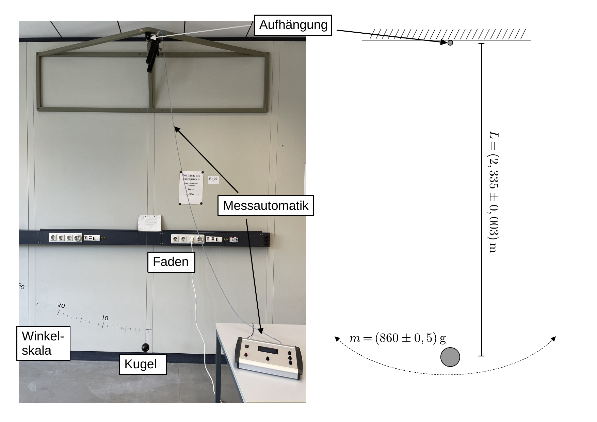
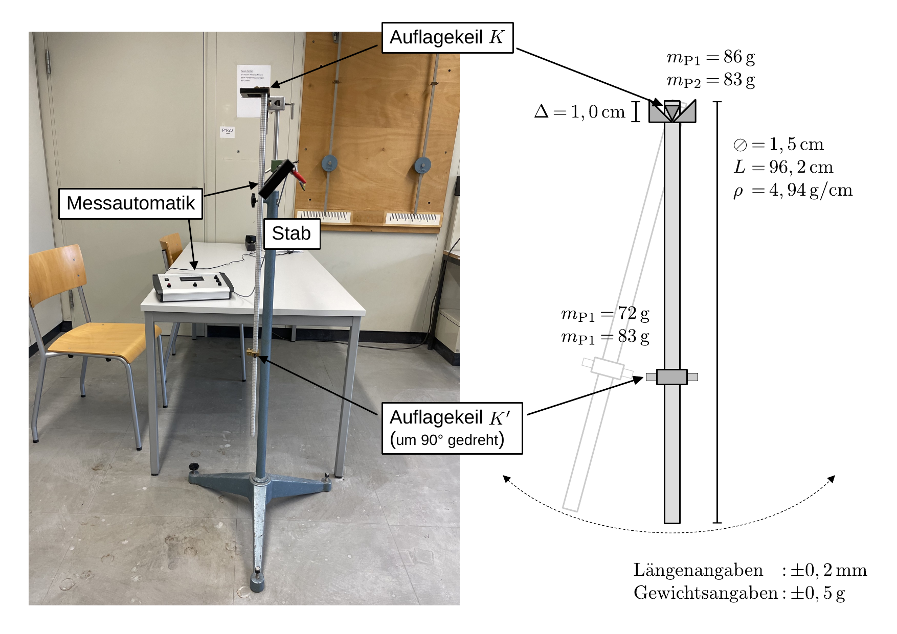
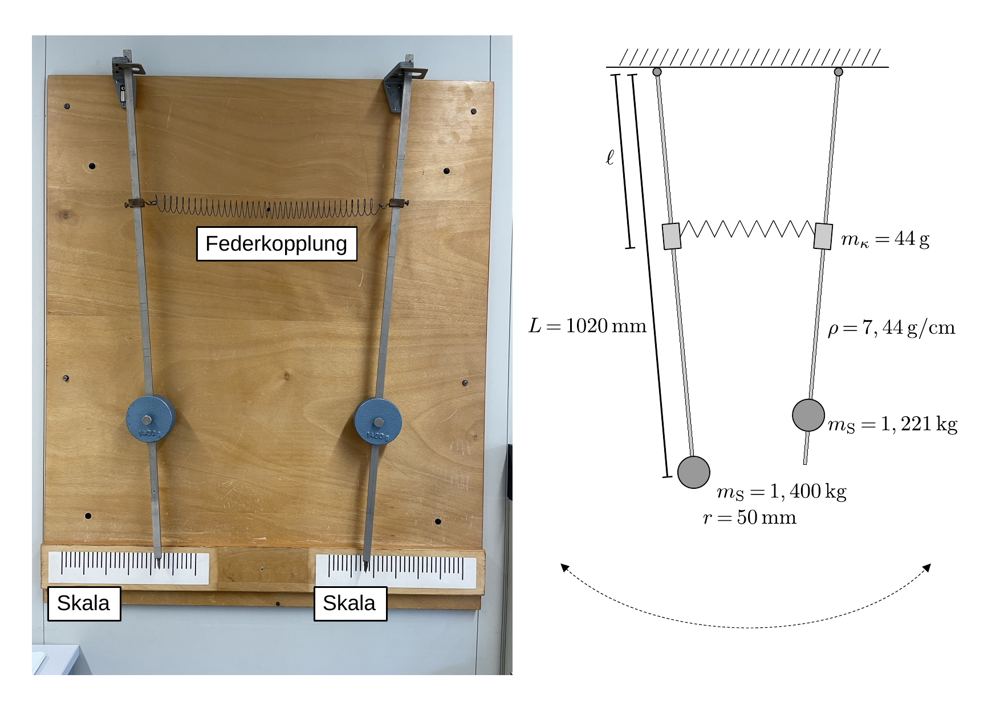

# Fakultät für Physik 

## Physikalisches Praktikum P1 für Studierende der Physik

Versuch P1-20, 21, 22 (Stand: Oktober 2023)

[Raum F1-11](https://labs.physik.kit.edu/img/Praktikum/Lageplan_P1.png)

# Pendel

## Motivation

Die [Schwingung](https://de.wikipedia.org/wiki/Schwingung) ist eine überall in der Natur auftretende Bewegungsform und deshalb in der Physik von besonderer Bedeutung. Mit diesem Versuch untersuchen Sie Schwingungen in ihrer einfachsten Form, als mechanische Schwingungen von [Pendeln](https://de.wikipedia.org/wiki/Pendel). Der erste neuzeitliche Forscher, dessen Beschäftigung mit Pendeln dokumentiert ist ist [Galileio Galilei](https://de.wikipedia.org/wiki/Galileo_Galilei) mit einer Schrift zur Untersuchung von Pendeln (1602). Er soll durch die gleichmäßigen Schwingungen eines Leuchter im [Dom zu Pisa](https://de.wikipedia.org/wiki/Dom_zu_Pisa) zu diesen Untersuchungen angeregt worden sein. Damals waren Pendelbewegungen nicht zu erklären, die kanonische Beschreibung der Natur basierte auf den Werken von [Aristoteles](https://de.wikipedia.org/wiki/Aristoteles), der natürliche von erzwungenen Bewegungen unterschied. Als natürliche Bewegung galt z.B. der Fall eines Steins zur Erde. Warf man einen Stein nach oben, galt dies als erzwungene Bewegung, die nach und nach wieder in die natürliche Bewegung nach unten (zur Erde) überging. Beim Pendel war ein solcher Übergang von einer erzwungenen in eine natürliche Bewegung nicht zu beobachten. Galilei beobachtete und dokumentierte als erster, dass die Periode $T_{0}$ eines schwingenden Pendels nicht von der schwingenden Masse sondern allein von der Länge des Pendels abhängt. Er behauptete allerdings auch, dass die Periode nicht von der Auslenkung der Pendels anhänge, ein Punkt in dem Sie ihn widerlegen werden. 

Auf Seiten der Erfassung und Verarbeitung von Daten zählen Untersuchungen an Pendeln zu den Blaupausen moderner, physikalischer Messungen. Jeder physikalischen Messung liegt heute ein (physikalisches) Modell zugrunde. Mit der Messung von $T_{0}$ führen Sie stichprobenartig [Zusallsexperimente](https://de.wikipedia.org/wiki/Zufallsexperiment) durch,  deren zufallsbedingte Unsicherheiten ([Varianz](https://de.wikipedia.org/wiki/Varianz)) Sie mit Methoden der Statistik abschätzen können. Aus der [Stichprobe](https://de.wikipedia.org/wiki/Stichprobe) ermitteln Sie einen [Erwartungswert](https://de.wikipedia.org/wiki/Erwartungswert) mit entsprechenden Unsicherheiten (die Sie wiederum aus der [Stichprobenvarianz](https://de.wikipedia.org/wiki/Stichprobenvarianz_(Sch%C3%A4tzfunktion)) abschätzen können), oder Sie [schätzen](https://de.wikipedia.org/wiki/Sch%C3%A4tzfunktion) Parameter, wie die Erdbeschleunigung im Schwerefeld der Erde $g$, innerhalb des zugrunde gelegten Modells mit entsprechenden Unsicherheiten. Irgendwo auf dem Weg zwischen einer noch unsicheren Entdeckung bis zu einer unumstößlichen Gewissheit, manifestiert sich die physikalisch reproduzierbare Beobachtung, die wir als unumstößliche Tatsache empfinden. Aus dieser Umschreibung können Sie erkennen wie eng unser heutiges Verständnis physikalischer Messungen mit den Methoden der Statistik verbunden ist.    

## Lehrziele

Wir listen im Folgenden die wichtigsten **Lehrziele** auf, die wir Ihnen mit dem Versuch **Pendel** vermitteln möchten: 

- Sie lernen den Umgang mit einigen der wichtigsten mechanischen Systeme kennen, mit deren Hilfe man Schwingungsphänomene experimentell studieren kann. Die Phänomene, die Sie mit gekoppelten Pendeln aber auch mit dem Reversionspendel beobachten und vermessen werden sind überraschend und nicht-trivial.  
- Sie schätzen den nicht immer intuitiven Einfluss der endlichen Ausdehnung physikalischer Körper auf die Bewegung der untersuchten Pendel ab und vergleichen Ihre Abschätzungen mit der Beobachtung.
- Sie üben sich anhand der einfachen Aufbauten im **sorgfältigen Experimentieren** und Messen, unter Laborbedingungen.
- Sie lernen den Nutzen redundanter und alternativer Messmethoden kennen und lernen die Vor- und Nachteile einzelner Bestimmungen einer physikalischen Größen, wie $g$ einzuschätzen. 
- Dieser Versuch eignet sich, aufgrund der allgemein gut bekannten zugrunde liegenden physikalischen Modelle, sehr gut dazu sich eingehender mit experimentellen Aspekten numerischer Anpassungen und der sorgfältigen Abschätzung statistischer und systematischer Unsicherheiten zu beschäftigen.

## Versuchsaufbau

Mit diesem Versuch stehen Ihnen mehrere Pendel zur Verfügung, deren Schwingungsverhalten Sie untersuchen werden. Im Folgenden sind die wichtigsten Informationen der verwendeten Aufbauten kurz zusammengefasst. Die angegebenen Größen finden Sie zudem in der Datei [Datenblatt.md](https://git.scc.kit.edu/etp-lehre/p1-for-students/-/blob/main/Spezifische_Ladung_des_Elektrons/Datenblatt.md) und in *python*-Modulen im *params*-Verzeichnis, auf dem SCC Gitlab server. 

### [Fadenpendel](https://de.wikipedia.org/wiki/Mathematisches_Pendel)

Eine Kugel hängt an einem dünnen Stahldraht der Länge $L=(2,355\pm0.003)\,\mathrm{m},$ gemessen von der Aufhängung des Drahtes bis zum Mittelpunkt der Kugel. Die aktuelle Länge und entsprechende Unsicherheit entnehmen Sie bitte dem Aushang im Praktikumsraum. Die Kugel hat eine Masse von $m=(860\pm0,5)\,\mathrm{g}$). Die Messung von $T_{0}$ erfolgt über eine Lichtschranke und zugehörige Messautomatik. Hinter dem Pendel befindet sich eine Winkelskala. 

### [Reversionspendel](https://de.wikipedia.org/wiki/Reversionspendel)

An einem Stativ hängt ein [physikalisches Pendel](https://de.wikipedia.org/wiki/Physikalisches_Pendel), bestehend aus einem dünnen zylindrischen Stab (mit Abmessungen, wie in der Skizze angegeben). Der obere Auflagekeil $K$ ist fest montiert, der untere Auflagekeil $K'$ ist um 90° relativ zu $K$ gedreht und lässt sich entlang des Stabs verschieben. Im Praktikumsraum befinden sich zwei Aufbauten (P1 und P2) für die sich die Massen der Montagespangen für $K$ und $K'$ (wie in der Skizze angegeben) leicht unterscheiden. Die Auflagepunkte von $K$ und $K'$ befinden sich jeweils im Abstand $\Delta=1,0\,\mathrm{cm}$ vom Rand der jeweiligen Montagespange zur Halterung entfernt. Die Messung von $T_{0}$ erfolgt über eine Lichtschranke und zugehörige Messautomatik.

### [Gekoppelte Pendel](https://de.wikipedia.org/wiki/Gekoppelte_Pendel)

Zwei baugleiche physikalische Pendel bestehen aus einem langen, dünnen Stab und jeweils einer verschiebbaren, flach-zylinderförmigen Pendelscheibe mit Massen, wie in der Skizze angegeben. Schließt der Stab mit der jeweiligen Pendelscheibe bündig ab, beträgt der Abstand zwischen der Aufhängung des jeweiligen Pendels und dem Schwerpunkt der entsprechenden Pendelscheibe $L=1020\,\mathrm{mm}$. Der Radius jeder Pendelscheibe beträgt $r=50\,\mathrm{mm}$.  Die Federkopplungen (mit den Massen $m_{\kappa}$) können entlang des jeweiligen Stabs verschoben werden. Zur Kopplung, wie in der Abbildung gezeigt, stehen verschiedene [Schraubenfedern](https://de.wikipedia.org/wiki/Feder_(Technik)) zur Verfügung.

## Wichtige Hinweise zum Versuch

- Die einzelnen Aufgabenteile zu diesem Versuch lassen sich unabhängig voneinander durchführen und unterliegen keiner bestimmten Reihenfolge. 
- **Die Kugel des Fadenpendels kann Verletzungen verursachen!** Halten Sie daher Abstand, solange die Kugel weit ausschwingt. 
- Wenn Sie die Kugel in den Draht der Aufhängung "hineinfallen" lassen, gehen Sie das Risiko ein den Draht zu zerstören.

# Navigation

- Wichtige Hinweise zur Vorbereitung und Durchführung von Aufgabe 1 finden Sie in der Datei [Hinweise-Aufgabe-1.md](https://git.scc.kit.edu/etp-lehre/p1-for-students/-/blob/main/Pendel/doc/Hinweise-Aufgabe-1.md).
- Wichtige Hinweise zur Vorbereitung und Durchführung von Aufgabe 2 finden Sie in der Datei [Hinweise-Aufgabe-2.md](https://git.scc.kit.edu/etp-lehre/p1-for-students/-/blob/main/Pendel/doc//Hinweise-Aufgabe-2.md).
- Wichtige Hinweise zur Vorbereitung und Durchführung von Aufgabe 3 finden Sie in der Datei [Hinweise-Aufgabe-3.md](https://git.scc.kit.edu/etp-lehre/p1-for-students/-/blob/main/Pendel/doc//Hinweise-Aufgabe-3.md).
- Wichtige technische Daten zum Versuch finden Sie in der Datei [Datenblatt.md](https://git.scc.kit.edu/etp-lehre/p1-for-students/-/blob/main/Pendel/Datenblatt.md).  
