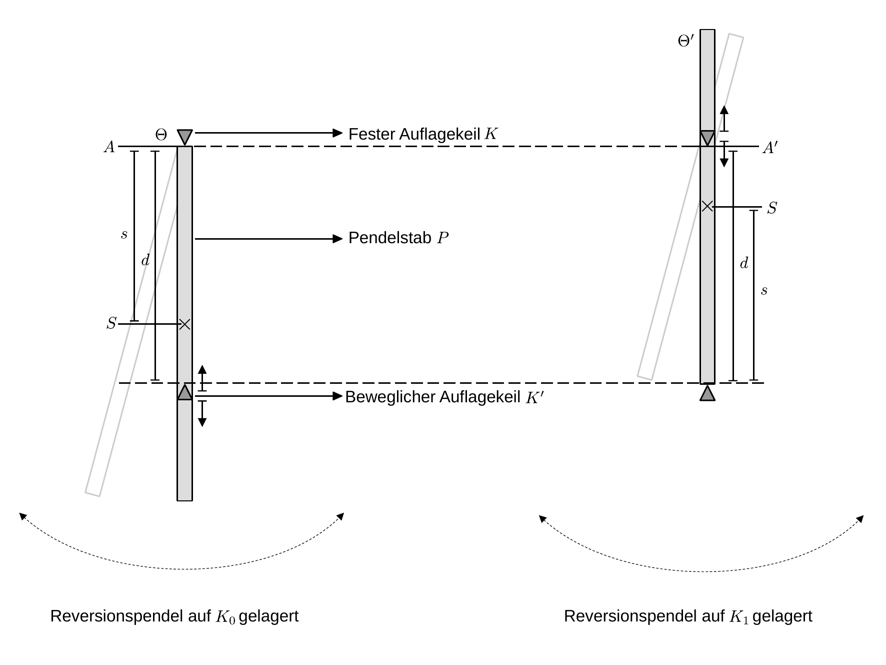

# Hinweise für den Versuch Pendel


## Aufgabe 2: Reversionspendel

### Eigenschaften des Reversionspendels

Beim [Reversionspendel](https://de.wikipedia.org/wiki/Reversionspendel) handelt es sich um ein Pendel, das in der [Gravimetrie](https://de.wikipedia.org/wiki/Gravimetrie), d.h. zur (lokalen) Messung der Erdbeschleunigung $g$ verwendet wird. Grundsätzlich lässt sich $g$ aus der Periode $T_{0}$ des [physikalischen Pendels](https://de.wikipedia.org/wiki/Physikalisches_Pendel), wie folgt berechnen:
$$
T_{0} = 2\pi\sqrt{\frac{\Theta}{m\,g\,s}};\qquad g = \frac{4\pi^{2}}{T_{0}^{2}}\frac{\Theta}{m\,s}.
$$
Dabei entspricht $s$ dem Abstand zwischen der Aufhängung $A$ und dem Schwerpunkt $S$, $\Theta$ dem Trägheitsmoment und $m$ der Masse des Pendels. Die Schwierigkeit bei der Verwendung von Gleichung **(1)** besteht darin $\Theta$ und $s$ *exakt* zu bestimmen. 

Das Reversionspendel ist eine einfache Konstruktion, um diese Schwierigkeit experimentell zu umgehen. Es besteht aus einem Pendelstab $P$, einem ($K$) festen und einem ($K'$) verschiebbaren Auflagekeil, wie in **Skizze 1** dargestellt:



**Skizze 1** (Schematischer Aufbau eines Reversionspendels)

---

Für die weitere Diskussion gehen wir von der folgenden vereinfachten Konstruktion aus: 

- Das Pendel liegt grundsätzlich mit $K$ im Punkt $A$ auf (**Skizze 1**, links). Für die weitere Diskussion gehen wir davon aus, dass dies der Fall ist.
- $K'$ kann entlang von $P$ verschoben werden. Beachten Sie, dass sich dabei sowohl $\Theta$, als auch $d$ ändert; 
- Die Abmessungen von $K$ und $K'$ sind der Art, dass ihre jeweiligen Schwerpunkte in den Auflagepunkten angenommen und die Trägheitsmomente aufgrund ihrer endlichen Ausdehnung vernachlässigt werden können. 
- Dreht man das Pendel um $180^{\circ}$ liegt es mit $K'$ im Punkt $A'$ auf (**Skizze 1**, rechts).   

Die [reduzierte Länge](https://de.wikipedia.org/wiki/Physikalisches_Pendel) $\ell_{r}$ des physikalischen Pendels entspricht der Länge, die ein hypothetisches [mathematisches Pendel](https://de.wikipedia.org/wiki/Mathematisches_Pendel) mit der gleichen Periode $T_{0}$ hätte:
$$
\begin{equation*}
\begin{split}
&T_{0}=2\pi\sqrt{\frac{\ell_{r}}{g}};\qquad T_{0} = 2\pi\sqrt{\frac{\Theta}{m\,g\,s}}\\
&\\
&\ell_{r}\equiv\frac{\Theta}{m\,s}\qquad(\text{reduzierte L\"ange}).\\
\end{split}
\end{equation*}
$$
Die Schwingung des physikalischen Pendels ist also zur Schwingung eines mathematischen Pendels der Länge $\ell_{r}$ *äquivalent*. 

### Spezialfall: Langer dünner Stab

Für einen dünnen Stab der Länge $\ell$, der um einen seiner Endpunkte schwingt gilt für $\Theta$ und $s$:
$$
\begin{equation*}
\Theta = \frac{1}{3}m\,\ell^{2}; \qquad s = \frac{1}{2}\ell.
\end{equation*}
$$
 Daraus ergeben sich für $\ell_{r}$ und $T_{0}$ zu 
$$
\begin{equation}
\begin{split}
&\ell_{r} = \frac{\frac{1}{3}m\,\ell^{2}}{\frac{1}{2}\ell\,m} = \frac{2}{3}\ell; \\
&\\
&T_{0} =2\pi\sqrt{\frac{\ell_{r}}{g}}=2\pi\sqrt{\frac{2\,\ell}{3\,g}}. 
\end{split}
\end{equation}
$$
Positioniert man $K'$ im Abstand $d=\ell_{r}$ zu $A$ besitzt das Reversionspendel zwei bemerkenswerte Eigenschaften: 

- **Eine zusätzliche Masse $\boldsymbol{m'}$ in der Position $\boldsymbol{d=\ell_{r}}$ ändert $\boldsymbol{T_{0}}$ nicht**. In diesem Fall ändern sich $\Theta$ und $s$ wie folgt:

  ```math
  \begin{equation*}
  \begin{split}
  &\Theta\to\Theta' = \frac{1}{3}m\,\ell^{2} + m'\left(\frac{2}{3}\ell\right)^{2};
  &\\
  &\\
  &s\,\,\to s'\, = \frac{\frac{1}{2}\ell\,m+\frac{2}{3}\ell\,m'}{m+m'}
  &\\
  &\\
  &T_{0} = 2\pi\sqrt{\frac{\Theta'}{(m+m')\,g\,s'}} = 2\pi\sqrt{\frac{(\frac{1}{2}m\ell+\frac{2}{3}m'\ell)\frac{2}{3}\ell}{(\frac{1}{2}\ell\,m+\frac{2}{3}\ell\,m')g}} = 2\pi\sqrt{\frac{2\,\ell}{3\,g}}.
  \end{split}
  \end{equation*}
  ```

  Der Vergleich mit Gleichung **(2)** zeigt, dass $T_{0}$ tatsächlich unverändert bleibt. 

- **Dreht man das Pendel um $\boldsymbol{180^{\circ}}$ um, schwingt es mit der gleichen Periode $\boldsymbol{T_{0}}$**. Beachten Sie hierzu **Skizze 1**, rechts. In gedrehtem Zustand befindet sich 1/3 des Stabs oberhalb der Aufhängung. Für das Direktionsmoment gilt daher:

  ```math
  \begin{equation*}
  D' = \frac{1}{6}\ell\,m\,g.
  \end{equation*}
  ```

  Für das Trägheitsmoment gilt nach dem [Satz von Steiner](https://de.wikipedia.org/wiki/Steinerscher_Satz):

  ```math
  \begin{equation*}
  \Theta' = \frac{1}{12}m\ell^{2}+m\left(\frac{1}{6}\ell\right)^{2} = \frac{1}{9}m\,\ell^{2}.
  \end{equation*}
  ```

  Daraus ergibt sich für $T_{0}$:

  ```math
  \begin{equation*}
  T_{0} = 2\pi\sqrt{\frac{\Theta'}{D'}}=2\pi\sqrt{\frac{\frac{1}{9}m\,\ell^{2}}{\frac{1}{6}\ell\,m\,g}} = 2\pi\sqrt{\frac{2\,\ell}{3\,g}}.
  \end{equation*}
  ```

  Der Vergleich mit Gleichung **(2)** zeigt, dass $T_{0}$ unverändert bleibt. 

Beide Eigenschaften sind hier für einen Spezielfall gezeigt, der auf den Versuch anwendbar ist. Sie gelten (ohne Beweis) jedoch für das Reversionspendel allgemein. Ausführliche Betrachtungen zum Reversionspendel gehen auf [Friedrich Wilhelm Bessel](https://de.wikipedia.org/wiki/Friedrich_Wilhelm_Bessel) zurück. Unabhängig von der exakten Form des Pendels, lässt sich die Position $d=\ell_{r}$ zwischen $K$ und $K'$ also z.B. dadurch auffinden, dass $T_{0}$ in der Aufhängung in den Punkten $A$ und $A'$ den gleichen Betrag hat. Hat man $d=\ell_{r}$ sicher aufgefunden lässt sich $g$, ohne Kenntnis von $\Theta$ oder $s$,  aus der Gleichung
$$
\begin{equation*}
g = \frac{4\pi^{2}}{T_{0}^{2}}\ell_{r} = \frac{4\pi^{2}}{T_{0}^{2}}d
\end{equation*}
$$
bestimmen.

### Hinweise zur Durchführung

#### Aufgabe 1.1: Funktionsweise

Beachten Sie zur Lösung dieser Aufgabe die folgenden Punkte und beantworten Sie die entsprechenden Fragen: 

- Berechnen Sie aus dem einfachen Modell eines dünnen Stabs mit den Abmessungen für das Pendel im Praktikum die konkreten Werte für $\Theta$, $s$ und $\ell_{r}$. 
- Das Pendel im Praktikum besteht nicht nur aus einem dünnen Stab. Es besitzt Halterungen, um $K$ und $K'$ zu fixieren. Wie groß sind für die berechneten Werte, Ihrer Erwartung nach, die Abweichungen dieses reellen Pendels von der oben gemachten, vereinfachenden Annahme eines dünnen Stabs? 

#### Aufgabe 1.2: Bestimmung von $g$

Gehen Sie für die Bestimmung von $\ell_{r}$ wie folgt vor: 

- Verschieben Sie $K'$ in einem Intervall um den in Aufgabe 1.1 abgeschätzten Wert von $\ell_{r}$ und messen Sie $d$, als den Abstand zwischen $K$ und $K'$ aus. 

- Bestimmen Sie für feste, so ermittelte, Werte von $d$ sowohl $T_{0}$ für das Pendel auf dem Auflagepunkt $A$ (**Skizze 1**, links), als auch $T_{0}'$ für das Pendel auf dem Auflagepunkt $A'$ (**Skizze 1**, rechts). Beschränken Sie sich auf kleine Auslenkungen des Pendels, so dass die Kleinwinkelnäherung anwendbar ist.

- Zur Messung wird eine Lichtschranke mit Zeiterfassungsgerät benutzt. Beachten Sie, dass eine Messung nur bei offener Schranke, d.h. wenn die Leuchtdiode an der Schranke rot leuchtet, gestartet werden kann. Wählen Sie als relative Unsicherheit für die Zeitmessung $\Delta t/t=\pm 0,2\%$. Hinzu zu rechnen ist noch eine weitere von der Messzeit unabhängige Unsicherheit aus der Digitalisierung, die Sie aus einer Messreihe bestimmen können, bei der Sie nur die einstellbare Anzahl der Schwingungen für die Zeitmessung an der Messautomatik verändern. Die Lichtschranke muss hierzu sorgfältig justiert werden, so dass das Schalten nahe beim Nulldurchgang erfolgt.

- Führen Sie auf diese Weise eine Messreihe für etwa 10 verschiedene Werte von $d$ durch. 

- Tragen Sie, zur Illustration die Werte von $T_{0}(d)$ und $T_{0}'(d)$ als Funktion von $d$ in das gleiche Diagramm ein. Die kurven sollten einen Schnittpunkt aufweisen. Geben Sie Unsicherheiten sowohl in $d$ als auch in $T_{0}^{(\prime)}$ an. 

- Zur Bestimmung von $\ell_{r}$ aus einer Anpassung an die Daten, tragen Sie die Differenz $\Delta T_{0} = T_{0}-T_{0}'$ als Funktion von $d$ in ein weiteres Diagramm ein und bestimmen Sie den Schnittpunkt mit der $x$-Achse ($\Delta T_{0}(d)=0$) aus einer Anpassung an die Daten. Bestimmen Sie auf diese Weise $\ell_{r}$ und $T_{0}(\ell_{r})$ und berechnen Sie daraus $g$. Geben Sie für die Anpassung Unsicherheiten sowohl in $d$ als auch in $\Delta T^{(\prime)}$ an.

- Wählen Sie ein einfaches Modell, aus dem Sie $\Delta T_{0}(d)=0$ leicht aus der Anpassung bestimmen können. Für eine lineare Anpassung ($\Delta T_{0}\propto d$) ist das Vorgehen klar. Für eine quadratische Anpassung ($\Delta T_{0}\propto d^{2}$) empfiehlt sich die Parametrisierung

  ```math
  \begin{equation*}
  \Delta T(d) = \alpha\left(\beta-d\right)^{2}+\gamma, 
  \end{equation*}
  ```

  wobei $\alpha,\beta,\gamma$ freie Parameter der Anpassung sind. So können Sie den Schnittpunkt mit der $x$-Achse als $\beta$ und die entsprechende Unsicherheit darauf als $\Delta\beta$ direkt aus der Anpassung ablesen. Überprüfen Sie die Anwendbarkeit eines solchen Modells zur Beschreibung der Daten mit Hilfe eines *goodness-of-fit* Parameters, wie dem $\chi^{2}$- oder $p$-Wert. 

# Navigation

[Main](https://git.scc.kit.edu/etp-lehre/p1-for-students/-/tree/main/Pendel)

