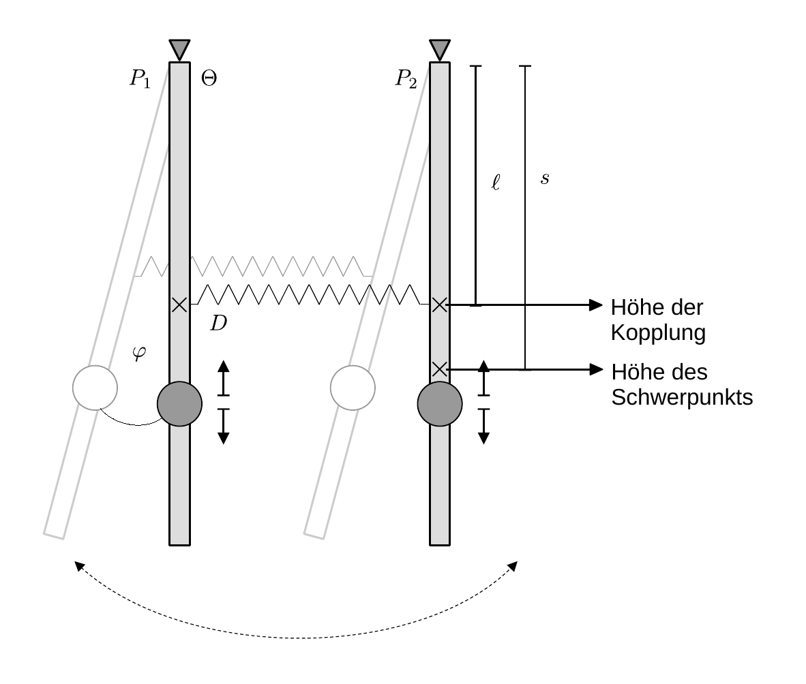

# Hinweise für den Versuch Pendel

## Aufgabe 3: Gekoppelte Pendel

### Bewegungsgleichungen gekoppelter Pendel

Für diesen Versuch verwenden Sie zwei Pendel $P_{1}$ und $P_{2}$, die durch eine [Schraubenfeder](https://de.wikipedia.org/wiki/Feder_(Technik)) mit dem Direktionsmoment $D$ auf Höhe $\ell$ miteinander gekoppelt sind, wie in **Skizze 2** dargestellt: 

**Skizze 2** (Schematische Skizze zweier gekoppelter Pendel $P_{1}$ und $P_{2}$)

---

Zur Vereinfachung der Diskussion gehen wir davon aus, dass beide Pendel das gleiche Trägheitsmoment $\Theta$ besitzen und vernachlässigen Dämpfungseffekte. Die Auslenkung jedes einzelnen Pendels sei $\varphi_{1/2}$. Für die Bewegung jeweils eines der Pendel gilt die Bewegungsgleichung: 

$$
\begin{equation*}
\Theta\,\ddot{\varphi}_{i} + mgs\,\varphi_{i} =0\qquad i=1,2.
\end{equation*}
$$

Hinzu kommt ein Drehmoment $M_{1/2}$ aufgrund der Kopplung durch die Feder, für das in der Kleinwinkelnäherung der folgende Zusammenhang gilt:
$$
\begin{equation*}
\begin{split}
&M_{1} = -k\ell^{2}\left(\varphi_{1}-\varphi_{2}\right);\\
&\\
&M_{2} = -k\ell^{2}\left(\varphi_{2}-\varphi_{1}\right).\\
\end{split}
\end{equation*}
$$
Hieraus folgen die Bewegungsgleichungen der beiden [gekoppelten Pendel](https://de.wikipedia.org/wiki/Gekoppelte_Pendel): 
$$
\begin{equation}
\begin{split}
&\Theta\,\ddot{\varphi}_{1} + mgs\,\varphi_{1} - k\ell^{2}\left(\varphi_{2}-\varphi_{1}\right) = 0;\\
&\\
&\Theta\,\ddot{\varphi}_{2} + mgs\,\varphi_{2} + k\ell^{2}\left(\varphi_{2}-\varphi_{1}\right) = 0\\
\end{split}
\end{equation}
$$
Das Gleichungssystem **(1)** ist gekoppelt, weil $\varphi_{1}$ in der Bewegungsgleichung zu $\varphi_{2}$ vorkommt und umgekehrt. Mit dem Lösungsansatz harmonischer Schwingungen:
$$
\begin{equation*}
\varphi_{i} = \Phi_{i}\sin(\omega t+\phi)\qquad i=1,2
\end{equation*}
$$
ergibt sich ein sekundäres Gleichungssystem für $\omega$, das in Matrixschreibweise die folgende Form annimmt: 
$$
\begin{equation}
\begin{split}
&\underbrace{
\left(
\begin{array}{cc}
\left(\frac{mgs}{\Theta} + \frac{k\ell^{2}}{\Theta}\right) -\omega^{2} & -\frac{k\,\ell^{2}}{\Theta} \\ 
-\frac{k\,\ell^{2}}{\Theta} &\left(\frac{mgs}{\Theta} + \frac{k\ell^{2}}{\Theta}\right) -\omega^{2} \\ 
\end{array}
\right)}
\left(\begin{array}{c}
\Phi_{1} \vphantom{\left(\frac{mgs}{\Theta} + \frac{k\ell^{2}}{\Theta}\right)} \\ 
\Phi_{2} \vphantom{\left(\frac{mgs}{\Theta} + \frac{k\ell^{2}}{\Theta}\right)}\\
\end{array}
\right) = 
\left(\begin{array}{c}
0 \vphantom{\left(\frac{mgs}{\Theta} + \frac{k\ell^{2}}{\Theta}\right)} \\ 
0 \vphantom{\left(\frac{mgs}{\Theta} + \frac{k\ell^{2}}{\Theta}\right)}\\
\end{array}
\right).\\
&\hphantom{\left(\frac{mgs}{\Theta} + \frac{k\ell^{2}}{\Theta}\right) +\,}\equiv B\\
\end{split}
\end{equation}
$$
Gleichung **(2)** entspricht einem Eigenwertproblem, dessen Lösung sich auf die Lösung des [charakteristischen Polynoms](https://de.wikipedia.org/wiki/Charakteristisches_Polynom) zurückführen lässt, dass Sie aus der linearen Algebra kennen. Die Lösungen des charakteristischen Polynoms entsprechen den [Eigenmoden](https://de.wikipedia.org/wiki/Eigenmode) der Anordnung, die in diesem Fall auch als **Fundamentalschwingungen** bezeichnet werden. 

Man erhält das charakteristische Polynom aus 
$$
\begin{equation*}
\det\left(B\right)=0,
\end{equation*}
$$
mit den Lösungen
$$
\begin{equation*}
\omega_{1}^{2} = \frac{mgs}{\Theta},\qquad
\omega_{2}^{2} = \frac{mgs}{\Theta}+2\frac{k\,\ell^{2}}{\Theta}.
\end{equation*}
$$
Die Eigenvektoren zu diesen Eigenwerten sind:
$$
\begin{equation*}
\hat{v}_{1} = 
\left(\begin{array}{c}
\hphantom{-}1\hphantom{-} \\ 
\hphantom{-}1\hphantom{-} \\
\end{array}
\right);\qquad
\hat{v}_{2} = 
\left(\begin{array}{c}
\hphantom{-}1\hphantom{-} \\ 
-1\hphantom{-} \\
\end{array}
\right).
\end{equation*}
$$
### Lösungen der Bewegungsgleichungen

Die physikalische Interpretation der Lösung von Gleichung **(2)** ist intuitiv: 

- Im Fall der **Fundamentalschwingung mit $\boldsymbol{\omega_{1}}$** schwingen beide Pendel "in Phase", die koppelnde Schraubenfeder bleibt entspannt und das Direktionsmoment für beide Pendel enspricht effektiv $D_{\omega_{1}}=mgs$, so als wären $P_{1}$ und $P_{2}$ nicht gekoppelt. 
- Im Fall der **Fundamentalschwingung mit $\boldsymbol{\omega_{2}}$** schwingen beide Pendel "gegenphasig", die koppelnde Feder bewirkt zusätzlich zum Schwerefeld $g$ ein maximales Hook'sches Direktionsmoment, das nach dem dritten Newtonschen Axiom ("actio gleich reactio") die Form $D_{\omega_{2}}=2\,k\,\ell^{2}$ hat.

Die allgemeine Lösung ist eine Superposition aus beiden [Eigenmoden](https://de.wikipedia.org/wiki/Eigenmode):
$$
\begin{equation}
\vec{\varphi}(t) = A_{1} \left(\begin{array}{c}
\hphantom{-}1\hphantom{-} \\ 
\hphantom{-}1\hphantom{-} \\
\end{array}
\right)
\sin(\omega_{1}t+\phi_{1}) + 
A_{2} \left(\begin{array}{c}
\hphantom{-}1\hphantom{-} \\ 
-1\hphantom{-} \\
\end{array}
\right)
\sin(\omega_{2}t+\phi_{2}).
\end{equation}
$$
Anschaulich beschreibt diese allgemeine Lösung eine [Schwebung](https://de.wikipedia.org/wiki/Schwebung) mit der Frequenz 
$$
\begin{equation}
\overline{\omega} = \frac{1}{2}(\omega_{1}+\omega_{2})
\end{equation}
$$
und einer Amplitudenmodulation mit der Frequenz
$$
\begin{equation}
\widetilde{\omega} = \frac{1}{2}(\omega_{2}-\omega_{1}).
\end{equation}
$$
Dieser Verlauf ergibt sich aus einer geeigneten Anwendung der [trigonometrischen Additionstheoreme](https://de.wikipedia.org/wiki/Formelsammlung_Trigonometrie#Summen_zweier_trigonometrischer_Funktionen_(Identit%C3%A4ten)) auf Gleichung **(3)**. $A_{1/2}$ und $\phi_{1/2}$ sind durch die Randwerte des Problems festgelegt. Wenn Sie z.B. zum Zeitpunkt $t=0$ $P_{1}$ in seiner Ruhelage festhalten und $P_{2}$ auslenken, wird die Schwingung mit der Zeit von $P_{2}$ nach $P_{1}$ übergehen, bis $P_{2}$ zum Stillstand kommt! Daraufhin wird die Schwingung mit $\overline{\omega}$ periodisch mit der Frequenz $\widetilde{\omega}$ zwischen $P_{1}$ und $P_{2}$ hin und her wandern.   

### Trägheitsmoment eines einzelnen Pendels

Das Trägheitsmoment $\Theta_{P}$ eines einzelnen Pendels können Sie mit Hilfe des Satzes von Steiner, dem Trägheitsmoment $\Theta_{S}$ einer (um ihren Schwerpunkt rotierenden) Scheibe und dem Trägheitsmoment $\Theta_{\mathrm{Stab}}$ eines (um ein Ende rotierenden) dünnen Stabs abschätzen:
$$
\begin{equation*}
\begin{split}
&\Theta_{S} = \frac{1}{2}m_{S}\,r^{2}; \qquad
\Theta_{\mathrm{Stab}}=\frac{1}{3}m_{\mathrm{Stab}}\,L_{\mathrm{Stab}}^{2}\\
&\\
&\Theta_{P} = \Theta_{\mathrm{Stab}}+\Theta_{S}+m_{S}\,L^{2}+m_{\kappa}\ell^{2},
\end{split}
\end{equation*}
$$
wobei $m_{S}$ der Masse der Scheibe, $L$ dem Abstand zwischen Aufhängung und dem Schwerpunkt der Scheibe, $r$ dem Radius der Scheide, $m_{\mathrm{Stab}}$ und $L_{\mathrm{Stab}}$ der Masse und der Länge des Pendelstabs, $m_{\kappa}$ der Masse der Kopplung zur Befestigung der koppelnden Feder und $\ell$ dem Abstand zwischen Kopplung und Aufhängung entsprechen. Bei einer solchen Abschätzung vernachlässigen Sie die Ausdehnung der Kopplung. 

#  Navigation

[Main](https://git.scc.kit.edu/etp-lehre/p1-for-students/-/tree/main/Pendel) | [Weiter](https://git.scc.kit.edu/etp-lehre/p1-for-students/-/tree/main/Pendel/doc/Hinweise-Aufgabe-3-a.md)
