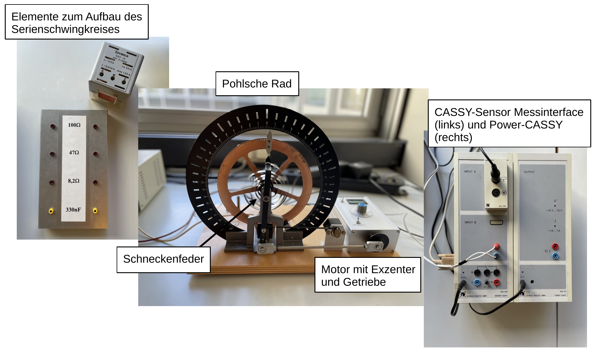

# Fakultät für Physik

## Physikalisches Praktikum P1 für Studierende der Physik

Versuch P1-12, 22 (Stand: September 2023)

[Raum F1-17](http://www-ekp.physik.uni-karlsruhe.de/~simonis/praktikum/layoutobjekte/Lageplan_P1.png)

# Resonanz

## Motivation

Überall, wo der Auslenkung eines (trägen) Objekts aus seiner Ruhelage ein "zurücktreibendes Moment" entgegenwirkt, kommt es zu [Schwingungen](https://de.wikipedia.org/wiki/Schwingung). In der uns umgebenden Natur sind Schwingungen allgegenwärtig. Sie treten als universelles Phänomen auf, dessen mathematische Beschreibung, egal ob in der Mechanik, Elektrodynamik, Thermodynamik, Biologie oder Regeltechnik, immer den gleichen Gesetzen folgt. Ist das "zurücktreibende Moment" linear proportional zur Auslenkung, dann ist die resultierende [Schwingungsgleichung](https://de.wikipedia.org/wiki/Harmonischer_Oszillator) geschlossen-analytisch lösbar. Aus der Vorlesung kennen Sie die kanonischen Fälle der linear gedämpften und ungedämpften harmonischen Schwingungen, sowie der äußerlich angeregten (linear gedämpften) Schwingung. Jedes schwingende System schwingt mit seiner Eigenfrequenz $\omega_{0}$ (Eigenschwingung), die durch die Größen von Trägheit und "zurücktreibendem Moment" vorgegeben ist. Bei äußerlich angeregten Schwingungen kommt es zum Phänomen der [Resonanz](https://de.wikipedia.org/wiki/Resonanz), falls die anregende Frequenz $\Omega$ mit $\omega_{0}$ zusammenfällt. 

Der Begriff Resonanz leitet sich vom lateinischen Wort *resonare* widerhallen ab. Er stammt aus der [Akustik](https://de.wikipedia.org/wiki/Akustik), wo er das merkliche Mitschwingen von Saiten bei Tönen geeigneter Tonhöhe bezeichnet. Erstmals wurden Resonanzphänomene durch [Galileio Galilei](https://de.wikipedia.org/wiki/Galileo_Galilei) in seinen Untersuchungen zu Pendeln (1602) und Saiten (1638) beschrieben. Die erste mathematische Formulierung der Wellengleichung (ohne Dämpfung) ist 1739 durch [Leonhard Euler](https://de.wikipedia.org/wiki/Leonhard_Euler) dokumentiert. Eulers Lösungen, sowohl der homogenen, als auch der inhomogenen Schwingungsgleichung enthielten bereits die Überlagerung der anregenden Schwingung (mit $\Omega$) mit der Eigenschwingung (mit $\omega_{0}$) und das Phänomen der unendlich anwachsenden Amplitude im Fall der Resonanz ([Resonanzkatastrophe](https://de.wikipedia.org/wiki/Resonanzkatastrophe)). Euler selbst betrachtete dieses Ergebnis in einem Brief an [Johann Bernoulli](https://de.wikipedia.org/wiki/Johann_II_Bernoulli), als „wunderliche“ theoretische Voraussage seiner Rechnung. Diese Anekdote demonstriert die große Vorhersagekraft mathematischer Modelle, die oft über die Vorstellungskraft der Protagonisten ihrer Zeit hinausgeht.  

Mit diesem Versuch haben Sie die Möglichkeit Schwingungsphänomene aus der Mechanik starrer Körper und aus der Elektrodynamik experimentell zu untersuchen und sich intuitiv damit vertraut zu machen. 

## Lehrziele

Wir listen im Folgenden die wichtigsten **Lehrziele** auf, die wir Ihnen mit dem Versuch **Resonanz** vermitteln möchten: 

- Sie können verschiedene Eigenschaften schwingender Systeme, deren physikalisches Verhalten Sie bisher nur abstrakt aus der Vorlesung kennen, experimentell untersuchen.
- Sie können die aus der Vorlesung abgeleiteten abstrakten Differentialgleichungen und deren Lösungen mit konkreten Messungen und Beobachtungen in der Realität verbinden.
- Sie lernen den Begriff [Gütefaktor](https://de.wikipedia.org/wiki/G%C3%BCtefaktor) kennen und bekommen ein Gefühl dafür, was er für ein schwingendes System bedeutet.  
- Sie untersuchen Schwingungsphänomene am Beispiel mechanischer Drehschwingungen und können so Erfahrungen mit der Dynamik starrer Körper machen.
- Sie untersuchen nicht nur mechanische sondern auch elektrische Schwingungen und erleben so Schwingungsphänomene in zwei ganz unterschiedlichen physikalischen Zusammenhängen. Beachten Sie, dass die Differenzialgleichungen auch aus unterschiedlichen physikalischen Prinzipien abgeleitet werden.
- Die Daten werden mit einem computergestützten Datenerfassungs-System (CASSY) aufgezeichnet. Dies gibt ihnen die Möglichkeit sich in der elektronischen Weiterverarbeitung der Daten in einem Standardformat (wie z.B. *xml*) zu üben. 

## Versuchsaufbau

Dieser Versuch ist zweigeteilt. Den ersten Teil bestreiten Sie mit dem [Pohlschen Rad](https://de.wikipedia.org/wiki/Pohlsches_Rad), das Sie in freie (bzw. schwach gedämpfte) und angeregte Schwingung versetzen und ggf. mit Hilfe einer Wirbelstrombremse zusätzlich von außen dämpfen.

In einem zweiten Teil bauen Sie einen einfachen elektrischen Serienschwingkreis auf und führen daran Resonanzuntersuchungen durch. Die meisten Elemente, die Sie für beide Versuchsteile benötigen sind Bestandteile des CASSY-Systems. Eine Auflistung der für ihre Auswertung wichtigen Bauelemente und deren Eigenschaften finden Sie in der Datei [Datenblatt.md](https://git.scc.kit.edu/etp-lehre/p1-for-students/-/blob/main/Resonanz/Datenblatt.md).

## Wichtige Hinweise zum Versuch

Sie benötigen einen **USB-Stick oder sonstigen Datenträger** zur Übermittlung der aufgezeichneten Daten von CASSY auf Ihren eigenen Rechner.

# Navigation

- Eine kurze Einführung ins CASSY-Messsystem finden Sie in der Datei [Hinweise-CASSY.md](https://git.scc.kit.edu/etp-lehre/p1-for-students/-/blob/main/Resonanz/doc/Hinweise-CASSY.md).
- Wichtige Hinweise zur Vorbereitung und Durchführung von Aufgabe 1 finden Sie in der Datei [Hinweise-Aufgabe-1.md](https://git.scc.kit.edu/etp-lehre/p1-for-students/-/blob/main/Resonanz/doc/Hinweise-Aufgabe-1.md).
- Wichtige Hinweise zur Vorbereitung und Durchführung von Aufgabe 2 finden Sie in der Datei [Hinweise-Aufgabe-2.md](https://git.scc.kit.edu/etp-lehre/p1-for-students/-/blob/main/Resonanz/doc//Hinweise-Aufgabe-2.md).
- Wichtige technische Daten zum Versuch finden Sie in der Datei [Datenblatt.md](https://git.scc.kit.edu/etp-lehre/p1-for-students/-/blob/main/Resonanz/Datenblatt.md).  
