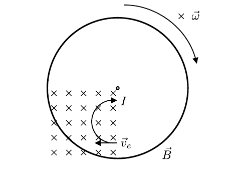

# Hinweise für den Versuch Resonanz

## Aufgabe 1: Freie Schwingung [1/2]

### Mechanische Schwingung ohne äußere Dämpfung

Überall, wo einer Bewegung entlang einer Koordinate $x$ eine [(hook'sche) Kraft](https://de.wikipedia.org/wiki/Hookesches_Gesetz) $F=-K\hspace{0.05cm}x$ entgegenwirkt kommt es zu mechanischen Schwingungen. 
$$
\begin{equation}
m\,\ddot{x}+K\,x=0.
\end{equation}
$$
Gleichung **(1)** ist eine allgemeine **Schwingungsgleichung**. Es handelt sich um eine gewöhnliche homogene Differentialgleichung 2. Ordnung in der Zeit $t$. Sie wird durch **harmonische Schwingungen** der Form
$$
\begin{equation*}
x(t) = x_{0}\cos(\omega_{0}\,t+\phi)
\end{equation*}
$$
allgemein gelöst. Mit der Amplitude $x_{0}$ und der Phase $\phi$ besitzt die Lösung zwei Freiheitsgrade. Einsetzen von $x(t)$ in Gleichung **(1)** führt auf eine Sekundärgleichung für $\omega_{0}$
$$
\begin{equation*}
\begin{split}
&\underbrace{\left(-m\,\omega_{0}^{2}+K\right)}\,x_{0}\cos(\omega_{0}\,t+\phi)=0 \\
& -m\,\omega_{0}^{2}+K=0; \\
&\\
&\omega_{0} = \sqrt{\frac{K}{m}},\\
\end{split}
\end{equation*}
$$
die notwendig erfüllt sein muss, wenn Gleichung **(1)** allgemein erfüllt sein soll. Das System schwingt also mit der Eigenfrequenz $\omega_{0}$, die durch die Werte von $m$ und $K$ vorgegeben ist.

### Pohlsches Rad

Für das [Pohlsche Rad](https://de.wikipedia.org/wiki/Pohlsches_Rad) gilt zusätzlich zur Kräftefreiheit Momentenfreiheit:
$$
\begin{equation}
\Theta\,\ddot{\varphi} + D\,\varphi = 0,
\end{equation}
$$
wobei $\varphi$ dem Drehwinkel, $\Theta$ dem [Trägheitsmoment](https://de.wikipedia.org/wiki/Tr%C3%A4gheitsmoment) (in $\mathrm{kg\hspace{0.05cm}m^{2}}$) und $D$ dem [Direktionsmoment](https://de.wikipedia.org/wiki/Direktionsmoment) (in $\mathrm{N\hspace{0.05cm}m}$) entsprechen. Für die ungedämpfte Schwingung folgt analog zu Gleichung **(1)**: 
$$
\begin{equation}
\omega_{0} = \sqrt{\frac{D}{\Theta}}
\end{equation}
$$

### Linear gedämpfte Schwingung

Ist im Fall einer gedämpften Schwingung, der Dämpfungsterm $\propto\dot{\varphi}$ (auch [Stokes'sche Reibung](https://de.wikipedia.org/wiki/Gesetz_von_Stokes) genannt), dann nimmt Gleichung **(2)** die folgende Form an: 
$$
\begin{equation}
\Theta\,\ddot{\varphi} + \delta\,\dot{\varphi} + D\,\varphi = 0.
\end{equation}
$$
Zur Lösung bietet sich der folgende Ansatz an:
$$
\begin{equation*}
\varphi(t) = \varphi_{0}\,e^{k\,t}
\end{equation*}
$$
 Einsetzen in Gleichung **(4)** führt auf die entsprechende Sekundärgleichung für $k$
$$
\begin{equation*}
\Theta\,k^{2} + \delta\,k + D = 0\\
\end{equation*}
$$
mit den allgemeinen Lösungen
$$
\begin{equation}
\begin{split}
k_{\pm} &= \frac{-\delta\pm\sqrt{\delta^{2}-4\,\Theta\,D}}{2\,\Theta} = -\underbrace{\frac{\delta}{2\,\Theta}\vphantom{\sqrt{\left(\frac{\delta}{2\,\Theta}\right)^{2}-\omega_{0}^{2}}}}\pm\sqrt{\left(\frac{\delta}{2\,\Theta}\right)^{2}-\omega_{0}^{2}}\\
&\hphantom{k_{\pm}= \frac{i\lambda\pm\sqrt{4\,\Theta\,D-\lambda^{2}}}{2\,\Theta} = } \equiv\lambda \\
&=-\lambda\pm\sqrt{\lambda^{2}-\omega_{0}^{2}}.
\end{split}
\end{equation}
$$
Man unterscheidet drei Fälle: 

$\boldsymbol{\lambda\lt\omega_{0}}$: In diesem Fall ist der Wurzelterm in Gleichung **(5)** imaginär, das System wird durch eine Schwingung mit der Frequenz $\omega=\sqrt{\omega_{0}^{2}-\lambda^{2}}$ mit einer exponentiellen Einhüllenden für die Amplitude beschrieben (schwache Dämpfung, **Schwingfall**):
$$
\begin{equation}
\begin{split}
\varphi(t) &=\varphi_{0}\,e^{-\lambda\,t}\sin(\omega\,t+\phi).
\end{split}
\end{equation}
$$
Beachten Sie, dass das System in diesem Fall nicht mehr mit der Eigenfrequenz $\omega_{0}$ sondern mit der reduzierten Eigenfrequenz $\omega$ schwingt. 

$\boldsymbol{\lambda\gt\omega_{0}}$: In diesem Fall ist der Wurzelterm in Gleichung **(5)** reell, das System ist stark gedämpft. Es kehrt mit einem exponentiellen Verlauf in seine Ruhelage zurück und schwingt nicht. Das System erreicht seine Ruhelage erst bei $t\to\infty$ (aperiodischer Fall, **Kriechfall**). 

$\boldsymbol{\lambda=\omega_{0}}$: In diesem Fall ist der Wurzelterm gleich 0. Das System verhält sich, wie im aperiodischen Fall, aber mit minimaler Dämpfung. Diesen Fall bezeichnet man als **aperiodischen Grenzfall**.  

Der aperiodische Grenzfall ist für Messinstrumente von Interesse, weil sich die Anzeige in diesem Fall am schnellsten ohne Überschwingen auf neue Messwerte einstellt. Der Kehrwert von $\lambda$ wird als [Relaxationszeit](https://de.wikipedia.org/wiki/Relaxation_(Naturwissenschaft)) bezeichnet. 

### Dämpfungsverhältnis

Das **Dämpfungsverhältnis** entspricht der relativen Abnahme der Amplitude nach Durchlaufen einer Periode $T=2\pi/\omega$ der Schwingung:
$$
\begin{equation}
\begin{split}
&\kappa =\frac{\varphi_{j}}{\varphi_{j-1}} = e^{-\lambda\,T}; \qquad
\lambda = -\frac{\ln\kappa}{T}; \\
&\\\text{mit:}\\
&\varphi_{j}(t) = \varphi(t+j\,T).\\
\end{split}
\end{equation}
$$
Die Amplitude $\varphi_{j}$ nimmt nach $n$ Perioden den Wert $\varphi_{j+n}=\varphi_{j}\kappa^{n}$ an.

Je nach Größe von $\lambda$ empfiehlt es sich in der Praxis $\kappa$ aus einem der beiden folgenden Verhältnisse und einer geeigneten Anzahl an $n$ Perioden zu bestimmen: 
$$
\begin{equation*}
\begin{split}
&\kappa = \frac{1}{n}\sum\limits_{j=1}^{n}\frac{\varphi_{j}}{\varphi_{j-1}}\qquad\text{(große Dämpfung)} \\
&\\
&\kappa = \sqrt[n]{\frac{\varphi_{0}}{\varphi_{n}}}\qquad\text{(kleine Dämpfung)} \\
\end{split}
\end{equation*}
$$

### Gütefaktor

Für den [Gütefaktor](https://de.wikipedia.org/wiki/G%C3%BCtefaktor) $Q$ sind zwei unterschiedliche Definition gebräuchlich, die für hinreichend große Werte von $Q$ näherungsweise äquivalent sind (siehe [Hinweise-Aufgabe-2.md](https://git.scc.kit.edu/etp-lehre/p1-for-students/-/blob/main/Resonanz/doc/Hinweise-Aufgabe-2.md)). Wir verwenden hier die Definition
$$
\begin{equation}
\begin{split}
&Q\equiv\frac{\omega\times\text{Gespeicherte Energie}}{\text{Verlustleistung}}\\
&\\
&\text{Gespeicherte Energie:} \\
&\\
&E_{\mathrm{kin}} = \frac{1}{2}\Theta\,\omega^{2}\\
&\\
&\text{Verlustleistung:} \\
&\\
&P_{\delta} = \frac{1}{2}\delta\,\omega^{2};\qquad \delta=2\,\lambda\,\Theta\\
&\\
&Q=\omega\,\frac{\Theta\,\omega^{2}}{2\,\lambda\,\Theta\,\omega^{2}} = \frac{\omega}{2\,\lambda}
\end{split}
\end{equation}
$$

### Wirbelstrombremse

Für den vorliegenden Versuch wird das [Pohlsche Rad](https://de.wikipedia.org/wiki/Pohlsches_Rad) durch eine [Wirbelstrombremse](https://de.wikipedia.org/wiki/Wirbelstrombremse) zusätzlich gedämpft. Dadurch kann die Dämpfung des Rades ohne direkten Kontakt, genau kontrolliert werden. 

Wird eine mit der Winkelgeschwindigkeit $\vec{\omega}$ rotierende Leiterscheibe, wie in **Skizze 1** dargestellt, von einem Magnetfeld $\vec{B}$ durchsetzt, erfahren die quasi-freien Elektronen des Leiters, als bewegte Ladungen mit der Geschwindigkeit $\vec{v}_{e}=\vec{r}_{e}\times\vec{\omega}$, eine Lorentz-Kraft $\vec{F}_{\mathrm{L}}$ senkrecht zu  $\vec{v}_{e}$ und $\vec{\omega}$.  

**Skizze 1** (Prinzip einer Wirbelstrombremse)

---

In der Praxis wird 
$$
\begin{equation*}
|\vec{B}| \propto I_{\mathrm{B}}
\end{equation*}
$$
variabel mit Hilfe einer von einem Strom $I_{\mathrm{B}}$ durchflossenen Spule erzeugt. Da $\vec{F}_{\mathrm{L}}$ immer senkrecht zu $\vec{v}_{e}$ wirkt werden die Elektronen auf eine Kreisbahn innerhalb der Leiterscheibe gelenkt (der die Bewegung der Elektronen mit der rotierenden Leiterscheibe zusätzlich zuzurechnen ist) und es kommt zu einem Kreisstrom ([Wirbelstrom](https://de.wikipedia.org/wiki/Wirbelstrom)) $I$. Die genaue Berechnung von $I$ erfordert die Lösung der [Maxwell-Geilchungen](https://de.wikipedia.org/wiki/Maxwell-Gleichungen). Über die [Lenzsche Regel](https://de.wikipedia.org/wiki/Lenzsche_Regel) lässt sich jedoch argumentieren, dass   
$$
\begin{equation*}
I\propto I_{\mathrm{B}}.
\end{equation*}
$$
Über $I$ nimmt die Leiterscheibe die elektrische Leistung 
$$
\begin{equation*}
P_{\delta}=R\,I^{2}\propto I_{\mathrm{B}}^{2}
\end{equation*}
$$
auf, die aus der Kreisbewegung der Scheibe gespeist und in Wärme umgewandelt wird. Die Kreisbewegung wird dabei gedämpft. Daraus lässt sich 
$$
\begin{equation*}
\lambda(I_{\mathrm{B}})\propto P_{\delta}\propto I_{\mathrm{B}}^{2}
\end{equation*}
$$
argumentieren.

Da $\lambda$ auch in der Berechnung von $\omega$ auftaucht sollte auch hier eine Abhängigkeit von $I_{\mathrm{B}}$ bestehen. So lange $\lambda$ dem Betrag nach klein gegen $\omega_{0}$ ist gilt jedoch
$$
\begin{equation*}
\omega = \sqrt{\omega_{0}^{2}-\lambda^{2}}\approx\omega_{0}\left(1-\frac{\lambda^{2}}{2\,\omega_{0}^{2}}\right)\approx \omega_{0}.
\end{equation*}
$$

# Navigation

[Main](https://git.scc.kit.edu/etp-lehre/p1-for-students/-/tree/main/Resonanz) | [Weiter](https://git.scc.kit.edu/etp-lehre/p1-for-students/-/blob/main/Resonanz/doc/Hinweise-Aufgabe-1-a.md)
