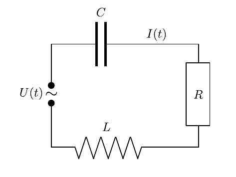

# Hinweise für den Versuch Resonanz

## Aufgabe 1: Erzwungene Schwingung

### Mechanische Schwingung

Im Fall der angeregten oder erzwungenen Schwingung wird eine Schwingung mit der Amplitude $\Phi$ und Frequenz $\Omega$ von außen vorgegeben. Gleichung (**(4)** [hier](https://git.scc.kit.edu/etp-lehre/p1-for-students/-/blob/main/Resonanz/doc/Hinweise-Aufgabe-1.md)) nimmt somit die folgende Form an: 
$$
\begin{equation}
\Theta\,\ddot{\varphi} + \delta\,\dot{\varphi} + D\,\varphi = \Phi \,e^{i\Omega\,t}.
\end{equation}
$$
Gleichung **(1)** wird durch eine Linearkombination aus der allgemeinen Lösung der homogenen Gleichung (**(4)** [hier](https://git.scc.kit.edu/etp-lehre/p1-for-students/-/blob/main/Resonanz/doc/Hinweise-Aufgabe-1.md)) und einer speziellen Lösung der inhomogenen Gleichung **(1)** gelöst. Für die spezielle Lösung liegt es nahe davon auszugehen, dass sich nach hinreichend langer Zeit eine Schwingung ebenfalls mit der Frequenz $\Omega$ einstellen wird. Wir verwenden daher einen Lösungsansatz der Form:
$$
\begin{equation*}
\varphi(t) = \tilde{\varphi}_{0}\,e^{i\Omega\,t}
\end{equation*}
$$
 Einsetzen in Gleichung **(1)** führt auf eine Sekundärgleichung aus der sich $\tilde{\varphi}_{0}$ bestimmen lässt:
$$
\begin{equation}
\begin{split}
&\left(-\Omega^{2} + i\frac{\delta\,\Omega}{\Theta} + \frac{D}{\Theta}\right)\,\tilde{\varphi}_{0} = \frac{\Phi}{\Theta};\\
&\\
&\tilde{\varphi}_{0} = \frac{\Phi/\Theta}{\left(\omega_{0}^{2}-\Omega^{2}\right) + 2i\,\lambda\,\Omega}.\\
\end{split}
\end{equation}
$$
Tatsächlich kann man also allgemein ein $\tilde{\varphi}_{0}$ finden, womit sich Gleichung **(1)** lösen lässt. Die Größe 
$$
\begin{equation*}
\tilde{\varphi}_{0} \equiv \varphi_{0}\,e^{i\phi}
\end{equation*}
$$
ist jedoch komplexwertig, d.h. zusätzlich zur Amplitude $\varphi_{0}$ stellt sich auch eine feste Phase $\phi$ relativ zur anregenden Schwingung ein. Beide lassen sich aus Gleichung **(2)** leicht bestimmen:
$$
\begin{equation}
\begin{split}
&\varphi_{0} = \frac{\Phi/\Theta}{\sqrt{\left(\omega_{0}^{2}-\Omega^{2}\right)^{2}+\left(2\,\lambda\,\Omega\right)^{2}}};
&\\
&\\
&\phi = \arctan\left(-\frac{2\,\lambda\,\Omega}{\omega_{0}^{2}-\Omega^{2}}\right).
\end{split}
\end{equation}
$$
Nach einem **Einschwingvorgang**, der sich durch die Lösung von Gleichung (**(4)** [hier](https://git.scc.kit.edu/etp-lehre/p1-for-students/-/blob/main/Resonanz/doc/Hinweise-Aufgabe-1.md)) ergibt stellt sich also eine Schwingung mit der Frequenz $\Omega$, der konstanten Amplitude $\varphi_{0}$ und der festen Phase $\phi$ relativ zur anregenden Schwingung ein. 

Wir diskutieren drei Spezialfälle:

- $\boldsymbol{\Omega\ll\omega_{0}}$: In diesem Fall gilt $\phi\to0,\hspace{0.05cm}\varphi_{0}\to\Phi/D$;
- $\boldsymbol{\Omega=\omega_{0}}$: In diesem Fall gilt $\phi=-\pi/2$, $\varphi_{0}$ ist umso größer, je kleiner $\lambda$ ist;
- $\boldsymbol{\Omega\gg\omega_{0}}$: In diesem Fall gilt $\phi\to-\pi,\hspace{0.05cm}\varphi_{0}\propto1/\omega_{0}^{2}$.

Das Maximum von $\varphi_{0}$ befindet sich nicht exakt bei $\Omega_{\mathrm{res}}=\omega_{0}$ sondern leicht unterhalb von $\omega_{0}$ bei
$$
\begin{equation*}
\Omega_{\mathrm{res}} = \sqrt{\omega_{0}^{2}-2\lambda^{2}} = \sqrt{\omega^{2}-\lambda^{2}\vphantom{\omega_{0}^{2}}}
\end{equation*}
$$
Bestimmt man die Breite $\Delta\Omega$ des Peaks der Resonanzkurve von $\varphi_{0}(\Omega)$ in den Punkten in denen $\varphi_{0}(\Omega_{\mathrm{res}})$ jeweils auf den Wert $\varphi_{0}(\Omega_{\mathrm{res}})/\sqrt{2}$ abgefallen ist, so gilt: 
$$
\begin{equation}
\Delta\Omega\approx2\lambda \approx \frac{\Omega_{\mathrm{res}}}{Q},
\end{equation}
$$
wobei $Q$ dem Gütefaktor von Gleichung (**(8)** [hier](https://git.scc.kit.edu/etp-lehre/p1-for-students/-/blob/main/Resonanz/doc/Hinweise-Aufgabe-1.md)) entspricht. Die Dämpfung $\lambda$ der Schwingung hat also Einfluss auf die Breite der Resonanzkurve. Daraus leitet sich die zweite gebräuchliche Definition von $Q$ als 

$$
\begin{equation*}
Q\equiv\left.\frac{\Delta\Omega}{\Omega}\right|_{\Omega_{\mathrm{res}}}
\end{equation*}
$$
ab. 

### Elektrische Schwingung

Für elektrische Schwingkreise bei denen eine Spule (mit Induktivität $L$), ein Kondensator (mit Kapazität $C$) und ein Widerstand $R$ in Serie geschaltet sind, wie in **Skizze 2** dargestellt

 

ergibt sich die inhomogene Schwingungsgleichung aus den [Kirchhoffschen Regeln](https://de.wikipedia.org/wiki/Kirchhoffsche_Regeln):
$$
\begin{equation*}
\begin{split}
&L\,\dot{I} + R\,I + \frac{1}{C}\int I\,\mathrm{d}t = U(t);
&\\
&\\
&L\,\ddot{I} + R\,\dot{I} + \frac{1}{C}I = \dot{U}(t)
\end{split}
\end{equation*}
$$
 Die Lösung erfolgt analog zum oben beschriebenen mechanischen Fall mit den Ersetzungen: 
$$
\begin{equation*}
\begin{split}
L\hspace{0.10cm} &\equiv \Theta \vphantom{\frac{1}{C}}\\
R\hspace{0.10cm} &\equiv \delta \vphantom{\frac{1}{C}}\\
\frac{1}{C} &\equiv D. \\
\end{split}
\end{equation*}
$$
  Daraus ergeben sich die folgenden abgeleiteten Größen: 
$$
\begin{equation*}
\begin{split}
\omega_{0} &= \sqrt{\frac{1}{L\,C}} \\
&\\
\lambda\hphantom{_{0}} &= \frac{R}{2\,L} \\
&\\
\omega\hphantom{_{0}} &=\sqrt{\omega_{0}^{2} - \lambda^{2}\vphantom{\left(\frac{R}{2\,L}\right)^{2}}} = \sqrt{\frac{1}{L\,C}-\left(\frac{R}{2\,L}\right)^{2}} \\
&\\
I_{0} &= \frac{U_{0}/L}{\sqrt{\left(\omega_{0}^{2}-\Omega^{2}\right)^{2}+\left(2\,\lambda\,\Omega\right)^{2}}} = \frac{U_{0}}{\sqrt{\left(\frac{1}{C\,\Omega}-L\,\Omega\right)^{2}+R^{2}}} = \frac{U_{0}}{Z};
&\\
&\\
\phi\hphantom{_{0}} &= \arctan\left(-\frac{2\,\lambda\,\Omega}{\omega_{0}^{2}-\Omega^{2}}\right) = \arctan\left(-\frac{\frac{1}{C\,\Omega}-L\,\Omega}{R}\right),
\\
\end{split}
\end{equation*}
$$
wobei $Z$ der [Impedanz](https://de.wikipedia.org/wiki/Elektrische_Impedanz) der Schaltung aus **Skizze 2** entspricht. Im Resonanzfall $\Omega_{\mathrm{res}}$ gilt: 

- $Z(\Omega_{\mathrm{res}})$ ist minimal; 
- $I_{0}(\Omega_{\mathrm{res}})$ ist maximal; 
- $\phi\to0$.

### Gütefaktor

Für den Gütefaktor $Q$ gilt: 
$$
\begin{equation*}
Q = \frac{\Omega_{\mathrm{res}}}{2\,\lambda} \approx \frac{1}{R}\sqrt{\frac{L}{C}}. 
\end{equation*}
$$
Wie im mechanischen Fall auch (siehe Gleichung **(4)**), beeinflusst der Grad der Dämpfung die Breite der Resonanzkurve. Bestimmt man die Breite $\Delta\Omega$ aus den jeweiligen Stellen für $I_{0}(\Omega_{\mathrm{res}})/\sqrt{2}$ erhält man: 
$$
\Delta\Omega \approx 2\,\lambda = \frac{R}{L}.
$$
Den Kehrwert von $Q$ bezeichnet man auch als [Verlustfaktor](https://de.wikipedia.org/wiki/Verlustfaktor) des Schwingkreises. Je geringer die Dämpfung, desto größer ist $Q$ und desto schmaler ist die Resonanzkurve. 

### Spannungsüberhöhung

Für die Spannungen an Kondensator und Spule gilt: 
$$
\begin{equation*}
\begin{split}
&|U_{L}(\omega_{0})| = |L\,\dot{I}| = \omega_{0}\frac{L}{R}U_{0} = Q\,U_{0} \\
&\\
&|U_{C}(\omega_{0})| = \left|L\,\int I\,\mathrm{d}t\right| = \frac{1}{\omega_{0}\,C\,R}\,U_{0} = Q\,U_{0}. \\
\end{split}
\end{equation*}
$$
Da im Schwingkreis $Q\gg1$ sein kann, können $|U_{L}|$ und $|U_{C}|$ die Amplitude der Erregerspannung $U_{0}$ deutlich übersteigen. Man spricht in diesem Fall von einer [Spannungsüberhöhung](https://de.wikipedia.org/wiki/Spannungs%C3%BCberh%C3%B6hung) im Resonanzfall. 

# Navigation

[Main](https://git.scc.kit.edu/etp-lehre/p1-for-students/-/tree/main/Resonanz) | [Weiter](https://git.scc.kit.edu/etp-lehre/p1-for-students/-/blob/main/Resonanz/doc/Hinweise-Aufgabe-2-a.md)
