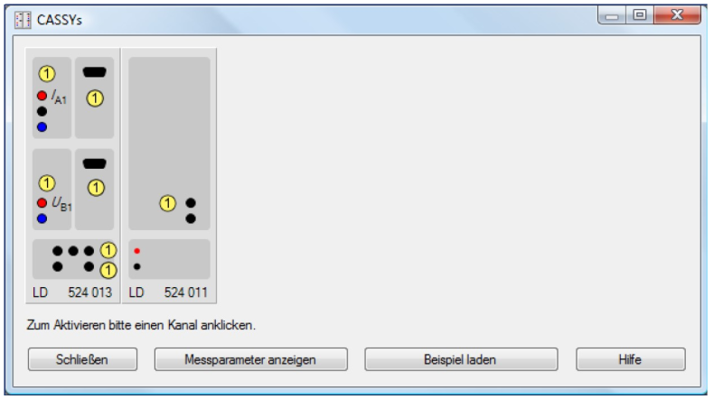
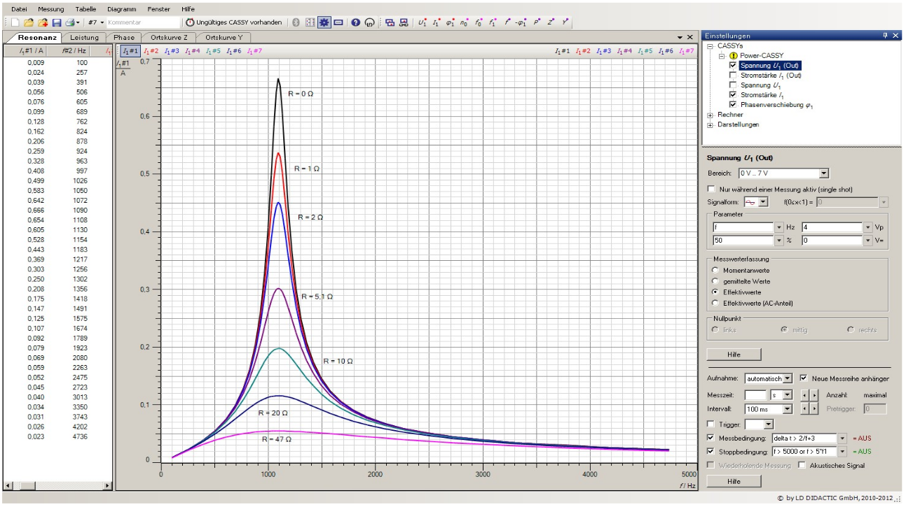

# Hinweise für den Versuch Resonanz

## Das CASSY-Messsystem

CASSY steht für **C**omputer **A**ided **S**cience **Sy**stem. CASSY stellt ein vollständiges Messsystem mit einer seriellen RS-232 (oder USB-)Schnittstelle dar. Die Steuerung erfolgt über den PC mit der CASSY-Lab-2 Software unter Windows XP.
Eine detaillierte Beschreibung dieser Software ist im umfangreichen [Handbuch](https://gitlab.kit.edu/kit/etp-lehre/p1-praktikum/students/-/tree/main/doc/CassyLab-2-Handbuch-Auszuege.pdf) zu finden. Eine Kurzfassung finden Sie [hier](https://gitlab.kit.edu/kit/etp-lehre/p1-praktikum/students/-/tree/main/doc/CassyLab-2-Handbuch-Auszuege.pdf). In der hier vorliegenden Datei fassen wir die grundlegenden und für den Versuch wichtigsten Optionen für Sie zusammen.

Das CASSY Grundmodul (Sensor-CASSY) stellt 2 Eingangskanäle zur Verfügung, die verschiedene Messgrößen erfassen können. Im Resonanzversuch mit
dem [Pohlschen Rad](https://de.wikipedia.org/wiki/Pohlsches_Rad) wird an den Kanal A eine sogenannte BMW-Box angeschlossen die es erlaubt, die Lichtschrankenimpulse der Drehpendelbewegung als Wegstrecke zu erfassen. Mit Kanal B können gleichzeitig die Spannungssignale aus dem Winkelgeber erfasst werden,
um die Bewegung des anregenden Motors aufzuzeichnen.

Nach dem Start der CASSY-Lab-2-Software (Doppelklick auf das Desktop-Symbol), erscheint das in **Abb. 1** gezeigte Dialogfenster (*CASSYs*). 



**Abb 1** (Dialogfenster *CASSYs*)

---

Es zeigt, dass die Software die CASSY-Hardware inklusive der auf Kanal A aufgesteckten BMW-Box gefunden hat. In diesem Dialogfenster können Sie die für die Messung relevanten Kanäle auswählen. Sie können alle hier vorgenommenen Einstellungen aber auch später im Unterfenster *Einstellungen* des Hauptprogramms verwalten. Sobald Sie die Eingangsgrößen gewählt und die Messbereiche festgelegt haben, können Sie dieses Fenster schließen.

Das eigentliche Programmfenster ist in **Abb. 2** gezeigt: 



**Abb 2** (Die CASSY Programm-Umgebung)

---

Dort können Sie rechts im Unterfenster *Einstellungen* die Messgrößen und deren Genauigkeit, sowie die jeweiligen Messbereiche vorgeben. Zusätzlich gibt es die für die Winkelmessung wichtige Option ```->0<-```, mit deren Hilfe der Nullpunkt der Messung festgelegt werden kann. Dies sollten Sie vor Beginn Ihrer Messungen unbedingt durchführen. Nachdem die Eingänge konfiguriert sind, können Sie den eigentlichen Messvorgang festlegen. Sie können sowohl die Anzahl der aufzuzeichnenden  Messpunkte, also auch den zeitlichen Abstand jeweils zweier Messpunkte vorgeben. Üblicherweise wird in diesem Versuch die Einstellung „automatische Aufnahme“ gewählt. Ebenfalls sollten Sie Messreihen nicht hintereinander hängen, sondern immer einzeln starten und verarbeiten. 

Die Symbole in der Werkzeugleiste sind in der CASSY-Anleitung dokumentiert. Besonders wichtig ist das **Symbol in Form einer Stoppuhr**. Es bedeutet „Messung starten“. Das Symbol in Form eines Zahnrads erlaubt es Ihnen das Unterfenster *Einstellungen* ein- und auszublenden.

Das Unterfenster *Einstellungen* besitzt drei Unterpunkte: 

- *CASSYs*, 
- *Rechner* und 
- *Darstellung*. 

Unter *CASSYs* sind, wie oben beschrieben, die Einstellungen für die Hardwareanschlüsse, sowie die Messparameter zusammengefasst. Unter
*Rechner* können Sie eigene Parameter und Formeln definieren. Ein weiterer wichtiger Unterpunkt ist hier die Definition von zeitlichen Ableitungen (achten Sie darauf, von welcher Größe die Ableitung gebildet wird). Unter dem dritten Punkt *Darstellungen* können verschiedene Darstellungen für die Messdaten
definiert werden. Mit dem Unterpunkt *Kurven* können Sie einer definierten Darstellung weitere Kurven hinzufügen.

### Wir geben im Folgenden ein Beispiel: 

Die über Eingang A gemessene Wegstrecke $s_{\mathrm{A1}}$ muss in einen Winkel (im Bogenmaß) umgerechnet werden. Dazu definieren Sie in 

```Einstellungen -> Rechner -> Formel```

eine neue Größe ($\text{Winkel} = s_{\mathrm{A1}}/0,0919$) (das ist die Messgröße geteilt durch den Radius $r_{\mathrm{Loch}}$ des Pohl’schen Rads in $\mathrm{m}$). Damit Sie Ihre selbst definierten Größen auch in den Darstellungen wiederfinden, müssen Sie die Felder *Symbol* und *Einheit* für die neue Messgröße definieren. Jede definierte Größe kann als Funktion der Zeit aufgetragen werden. Es können auch Paare von Größen in
zweidimensionalen Darstellungen gegeneinander dargestellt werden. Nutzen Sie diese Optionen, um das **Phasenraumdiagramm** (oder Phasenraumprotrait) aus Aufgabe 1.1 erzeugen. Wählen Sie hierfür z.B. für die $x$-Achse den Winkel und für die $y$-Achse die Winkelgeschwindigkeit als darzustellende Größen aus. Alle Größen, die Sie darstellen wollen müssen Sie zuerst definiert haben. Daraufhin sind im CASSY-Lab-Fenster neben dem Standarddiagramm alle möglichen Darstellungen anwählbar. Mit der Option *FFT* unter 

```Einstellungen -> Rechner``` 

erhalten Sie die Fourier-Transformierte einer Weg-Zeit-Funktion. Statt Weg
gegen Zeit werden in diesem Fall Amplituden gegen die jeweilige Frequenz aufgetragen. Diese Darstellung kann insbesondere zur Betrachtung des Einschwingvorgangs der angeregten Schwingungen nützlich sein. 

Mit einem „Rechtsklick“ auf den Achsenbereich können Sie die Skalierung von $x$ bzw. $y$ anpassen. Ein „Rechtsklick“ ins Diagrammfenster bietet Ihnen nützliche weitere Analysewerkzeuge.

### Aufbau des elektrischen Serienschwingkreises

Diesen Versuchsteil steuern Sie komplett mit dem CASSY-System an. Sie prägen einem elektrischen $RLC$-Serienschwingkreis eine sinusförmige Spannung $U(t)$ mit konstanter Amplitude und Frequenz $\Omega$ auf. Dabei stellt sich nach einer Einschwingphase im Schwingkreis eine Schwingung ebenfalls mit der Frequenz $\Omega$ ein. Eine Spule (mit $L=44\hspace{0.05cm}\mathrm{mH}$), ein Kondensator (mit $C=0,33\hspace{0.05cm}\mathrm{\mu F}$) und drei verschiedene ohmsche Widerstände ($8,2\hspace{0.05cm}\Omega$; $47\hspace{0.05cm}\Omega$ oder $100\hspace{0.05cm}\Omega$) stehen Ihnen hierzu zur Verfügung. Als Spannungsquelle dient das Power-CASSY Interface, das die anliegende Wechselspannung, den Gesamtstrom im Schwingkreis und die Phasenlage ausließt. Der Spannungsabfall an der Spule wird über den Eingang A, der Spannungsabfall am Kondensator über den Eingang B des Sensor-CASSY gemessen. Dazu muss die BMW-Box vom Eingang A des Sensor-CASSY entfernt werden.

#### Konfigurieren der Hardware 

Das Power-CASSY ist ein Funktionsgenerator und kann verschiedenartige Wechselspannungen mit bis zu $\pm10\hspace{0.05cm}\mathrm{V}$ Amplitude und variablen Frequenzen erzeugen. Stellen Sie im Dialogfenster *Power-CASSY* zunächst die Messwerterfassung auf *Effektivwerte* und den Stellbereich auf $0-7\hspace{0.05cm}\mathrm{V}$. Wählen Sie eine sinusförmige Wechselspannung $V_{\mathrm{P}} = 3\hspace{0.05cm}\mathrm{V}$ ein. Danach müssen Sie die Funktion ```f2``` als ersten Frequenzparameter eintragen, diese Funktion wird für die automatische Anpassung der Frequenzwerte benötigt. Wählen Sie außerdem die grün unterlegten Größen *Strom* und *Phase* ($I_{2}$ und $\phi_{2}$) per Häkchen an.
Definieren Sie daraufhin ```f2``` im Menü *Rechner*. Eine einfache Formel wäre 

```f2 = f0 + (n - 1)*20```

 mit ```f0``` als Startfrequenz. Diese Definition würde bewirken, dass die vom Power-CASSY erzeugte Frequenz sukzessive ab der Startfrequenz ```f0``` in 20 Hz-Schritten bis zum maximal vorgegebenen Frequenzwert erhöht wird. Für eine genaue Vermessung der Kurve im Bereich der Resonanz ist eine solche Wertefolgt jedoch nicht fein genug. Eine feinere Schrittweite führt andererseits zu einer längeren Messzeit. Daher bietet die Firma Leybold die Möglichkeit an eine Funktion zur schrittweisen Erhöhung von $\Omega$ zu verwenden, wobei die Schrittweite in Resonanznähe verdichtet wird. Wenn sie von dieser Möglichkeit Gebrauch machen wollen müssen Sie die folgenden Größen neu definieren:

##### Die Parameter (als Symbol):

- Anzahl der Messwerte: ```n0 = 25```
- Frequenz: ```f0 = 10 Hz``` (Startfrequenz)
- Frequenz: ```f1 = fres``` (erwartete Resonanzfrequenz; diese müssen Sie im Vorfeld aus $L$ und $C$ berechnen)

##### Die Formel:

- Symbol: ```f2```
- Frequenz: ```f2 f0 + (t <> 0 and n <> 1)*(f1 - f0)*(1 + sgn(last n - n0)*(10 ^ (abs(last n - n0)/n0) - 1)/9)```
- Einheit : ```Hz von : 0 Hz bis : 5000 Hz```
- Dezimalstellen : ```0```

Zusätzlich muss eine Messbedingung eingeführt werden, die eine Messwertaufnahme bis $3\hspace{0.05cm}\mathrm{kHz}$ (oder der 5-fachen Resonanzfrequenz) begrenzt, und den nächsten Messpunkt frühestens nach ```2/f2 + 2 s``` nach einer Frequenzerhöhung (Einschwingzeit) aufnimmt:

```f2 < 5*f1 and f2 < 3000 and delta t > 2/f2 + 2```

**Achtung:** Es werden nur dann Effektivwerte von den Messgeräten gemessen, wenn die Intervallzeit auf $100\hspace{0.05cm}\mathrm{ms}$ gesetzt wird.

Durch die Wahl der Frequenz ```f2``` im Power-CASSY wird automatisch die Schrittweite, gemäß den Vorgaben für die Anzahl ```n0```, die Startfrequenz ```f0``` und die ungefähre Resonanzfrequenz ```f1``` angepasst. Um ```f2 = fres``` herum werden die Werte dichter gesetzt als sonst. 

Es empfiehlt sich, wegen der Übersichtlichkeit unter *Darstellungen* geeignete Diagramme zu definieren z.B. *Resonanzkurve I2*, *Impedanz Z gegen f2*, oder *Resonanzüberhöhung UA1, UB1, U2 gegen f2*.

### Optionale Rohdatenanalyse:

Bei CASSY handelt es sich um ein Messsystem für den erweiterten Schul- und Lehrbetrieb, das in seiner Handhabe bereits relativ kompliziert, in seinen Möglichkeiten im Vergleich dazu jedoch eingeschränkt ist. In Physiklabors kommt dieses System nicht zum Einsatz. Es gibt die Möglichkeit die Rohdaten aus dem CASSY-System frei zu analysieren. Wir empfehlen Ihnen dieses Vorgehen z.B. für eine vernünftige Analyse der Daten mit den Programm-Paketen *kafe2* oder *PhyPraKit*. 

CASSY erlaubt hierzu den Export der aufgezeichneten Daten im *xml*-Format. Die entsprechenden Dateien (mit der unorthodoxen Endung *.labx*) können Sie mit der Funktion ```readCassy``` in [PhyPraKit](https://etpwww.etp.kit.edu/~quast/PhyPraKit/htmldoc/) als python-Arrays einlesen. Sie können die Daten daraufhin selbst mit Hilfe von *matplotlib* grafisch darstellen und mit Funktionen aus den *PhyPraKit* Paket auswerten (s. Beispiel-Datei *readCassy.py*). Ein vollständigeres Beispiel zur Illustration verschiedener Möglichkeiten zur Signalauswertung und die generelle Vorgehensweise finden Sie mit dem Script *Beispiel_Drehpendel.py*. Daraus können Sie die folgenden Funktionalitäten herauslesen:

- Einlesen der Daten im *.labx*-Format

- Säubern der Daten durch verschiedene Filterfunktionen:

  - *Offset*-Korrektur,

  - Glättung durch gleitenden Mittelwert,

  - Zusammenfassung benachbarter Datenpunkte durch Mittelwertbildung,

  - Fourier-Transformation des Signals,
  - Suche nach Extrema ('peaks' und 'dips') Anpassung von Funktionen an Einhüllende der Maxima und Minima,
  - Interpolation durch [Spline-Funktionen](https://de.wikipedia.org/wiki/Spline-Interpolation#:~:text=Bei%20der%20Spline-Interpolation%20versucht,Polynome%20niedrigen%20Grades%20zu%20interpolieren.),
  - Numerische Ableitung und Ableitung der Spline-Funktionen,
  - Phasenraum-Darstellung (aufgezeichnete Amplitude gegen deren Ableitung nach der Zeit).

Wie Sie sehen können Sie aus diesem Beispiel alle Funktionen herauslesen, die Ihnen das CASSY-System zur Verfügung stellt. Gleichzeitig können Sie frei über die aufgezeichneten Rohdaten verfügen und diese mit python und anderen Programm-Paketen und Bibliotheken, die Ihnen in der Zwischenzeit vertraut sein sollten frei analysieren. 

# Navigation

[Main](https://gitlab.kit.edu/kit/etp-lehre/p1-praktikum/students/-/tree/main/Resonanz)
