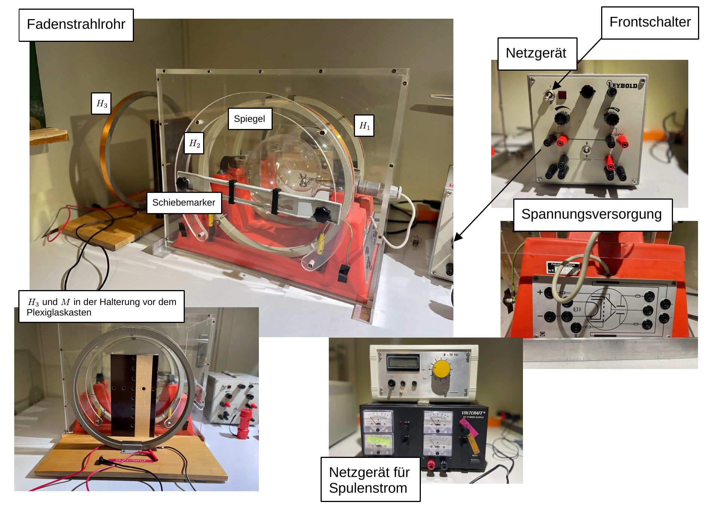
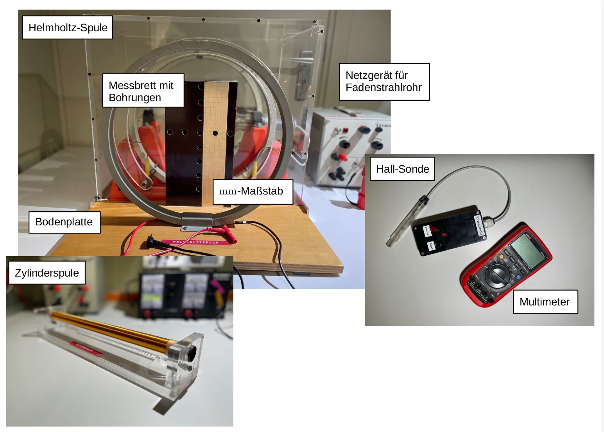
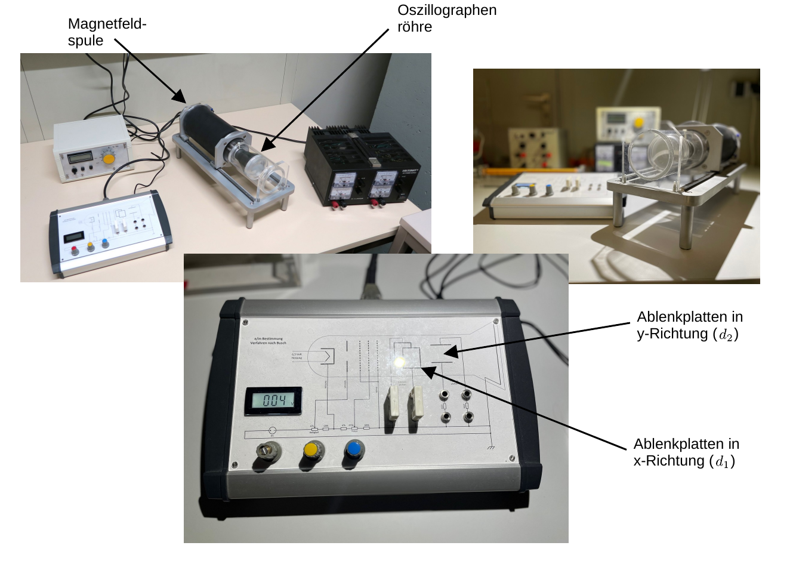

# Fakultät für Physik

## Physikalisches Praktikum P1 für Studierende der Physik

Versuch P1-71, 72, 73 (Stand: Oktober 2023)

[Raum F1-14](http://www-ekp.physik.uni-karlsruhe.de/~simonis/praktikum/layoutobjekte/Lageplan_P1.png)

# Spezifische Ladung des Elektrons

## Motivation

Das [Elektron](https://de.wikipedia.org/wiki/Elektron) wurde 1897 von [Joseph John Thomson](https://de.wikipedia.org/wiki/Joseph_John_Thomson) bei der systematischen Untersuchung der damals sogenannten [Kathodenstrahlen](https://de.wikipedia.org/wiki/Elektronenstrahl) entdeckt. Solche Untersuchungen wurden mit Apparaturen wie dem in diesem Versuch vorgestellten [Fadenstrahlrohr](https://de.wikipedia.org/wiki/Fadenstrahlrohr) durchgeführt. Damals wusste man nichts über die Existenz des Elektrons und hatte so gut wie keine Vorstellung über den elementaren Aufbau der Materie. Die Erkenntnis, dass es sich bei den Kathodenstrahlen um Teilchenstrahlen handelt und die Eigenschaften dieser Teilchen wurden der Natur in diesen Jahren Schritt für Schritt abgerungen. 

Heute kennen wir die Eigenschaften des Elektrons sehr genau. Wir wissen, dass die [Elementarladung](https://de.wikipedia.org/wiki/Elementarladung) $e=1,6\times10^{-19}\,\mathrm{C}$ in der Natur quantisiert auftritt. Die Masse des Elektrons von etwa $m_{\mathrm{e}}=511\,\mathrm{keV/c^{2}}$ ist uns bis auf die 11. Nachkommastelle bekannt. Eine kleinste Einheit der Masse, wie im Fall der Ladung, wurde bisher noch nicht beobachtet. Wir nehmen an, dass das Elektron ein punktförmiges Teilchen ohne weitere Struktur ist. Diese Annahme haben wir bisher bis auf Längenskalen von $10^{-19}\,\mathrm{m}$ getestet und bestätigt gefunden. 

Mit diesem Versuch lernen Sie die Methoden kennen, mit denen man vor über 100 Jahren das Tor in die Welt der kleinsten bekannten Bausteine der Materie aufgetan hat. Gleichzeitig bieten Ihnen die sichtbar gemachten Bahnen der Elektronenstrahlen die Möglichkeit die Bewegungen von Ladungen in elektrischen und magnetischen Feldern im Experiment zu beobachten. Das Prinzip die Spuren geladener Teilchen (für unsere Augen) sichtbar zu machen liegt allen Experimenten der modernen Elementarteilchenphysik bis zum heutigen Tag zugrunde. Das gleiche gilt für das, was wir über die Bewegung geladener Spuren in Magnetfeldern wissen. 

## Lehrziele

Wir listen im Folgenden die wichtigsten **Lehrziele** auf, die wir Ihnen mit dem Versuch **Spezifische Ladung des Elektrons** vermitteln möchten: 

- Sie üben sich im sicheren Umgang mit hohen Spannungen und Strömen. 
- Sie beobachten die sichtbaren Bahnen von Elektronenstrahlen in elektrischen und magnetischen Feldern und überprüfen einfache Gesetzmäßigkeiten der Elektrostatik.
- Sie nutzen das Magnetfeld einer langen Spule zu Kalibrationszwecken.
- Sie lernen die besondere Bedeutung von [Helmholtz-Spulen](https://de.wikipedia.org/wiki/Helmholtz-Spule) für die Erzeugung homogener magnetischer Felder kennen. Dies ist eine wichtige Anwendung des Gesetzes von [Biot-Savart](https://de.wikipedia.org/wiki/Biot-Savart-Gesetz).
- Sie vergegenwärtigen sich die Funktionsweise der [Hall-Sonde](https://de.wikipedia.org/wiki/Hall-Sensor) und üben sich im praktischen Umgang mit Hall-Sonden zur Vermessung magnetischer Felder. 
- Sie lernen das [Fadenstrahlrohr](https://de.wikipedia.org/wiki/Fadenstrahlrohr) als historisches Instrument zur Bestimmung der [spezifischen Ladung](https://de.wikipedia.org/wiki/Spezifische_Ladung) des Elektrons $e/m_{\mathrm{e}}$ und zur Untersuchung von Kathodenstrahlen kennen. 
- Sie vergegenwärtigen sich die technische Funktionsweise der [Braunschen Röhre](https://de.wikipedia.org/wiki/Kathodenstrahlr%C3%B6hre), deren Prinzip jeder Art von Röhrenmonitoren zugrunde liegt und lernen das Verfahren von Busch zur Bestimmung von $e/m_{\mathrm{e}}$ kennen. 

## Versuchsaufbau

Der Versuchsaufbau besteht aus zwei Teilen: Dem Aufbau zum Betrieb des Fadenstrahlrohrs und dem Aufbau zur Bestimmung von $e/m_{\mathrm{e}}$ nach [Hans Busch](https://de.wikipedia.org/wiki/Hans_Busch_(Physiker)). Den Messungen mit dem Fadenstrahlrohr geht die Vermessung des Magnetfelds im Inneren eines Helmholtz-Spulenpaars voran. Eine Auflistung der einzelnen technischen Geräte zum Betrieb der jeweiligen Versuchsteile und deren Eigenschaften finden Sie in der Datei [Datenblatt.md](https://git.scc.kit.edu/etp-lehre/p1-for-students/-/blob/main/Spezifische_Ladung_des_Elektrons/Datenblatt.md). 

### Fadenstrahlrohr

In einem Plexiglaskasten befindet sich ein Fadenstrahlrohr. Dabei handelt es sich um einen teil-evakuierten, mit Wasserstoff gefüllten Glaskolben (mit einem Innendruck von $\approx 0,013\hspace{0.05cm}\mathrm{mbar}$) mit einer geeigneten Vorrichtung zur Erzeugung eines kontinuierlichen Elektronenstrahls. Die Elektronen werden aus einer Glühkathode mit indirekter Heizung abgedampft und durch eine Ringanode unter hoher Spannung beschleunigt. Ein [Wehneltzylinder](https://de.wikipedia.org/wiki/Wehneltzylinder) dient zur Fokussierung des resultierenden Elektronenstrahls. 

Die Elektronen des Strahls stoßen auf ihrer Bahn durch den Kolben zufällig mit Molekülen des Wasserstoffs, die so zu sichtbarem Leuchten angeregt werden. Auf diese Weise kann die Bahn des Elektronenstrahls sichtbar gemacht werden. Der Kolben befindet sich zentral zwischen zwei Helmholtz-Spulen, die im Folgenden auch mit $H_{1}$ (hintere Spule in Blickrichtung in der oberen Abbildung) und $H_{2}$ (vordere Spule in Blickrichtung in der oberen Abbildung) bezeichnet werden. 

### Magnetfeld im Inneren des Fadenstrahlrohrs

Zur Vermessung des Magnetfelds im Inneren des Helmholtz-Spulenpaars dient Ihnen eine dritte Helmholtz-Spule $H_{3}$, die Sie symmetrisch zum im Fadenstrahlrohr verbauten Spulenpaar positionieren können. Mit Hilfe eines Holzbretts $M$ mit Milimeter-Skala und einer [Hall-Sonde](https://de.wikipedia.org/wiki/Hall-Effekt) können Sie das Magnetfeld innerhalb des Spulenpaars ausmessen. Zur Kalibration der Hall-Sonde dient das bekannte Mangetfeld einer langen Zylinderspule.  

### Oszillographenröhre für das Verfahren von Busch 

In einem Plexiglaszylinder befindet sich eine Oszillographenröhre, die zwei Paare von Kondensator-(Deflektor-)platten zur Ablenkung des Elektronenstrahls in $x$- und $y$-Richtung besitzt. Der Plexiglaszylinder befindet sich im Magnetfeld $\vec{B}$ einer Spule. Zu Anschauungszwecken lässt sich diese Spule zurück schieben, so dass die darin befindliche Oszillographenröhre sichtbar wird. Die Anordnung wird so betrieben, dass $\vec{B}$ **parallel** zum elektrischen Feld $\vec{E}_{z}$ der Beschleunigungsspannung $U_{z}$ für die Elektronen in der Röhre ausgerichtet ist. Ohne zusätzliche Beschleunigung senkrecht zu $\vec{z}$ erfahren die Elektronen durch $\vec{B}$ keine Ablenkung und der Elektronenstrahl erscheint als Signal in einem Punkt auf dem Schirm $S$. Liegt an den Deflektorplatten eine Spannung $U_{x}$ oder $U_{y}$ zur Ablenkung des Elektronenstahls senkrecht zur $z$-Achse an, bilden die Elektronen spiralförmige Trajektorien aus, die bei festen Werten von $U_{z}$ und $B=|\vec{B}|$ abhängig von der Position des Schirms entweder wieder als Punkt, oder als Strich auf dem Schirm abgebildet werden. 

## Anmerkungen zum Versuch

- **Für diese Versuche werden gefährliche elektrische Spannungen verwendet!** Während des Aufbaus und während aller Veränderungen an den Schaltungen dürfen daher *keine* Geräte eingeschaltet sein. Bei jeder neuen Schaltung ist das erste Einschalten **nur nach Kontrolle durch den Betreuer** erlaubt. 

- **Sie haben nicht nur mit hohen elektrischen Spannungen sondern auch mit u.U. hohen magnetischen Feldern zu tun.** Stromdurchflossene Leiter haben induktive Impedanzen. Schalten Sie die Stromversorgung der Magnetspulen nicht plötzlich aus, sondern regeln Sie diese bei den Ein- ober Ausschaltvorgängen nach oben oder unten bevor Sie die Netzgeräte ein- oder ausschalten.  

- Vermeiden Sie, bei der Bestimmung von $e/m_{\mathrm{e}}$ nach dem Verfahren von Busch, hohe Leuchtdichten an der Oszillographenröhre, damit der Schirm nicht einbrennt. Der mechanische Aufbau im Innern einer Oszillographenröhre ist nicht so perfekt, dass der Strahl die Schirmmitte treffen muss. Es handelt sich dabei nicht um einen Fehler am Gerät.

- Sie können wahlweise das erste Paar von Deflektorplatten der Oszillographenröhre (im Abstand $d_1$ zu $S$) oder das zweite Paar (im Abstand $d_2$ zu $S$) für Ihre Messung verwenden.

- Einen gelungen *virtuellen* Aufbau zur Bestimmung der spezifischen Ladung des Elektrons mit Hilfe des Fadenstrahlrohrs können Sie unter der Webseite [virtuelle-experimente.de](https://virtuelle-experimente.de/b-feld/e-m-bestimmung/edurchm.php) im Internet finden.  

## Aufgabe 1: Bestimmung der spezifischen Ladung des Elektrons mit dem Fadenstrahlrohr

### Aufgabe 1.1: Vermessung des Magnetfelds im Inneren eines [Helmholtz-Spulenpaars](https://de.wikipedia.org/wiki/Helmholtz-Spule)

Bauen Sie vor dem Plexiglaskasten des Fadenstrahlrohrs die zusätzliche Helmholtzspule $H_{3}$ und die Messplatte $M$ so auf, dass sich $M$ in der Mittelebene zwischen $H_{2}$ und $H_{3}$ befindet. Dies ist i.a. durch die feste Konstruktion bereits der Fall. Achten Sie auf den Abstand zwischen $H_{2}$ und $H_{3}$, der dem Radius der Spulen entsprechend sollte. Die Anordnung gleicht somit der Anordnung von $H_{1}$ und $H_{2}$, in der sich das Fadenstrahlrohr befindet. An einigen vorgesehenen Stellen besitzt $M$ Bohrungen in denen Sie die Hall-Sonde befestigen können. Messen Sie $U_{\mathrm{H}}$ an den vorgesehenen Stellen für die Spulenströme $1,0$, $1,5$ und $2,0\,\mathrm{A}$. Beachten Sie hierzu Anmerkung 1.1.

### Aufgabe 1.2: Kalibration der Hall-Sonde

Das Magnetfeld einer langen Spule lässt sich mit Hilfe des [Ampèreschen Gesetzes](https://de.wikipedia.org/wiki/Amp%C3%A8resches_Gesetz#Magnetfeld_der_Spule) leicht berechnen: 
$$
B_{0}(I, N, \ell) = \mu_{0}\,\frac{N\,I}{\ell},
$$
wobei $\mu_{0}$ der [magnetischen Feldkonstanten](https://de.wikipedia.org/wiki/Magnetische_Feldkonstante), $I$ dem Strom durch die Spule, $N$ der Anzahl der Windungen und $\ell$ der Länge der Spule entsprechen. 

Kalibrieren Sie die Hall-Sonde mit Hilfe von Gleichung (1). Messen Sie hierzu etwa 10 Wertepaare aus $U_{\mathrm{H}}$ und $I$ und bestimmen Sie daraus eine Eichgerade $B(U_{\mathrm{H}})$. Mit Hilfe dieser Eichgeraden können Sie die in Aufgabe 1.1 bestimmten Werte von $U_{\mathrm{H}}$ in magnetische Feldstärken $B(U_{\mathrm{H}})$ übersetzen. Die Kalibration erfolgt nach der eigentlichen Ausmessung des Magnetfeldes mit der Hall-Sonde, damit Sie wissen, welcher Wertebereich von $U_{\mathrm{H}}$ für die Kalibration von Relevanz ist.  

### Aufgabe 1.3: Vergleich der gemessenen Werte mit der Erwartung 

Unter der Bedingung, das der Abstand zwischen $H_{2}$ und $H_{3}$ dem Radius $R$ der Spulen entspricht ist davon auszugehen, dass die [Stärke des Magnetfelds $B(r)$ auf der radialen Symmetrieachse des Spulenpaares](https://de.wikipedia.org/wiki/Helmholtz-Spule#Berechnung_der_magnetischen_Flussdichte) besonders homogen ist. Dabei bezeichnet $r$ den radialen Abstand von der Symmetrieachse. In diesem Fall erwartet man nach dem Gesetz von Biot-Savart die Feldstärke

$$
B(r=0) = \frac{8}{\sqrt{125}}\,\frac{\mu_{0}\,N\,I}{R},
$$
wobei $I$ dem Strom durch das Spulenpaar, $N$ der Anzahl der Windungen pro Spule und $R$ dem Radius der Spulen entsprechen. Dieser Formel liegt die Annahme zugrunde, dass beide Spulen in allen in Gleichung (2) auftauchenden Parametern baugleich sind. Vergleichen Sie Ihren gemessenen Wert des Feldes für $r=0$ zwischen $H_{2}$ und $H_{3}$ mit dem nach Gleichung (2) erwarteten Wert. Diskutieren Sie die Homogenität von $B(r)$ für die vorliegende Spulenanordnung. 

### Aufgabe 1.4: Durchmesser der Elektronenkreisbahnen im Fadenstrahlrohr

In einem homogenen Magnetfeld der Stärke $\vec{B}$ wird der Elektronenstrahl senkrecht zu seiner Bewegungsrichtung durch die Lorentz-Kraft abgelenkt. Tritt der Strahl senkrecht zu $\vec{B}$ in das Feld gilt: 
$$
e\,B\,v = m_{\mathrm{e}}\,\frac{v_{\mathrm{e}}^{2}}{r}, \qquad \frac{e}{m_{\mathrm{e}}}= \frac{v_{\mathrm{e}}}{B\,r},
$$
wobei $v_{\mathrm{e}}$ die Geschwindigkeit der Elektronen und $r$ der Radius des Strahls sind. Aus der am Fadenstrahlrohr anliegenden Beschleunigungsspannung $U$ lässt sich $v_{\mathrm{e}}$ wie folgt bestimmen:
$$
e\,U = \frac{m\,v_{\mathrm{e}}^{2}}{2}, \qquad v_{\mathrm{e}} = \sqrt{2\,U\,\frac{e}{m_{\mathrm{e}}}}.
$$
Aus den Gleichungen (3) und (4) ergibt sich der Zusammenhang
$$
\frac{8\,U}{B^{2}} = \frac{e}{m_{\mathrm{e}}}\,\frac{1}{d^{2}},
$$
aus dem Sie $e/m_{\mathrm{e}}$ als Steigung einer Ursprungsgeraden bestimmen können. 

Messen Sie den Durchmesser $d=2\,r$ der Kreisbahn des Elektronenstrahls im Fadenstrahlrohr. Bauen Sie hierzu die Zusatzspule ab. Schließen Sie das Fadenstrahlrohr, wie in der obigen Skizze angegeben an. Benutzen Sie an den vorgesehenen Stellen die Sicherheitskabel. Gehen Sie dann wie folgt vor: 

#### Aufgabe 1.4.1

Bestimmen Sie $d$ als Funktion der Anodenspannung (z.B. mit sechs Messpunkten  $100$; $125$; $\ldots 250\,\mathrm{V}$) bei zwei Spulenströmen (z.B. $1\,\mathrm{A}$ und $2\,\mathrm{A}$).

#### Aufgabe 1.4.2

Bestimmen Sie $d$ als Funktion des Spulenstroms (z.B. mit zehn Messpunkten $1,0$; $1,2$; $\ldots 2,0\,\mathrm{A}$) bei zwei Anodenspannungen (z.B. $125\,\mathrm{V}$ und $250\,\mathrm{V}$).

Beachten Sie hierzu Anmerkung 1.2. Tragen Sie die Ergebnisse zur Kontrolle der theoretischen Abhängigkeiten zunächst in geeignete nach Aufgabe 1.4.1 und Aufgabe 1.4.2 getrennte Koordinatensysteme ein. Fassen Sie dann alle Ergebnisse in einem geeigneten Koordinatensystem zusammen und entnehmen Sie diesem den Wert von $e/m_{\mathrm{e}}$.

## Anmerkungen zu Aufgabe 1

### Anmerkung 1.1

Der angezeigte Wert von $U_{\mathrm{H}}$ hängt von der Temperatur der Hall-Sonde ab. Achten Sie daher während des Betriebs darauf, dass die Sonde nicht allzu starken Temperaturänderungen ausgesetzt ist. Lassen Sie die Sonde z.B. nicht allzu lange eingeschaltet, damit sie nicht überhitzt.

### Anmerkung 1.2

Den [Parallaxenfehler](https://de.wikipedia.org/wiki/Parallaxenfehler) bei der Bestimmung von $d$ können Sie mit Hilfe der verschiebbaren Marken vor, und des Spiegels hinter dem Fadenstrahlrohr minimieren. Achten Sie darauf, dass das Fadenstrahlrohr so in der Halterung orientiert ist, dass sich Kreisbahnen und keine Spiralen ergeben.

### Anmerkung 1.3 

Einen gelungen *virtuellen* Aufbau zur Bestimmung der spezifischen Ladung des Elektrons mit Hilfe des Fadenstrahlrohrs können Sie unter der Webseite [virtuelle-experimente.de](https://virtuelle-experimente.de/b-feld/e-m-bestimmung/edurchm.php) im Internet finden.  

#### Lösung:

*Sie können Ihre Lösung/Ihr Protokoll direkt in dieses Dokument einfügen. Wenn Sie dieses Dokument als Grundlage für ein [Jupyter notebook](https://jupyter.org/) verwenden wollen können Sie die Auswertung, Skripte und ggf. bildliche Darstellungen mit Hilfe von [python](https://www.python.org/) ebenfalls hier einfügen. Löschen Sie hierzu diesen kursiv gestellten Text aus dem Dokument.*

## Aufgabe 2: Bestimmung der spezifischen Ladung des Elektrons nach der Methode von Busch

### Aufgabe 2.1: Vorbereitung der Messung

Die Oszillographenröhre innerhalb des Plexiglaszylinders wird über das in der obigen Abbildung gezeigte, zugehörige Steuerpult mit allen notwendigen Spannungen versorgt. Die Deflektorspannung kann wahlweise mit einem der beiden Paare von Deflektorplatten verbunden werden wobei beide Platten des ungenutzten Paares mit den Kurzschlussbrücken auf Masse gelegt werden müssen. Zur Vorbereitung der Messung gehen Sie wie folgt vor:

- Stellen Sie eine niedrige Beschleunigungsspannung (von z.B. $\approx 300\,\mathrm{V}$) ein. 
- Wählen Sie bei $B=0$ die Deflektorspannung so, dass ein maximal langer Strich auf dem Schirm erscheint. 
- Stellen Sie die Intensität und den Fokus des beobachteten Signals sinnvoll ein. 
- Steigern Sie dann langsam den Magnetspulenstrom und beobachten Sie die resultierende Bildveränderung. Diskutieren Sie deren Zustandekommen. 
- Stellen Sie schließlich den Spulenstrom so ein, dass alle Elektronen den Schirm wieder in einem Signalpunkt treffen. Versuchen Sie auch einen höheren Spulenstrom einzustellen, bei dem sich der auf dem Schirm beobachtete Strich erneut zu einem Punkt zusammenzieht.

### Aufgabe 2.2: Bestimmung von $e/m_{\mathrm{e}}$ 

Messen Sie für Beschleunigungsspannungen von $U = 200\,\ldots 700\,\mathrm{V}$ (in Schritten von $50\,\mathrm{V}$) den nötigen Spulenstrom $I$, um auf dem Schirm einen Signalpunkt zu erzeugen. Gehen Sie dabei, für jeden Messpunkt, wie in Aufgabe 2.1 beschrieben vor. Tragen Sie $U$ über $I^{2}$ auf und ermitteln Sie $e/m_{\mathrm{e}}$ aus der Geradensteigung. 

## Anmerkungen zu Aufgabe 2

### Anmerkung 2.1

Beim hier verwendeten Aufbau müssen Sie den einfachen Zusammenhang für eine als *lang* angenommene Spule aus Gleichung (1), der folgenden empirischen Formel
$$
\begin{equation}
\begin{split}
B(a, I, \ell)&=B_{0}
\left(0,567\left(
\frac{a}{\sqrt{R^{2}+a^{2}}}+
\frac{\ell-a}{\sqrt{R^{2}+(\ell-a)^{2}}}
\right)\right) \\ 
&
\vphantom{
\left(0,567\left(
\frac{a}{\sqrt{R^{2}+a^{2}}}+
\frac{\ell-a}{\sqrt{R^{2}+(\ell-a)^{2}}}
\right)\right)
}
=\kappa\,I \\
\end{split}
\end{equation}
$$
gemäß modifizieren. Dabei ist $a$ der Abstand von $B$ (auf der $z$-Achse) vom Spulenende in $E$, $\ell$ die Länge und $R$ der mittlere Radius der Spule; $B_{0}$ ist aus Gleichung (1) zu entnehmen. Einen Vergleich der mit Hilfe von Gleichung (6) bestimmten, erwarteten Werte von $B$ mit einer Kalibrationsmessung, für fünf verschiedene Magnetspulenströme $I$ ist in der folgenden Abbildung gezeigt: 

Dabei entspricht der $0$-Punkt auf der $x$-Achse der Abbildung dem Eintritt des Elektronenstrahls in die Spule bei $E$ (siehe obige Abbildung); $a$ ist in $\mathrm{mm}$ und $B$ in $\mathrm{mT}$ angegeben. Die Markierungen entsprechen den Messpunkten und die gestrichelten Linien der entsprechenden Erwartung nach Gleichung (6). 

Der Zusammenhang zwischen der Geschwindigkeit der Elektronen in $z$-Richtung und der Beschleunigungsspannung an der Oszillographenröhre 
$$
v_{z} = \sqrt{2\,U\,e/m_{\mathrm{e}}}
$$
ergibt sich aus Gleichung (4). Für die Kreisbahn der Elektronen in der $xy$-Ebene ergibt sich: 
$$
\begin{equation}
\begin{split}
e/m_{\mathrm{e}}\,\langle B\rangle = \omega = 2\,\pi\frac{v_{z}}{d_{S}-d_{i}},
\end{split}
\end{equation}
$$
wobei $\omega$ der Kreisfrequenz der Bewegung, $d_{S}$ dem Abstand des Schirms und $d_{i}$ dem Abstand des Zentrums des gewählten Deflektorplattenpaars von $E$ entsprechen (siehe obige Abbildung). Beachten Sie, das $\langle B\rangle$ in Gleichung (8) dem gemittelten Magnetfeld 
$$
\langle B\rangle = \frac{1}{d_{S}-d_{i}} \int\limits_{d_{i}}^{d_{S}}B(a, I, N, \ell)\,\mathrm{d}a
$$
entspricht. Bei $\kappa$ handelt es sich um einen Geometriefaktor, der vom gewählten Deflektorplattenpaar abhängt. 

#### Lösung:

*Sie können Ihre Lösung/Ihr Protokoll direkt in dieses Dokument einfügen. Wenn Sie dieses Dokument als Grundlage für ein [Jupyter notebook](https://jupyter.org/) verwenden wollen können Sie die Auswertung, Skripte und ggf. bildliche Darstellungen mit Hilfe von [python](https://www.python.org/) ebenfalls hier einfügen. Löschen Sie hierzu diesen kursiv gestellten Text aus dem Dokument.*

