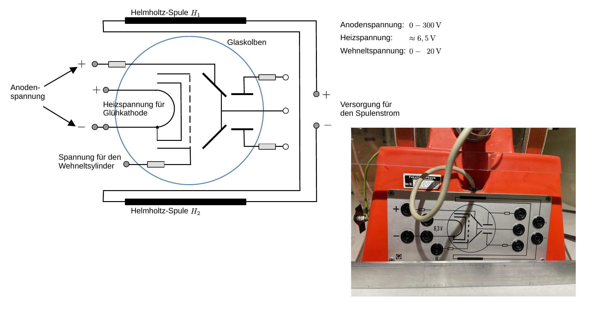

# Hinweise für den Versuch Spezifische Ladung des Elektrons

## Aufgabe 1: Fadenstrahlrohr [2/2]

### Hinweise zur Durchführung

### Aufgabe 1.1: Magnetfeld im Fadenstrahlrohr

Das Magnetfeld $\vec{B}$ des Fadenstrahlrohrs wird durch zwei im Plexiglaskasten verbaute stromdurchflossene [Helmholtz-Spulen](https://de.wikipedia.org/wiki/Helmholtz-Spule) $H_{1}$ und $H_{2}$ erzeugt. Da der Raum zwischen $H_{1}$ und $H_{2}$ für eine Messung unzugänglich ist schätzen Sie $\vec{B}$ wie folgt ab:

- Bauen Sie symmetrisch zu $H_{1}$ und $H_{2}$, vor dem Plexiglaskasten eine baugleiche dritte Helmholtz-Spule $H_{3}$ und eine mit Bohrungen versehene Holzplatte $M$ mit Millimeter-Skala auf, so dass sich $M$ in der Mittelebene zwischen $H_{2}$ und $H_{3}$ befindet. Dies ist i.a. durch die feste Konstruktion vor dem Plexiglaskasten bereits der Fall. Achten Sie dennoch auf den Abstand zwischen $H_{2}$ und $H_{3}$, der dem Radius der Spulen entsprechend sollte!
- Schließen Sie $H_{2}$ und $H_{3}$ an die Stromversorgung an. Die Anordnung gleicht somit in ihrer Geometrie der Anordnung von $H_{1}$ und $H_{2}$. 
- In den Bohrungen von $M$ können Sie die [Hall-Sonde](https://de.wikipedia.org/wiki/Hall-Effekt) befestigen. Messen Sie die Hall-Spannung $U_{\mathrm{H}}$ an den vorgesehenen Stellen für die Spulenströme $1,0\hspace{0.05cm}\mathrm{A}$, $1,5\hspace{0.05cm}\mathrm{A}$ und $2,0\hspace{0.05cm}\mathrm{A}$. Nutzen Sie hierzu alle zu Verfügung stehenden Bohrungen.
- Der angezeigte Wert von $U_{\mathrm{H}}$ hängt von der Temperatur der Hall-Sonde ab. Achten Sie daher während des Betriebs darauf, dass die Sonde nicht allzu starken Temperaturänderungen ausgesetzt ist. Lassen Sie die Sonde z.B. nicht allzu lange eingeschaltet.

Kalibrieren Sie daraufhin die Hall-Sonde mit Hilfe von Gleichung **(4)**. Gehen Sie dabei wie folgt vor: 

- Messen Sie etwa **10 Wertepaare** aus $U_{\mathrm{H}}$ und dem Strom $I$ durch die lange Spule, die Ihnen zur Kalibration der Hall-Sonde zur Verfügung steht.  
- Aus der Stromstärke $I$ können Sie mit Hilfe von Gleichung **(4)** $B=|\vec{B}|$ berechnen. Bestimmen Sie aus den aufgezeichneten Datenpunkten eine Eichgerade $B(U_{\mathrm{H}})$. 
- Mit Hilfe dieser Eichgeraden können Sie die in Aufgabe 1.1 bestimmten Werte von $U_{\mathrm{H}}$ in magnetische Feldstärken $B(U_{\mathrm{H}})$ übersetzen. 

Die Kalibration erfolgt **nach der eigentlichen Ausmessung** des Magnetfeldes mit der Hall-Sonde, damit Sie wissen, welcher Wertebereich von $U_{\mathrm{H}}$ für die Kalibration von Relevanz ist.  

### Aufgabe 1.2: Durchmesser der Elektronenkreisbahnen im Fadenstrahlrohr

Messen Sie den Durchmesser $d=2\,r$ der Kreisbahn des Elektronenstrahls im Fadenstrahlrohr. 

**Skizze 3** (Schaltplan zur Verkabelung des Fadenstrahlrohrs)

---

Gehen Sie dabei wir folgt vor:

- Bauen Sie die Spule $H_{3}$ ab und schließen Sie das Fadenstrahlrohr, wie in **Skizze 3** angegeben an. 
- Benutzen Sie an den vorgesehenen Stellen die vorhandenen Sicherheitskabel. Sie benötigen nur die grau markierten Spannungsanschlüsse.

- Versuchen Sie den [Parallaxenfehler](https://de.wikipedia.org/wiki/Parallaxenfehler) bei der Bestimmung von $d$ mit Hilfe der Schiebemarker vor, und des Spiegels hinter dem Fadenstrahlrohr zu minimieren. 
- Achten Sie darauf, dass das Fadenstrahlrohr so in der Halterung orientiert ist, dass sich Kreisbahnen und keine Spiralen ergeben.
- Stellen Sie die Ergebnisse beider Messreihen in einem geeigneten gemeinsamen Koordinatensystem dar und bestimmen Sie daraus den Wert von $e/m_{\mathrm{e}}$.

# Navigation

[Main](https://git.scc.kit.edu/etp-lehre/p1-for-students/-/tree/main/Spezifische_Ladung_des_Elektrons) | [Weiter](https://git.scc.kit.edu/etp-lehre/p1-for-students/-/blob/main/Spezifische_Ladung_des_Elektrons/doc/Hinweise-Aufgabe-1-a.md)
