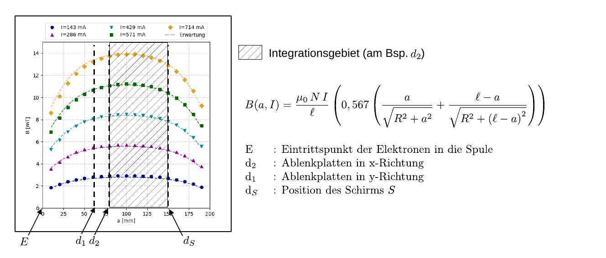

# Hinweise für den Versuch Spezifische Ladung des Elektrons

## Aufgabe 2: Methode von Busch [2/2]

### Berechnung von $e/m_{e}$

Beim hier verwendeten Aufbau sind die Voraussetzungen für eine als *lang* angenommene Spule aus Gleichung (**(4)** [hier](https://git.scc.kit.edu/etp-lehre/p1-for-students/-/blob/main/Spezifische_Ladung_des_Elektrons/doc/Hinweise-Aufgabe-1.md)) nicht mehr erfüllt. Gleichung (**(4)** [hier](https://git.scc.kit.edu/etp-lehre/p1-for-students/-/blob/main/Spezifische_Ladung_des_Elektrons/doc/Hinweise-Aufgabe-1.md)) muss daher auf folgende Weise modifiziert werden:
$$
\begin{equation}
B(a, I, \ell)=B_{0}
\left(0,567\left(
\frac{a}{\sqrt{R^{2}+a^{2}}}+
\frac{\ell-a}{\sqrt{R^{2}+(\ell-a)^{2}}}
\right)\right). 
\end{equation}
$$
Dabei ist $a$ der Abstand von $B$ vom Spulenanfang im Eintrittspunkt $E$ auf der $z$-Achse, $\ell$ die Länge und $R$ der mittlere Radius der Spule; $B_{0}$ ist aus Gleichung (**(4)** [hier](https://git.scc.kit.edu/etp-lehre/p1-for-students/-/blob/main/Spezifische_Ladung_des_Elektrons/doc/Hinweise-Aufgabe-1.md)) zu entnehmen. Einen Vergleich der mit Hilfe von Gleichung **(1)** bestimmten, erwarteten Werte von $B$ mit einer Kalibrationsmessung, für fünf verschiedene Magnetspulenströme $I$ ist in **Abb. 1** gezeigt: 

**Abb 1** (Vergleich von $B(a,\hspace{0.05cm}I,\hspace{0.05cm}\ell)$ aus Gleichung **(1)** mit entsprechenden Messwerten für fünf verschiedene Spulenströme)

---

Dabei entspricht der $0$-Punkt auf der $x$-Achse der Abbildung dem Punkt $E$; $a$ ist in $\mathrm{mm}$ und $B$ in $\mathrm{mT}$ angegeben. Die Marker entsprechen den Messpunkten und die gestrichelten Linien der entsprechenden Erwartung nach Gleichung **(1)**. 

Der Zusammenhang zwischen der Geschwindigkeit der Elektronen in $z$-Richtung und $U_{z}$ an der Oszillographenröhre 
$$
\begin{equation*}
v_{z} = \sqrt{2\,U\,e/m_{\mathrm{e}}}
\end{equation*}
$$
ergibt sich aus Gleichung (**(2)** [hier](https://git.scc.kit.edu/etp-lehre/p1-for-students/-/blob/main/Spezifische_Ladung_des_Elektrons/doc/Hinweise-Aufgabe-1.md)). Für die Kreisbahn der Elektronen in der $xy$-Ebene ergibt sich: 
$$
\begin{equation}
\begin{split}
&e\,v_{e}\hphantom{/}\,\langle B\rangle = m_{e}\frac{v_{e}^{2}}{a_{\mathrm{max}}};\\
&\\
&e/m_{\mathrm{e}}\,\langle B\rangle = \frac{v_{e}}{a_{\mathrm{max}}} = \omega = 2\,\pi\frac{v_{z}}{d_{S}-d_{i}},\\
\end{split}
\end{equation}
$$
wobei $\omega$ der Kreisfrequenz der Bewegung in der $xy$-Ebene, $d_{S}$ dem Abstand von $S$ und $d_{i}$ dem Abstand des Zentrums des gewählten Deflektorplattenpaars von $E$ entsprechen (siehe **Abb. 2**). Beachten Sie, das $\langle B\rangle$ in Gleichung **(2)** dem gemittelten Magnetfeld 
$$
\begin{equation*}
\langle B\rangle = \frac{1}{d_{S}-d_{i}} \int\limits_{d_{i}}^{d_{S}}B(a, I, N, \ell)\,\mathrm{d}a = K \,I
\end{equation*}
$$
entspricht. Der Integrationsweg für die Deflektorplatten in Position $d_{2}$ ist durch die schraffierte Fläche in **Abb. 2** dargestellt: 

**Abb 2** (Bestimmung von $\langle B\rangle$ für die Deflektorplatten in Position $d_{2}$)

---

Bei $K$ handelt es sich also um einen Geometriefaktor, der **vom gewählten Deflektorplattenpaar in $d_{1}$ oder $d_{2}$ abhängt**. 

### Hinweise zur Durchführung

#### Aufgabe 2.1: Vorbereitung der Messung

Sie können die Oszillographenröhre im Plexiglaszylinders über das zugehörige Steuerpult mit allen notwendigen Spannungen versorgen. Die Deflektorspannung kann wahlweise mit einem der beiden Paare von Deflektorplatten verbunden werden wobei Sie dann die Platten des ungenutzten Paares mit den Kurzschlussbrücken auf Masse legen sollten. Zur Vorbereitung der Messung gehen Sie wie folgt vor:

- Stellen Sie eine niedrige Beschleunigungsspannung (von z.B. $\approx 300\,\mathrm{V}$) ein. 
- Wählen Sie bei $B=0$ die Deflektorspannung so, dass ein maximal langer Strich auf dem Schirm erscheint. 
- Stellen Sie die Intensität und den Fokus des beobachteten Signals sinnvoll ein. 
- Steigern Sie dann langsam den Magnetspulenstrom und beobachten Sie die resultierende Veränderung des Bildes. Beschreiben und diskutieren Sie deren Zustandekommen in eigenen Worten. 
- Stellen Sie schließlich den Spulenstrom so ein, dass alle Elektronen den Schirm wieder in einem Punkt treffen. Versuchen Sie auch einen höheren Spulenstrom einzustellen, bei dem sich der auf dem Schirm beobachtete Strich erneut zu einem Punkt zusammenzieht.

Achten Sie bei Ihren Messungen darauf, dass die Spule bis zum Anschlag an die Plexiglaskonstruktion geschoben ist. 

### Aufgabe 2.2: Bestimmung von $e/m_{\mathrm{e}}$ 

Messen Sie für Beschleunigungsspannungen von $U = 200\,\ldots 700\,\mathrm{V}$ (in Schritten von $50\,\mathrm{V}$) den nötigen Spulenstrom $I$, um auf dem Schirm einen Signalpunkt zu erzeugen. Gehen Sie dabei, für jeden Messpunkt, wie in Aufgabe 2.1 beschrieben vor. Tragen Sie analog zu Aufgabe 1 $U$ **geeignet** über $I^{2}$ auf und ermitteln Sie $e/m_{\mathrm{e}}$ aus der Geradensteigung. 

# Navigation

[Zurück](https://gitlab.kit.edu/kit/etp-lehre/p1-praktikum/students/-/tree/main/Spezifische_Ladung_des_Elektrons/doc/Hinweise-Aufgabe-2.md) | [Main](https://gitlab.kit.edu/kit/etp-lehre/p1-praktikum/students/-/tree/main/Spezifische_Ladung_des_Elektrons)
