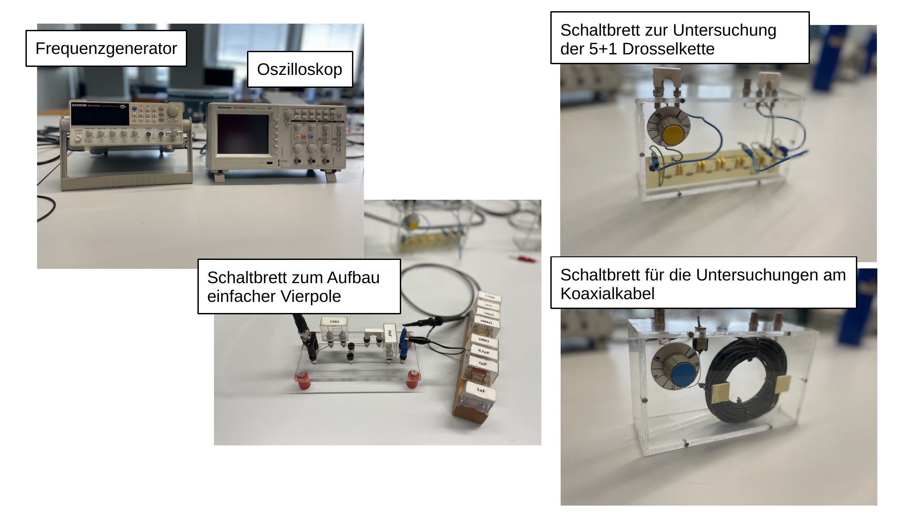

# Fakultät für Physik

## Physikalisches Praktikum P1 für Studierende der Physik

Versuch P1-53, 54, 55 (Stand: September 2023)

[Raum F1-17](http://www-ekp.physik.uni-karlsruhe.de/~simonis/praktikum/layoutobjekte/Lageplan_P1.png)

# Vierpole und Leitungen

## Motivation

In der stromleitungsgebundenen Signalübertragung werden elektrische Signale i.d.R. durch mindestens zwei getrennte Leiter —einen Hin- und Rückleiter— übertragen. Für [Gleichstrom](https://de.wikipedia.org/wiki/Gleichstrom) oder [Wechselstrom](https://de.wikipedia.org/wiki/Wechselstrom) niedriger Frequenz lässt sich eine solche Leitung in guter Näherung mit Hilfe des [ohmschen Widerstands](https://de.wikipedia.org/wiki/Elektrischer_Widerstand#Ohmscher_Widerstand), bestimmt aus der Querschnittsfläche, [Leitfähigkeit](https://de.wikipedia.org/wiki/Leitf%C3%A4higkeit) und Länge der Leitung, beschreiben. Ist die [Wellenlänge](https://de.wikipedia.org/wiki/Wellenlänge) der übertragenen Signale jedoch so klein, oder die räumliche Ausdehnung eines Leitungssystems so groß, dass die Laufzeit der übertragenen Signale nicht mehr vernachlässigt werden kann, treten Wellenphänomene auf, die die Signalübertragung beeinflussen. Die Beschreibung dieser Phänomene erfordert mathematische Modelle, die den Ort des Signals mit einschließen.

Als erster beschäftigte sich 1855 [William Thomson](https://de.wikipedia.org/wiki/William_Thomson,_1._Baron_Kelvin) mit der Beschreibung der Vorgänge auf Leitungen. Die Notwendigkeit hierzu ergab sich aus der Verlegung transatlantischer [Seekabel](https://de.wikipedia.org/wiki/Seekabel), ab 1850, und die dabei auftretenden starken [Verzerrungen](https://de.wikipedia.org/wiki/Verzerrung_(Elektrotechnik)) der übertragenen Signale, die ein tieferes Verständnis erforderten. Im Jahr 1886 formulierte [Oliver Heaviside](https://de.wikipedia.org/wiki/Oliver_Heaviside) die bis dato gewonnenen Erkenntnisse in ihrer heutigen Form als [Leitungsgleichungen](https://de.wikipedia.org/wiki/Leitungsgleichung) und begründete damit die allgemeine [Leitungstheorie](https://de.wikipedia.org/wiki/Leitungstheorie). [Rudolf Franke](https://de.wikipedia.org/wiki/Rudolf_Franke_(Ingenieur,_1870)) betrachtete die Leitung 1891 erstmals mit den Mitteln der [Vierpoltheorie](https://de.wikipedia.org/wiki/Zweitor). 

Mit diesem Versuch werden Sie die Eigenschaften von Vielpolen und Leitungen im Versuch kennenlernen. In der Vorbereitung auf den Versuch machen wir Sie mit den Grundlagen der stromleitungsgebundenen Signalübertragung vertraut. Diese spielt sowohl bei der Übertragung von Signalen über große Strecken, als auch bei sehr schnell getakteten Signalen (z.B. im $\mathrm{GHz}$-Bereich, wie bei modernen Rechnern üblich) eine wichtige Rolle. Auch bei der Planung nahezu aller Versuche im Praktikum sollten Sie sich über die Eigenschaften der Signalübertragung in Kabeln im Klaren sein. 

## Lehrziele

Wir listen im Folgenden die wichtigsten **Lehrziele** auf, die wir Ihnen mit dem Versuch **Vierpole und Leitungen** vermitteln möchten: 

- Sie üben sich im theoretischen und praktischen Umgang mit Wechselstromkreisen. Sie werden dabei mehreren Anwendungen der [Kirchhoffschen Regeln](https://de.wikipedia.org/wiki/Kirchhoffsche_Regeln) begegnen, die bei der Berechnungen von Schaltkreisen von fundamentaler Bedeutung ist.
- Die Übertragung von Signalen durch Stromleitungen beschreibt man durch [Vierpol](https://de.wikipedia.org/wiki/Zweitor)-Schaltungen. Mit diesem Versuch erhalten Sie ein grundlegendes Verständnis für solche Schaltungen. 
- Sie entwickeln Ihr Verständnis ausgehend vom $RC$-Glied, das Sie als Hochpass, Tiefpass oder Phasenschieber untersuchen, über das $\pi$-Glied, als Bestandteil der (idealen) Drosselkette, eine aus sechs $\pi$-Gliedern zusammengesetzte Drosselkette, bis hin zum Koaxialkabel.
- Für Ihre Versuche nutzen Sie ein Oszilloskop in verschiedenen üblichen Betriebsmodi und lernen dieses für einen Physiker essentielle Gerät weiter kennen.
- Schließlich bestimmen Sie mit der [Dielektrizitätskonstanten](https://de.wikipedia.org/wiki/Permittivit%C3%A4t) $\epsilon$ eine wichtig Materialeigenschaft eines Standard-Koaxialkabels.    

## Versuchsaufbau

Der Versuch umfasst einen Frequenzgenerator, ein Oszilloskop zur Untersuchung der erzeugten Signale an verschiedenen Stellen des zu untersuchenden Vierpols und eine Anzahl von Steckbrettern, an denen die zu untersuchenden Schaltungen entsprechen aufgebaut oder vervollständigt werden können. Eine Auflistung der für ihre Auswertung wichtigen Bauelemente und deren Eigenschaften finden Sie in der Datei [Datenblatt.md](https://git.scc.kit.edu/etp-lehre/p1-for-students/-/blob/main/Vierpole_und_Leitungen/Datenblatt.md?ref_type=heads).

Zur Schaltung einfacher Vierpole stehen Ihnen verschiedene ohmsche Widerstände, Kondensatoren verschiedener Kapazität und eine Reihe von Koaxialkabeln, Brücken und Verbindungssteckern zur Verfügung.

# Navigation

- Eine kurze Einführung in die stromleitungsgebundene Signalübertragung finden Sie in der Datei [Hinweise-Leitungen.md](https://git.scc.kit.edu/etp-lehre/p1-for-students/-/blob/main/Vierpole_und_Leitungen/doc/Hinweise-Leitungen.md?ref_type=heads).
- Wichtige Hinweise zur Vorbereitung und Durchführung von Aufgabe 1 finden Sie in der Datei [Hinweise-Aufgabe-1.md](https://git.scc.kit.edu/etp-lehre/p1-for-students/-/blob/main/Vierpole_und_Leitungen/doc/Hinweise-Aufgabe-1.md).
- Wichtige Hinweise zur Vorbereitung und Durchführung von Aufgabe 2 finden Sie in der Datei [Hinweise-Aufgabe-2.md](https://git.scc.kit.edu/etp-lehre/p1-for-students/-/blob/main/Vierpole_und_Leitungen/doc//Hinweise-Aufgabe-2.md).
- Wichtige Hinweise zur Vorbereitung und Durchführung von Aufgabe 3 finden Sie in der Datei [Hinweise-Aufgabe-3.md](https://git.scc.kit.edu/etp-lehre/p1-for-students/-/blob/main/Vierpole_und_Leitungen/doc/Hinweise-Aufgabe-3.md).
- Wichtige technische Daten zum Versuch finden Sie in der Datei [Datenblatt.md](https://git.scc.kit.edu/etp-lehre/p1-for-students/-/blob/main/Vierpole_und_Leitungen/Datenblatt.md).  
