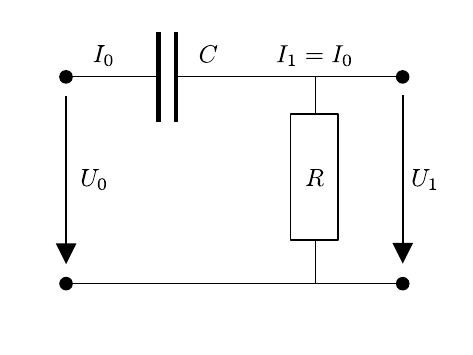

# Hinweise für den Versuch Vierpole und Leitungen

## Aufgabe 1 & 2: Einfache Vierpole

### Hochpass

Als einfachen Hochpass verwenden wir eine Schaltung, wie in **Skizze 1** dargestellt.

**Skizze 1** (Schaltbild einer einfachen Hochpassschaltung)

---

Die Eingänge (für $U_{0}$) befinden sich links, die Ausgänge (für $U_{1}$) rechts in der Skizze. Aus den [Kirchhoffschen Regeln](https://de.wikipedia.org/wiki/Kirchhoffsche_Regeln) ergibt sich für diese Schaltung beim Anlegen einer Wechselspannung:
$$
\begin{equation}
U_{0} = I_{0}\,R + \frac{I_{0}}{i\omega\,C};\qquad U_{1} = I_{1}\,R;\qquad I_{0}=I_{1}.
\end{equation}
$$
Für das Verhältnis von $U_{1}$ zu $U_{0}$ ergibt sich
$$
\begin{equation*}
\frac{U_{1}}{U_{0}} = \frac{R}{R+\frac{1}{i\omega\,C}}= \frac{1}{1+\frac{1}{i\omega\,C\,R}}.
\end{equation*}
$$
Für die Messung von Relevanz ist das Verhältnis der Beträge (Spannungsübertrag) und die Phasendifferenz zwischen Ein- und Ausgangssignal:
$$
\begin{equation}
\begin{split}
&\frac{\left|U_{1}\right|}{\left|U_{0}\right|} = \frac{1}{\sqrt{1+\frac{1}{\omega^{2}C^{2}R^{2}}}
}\qquad(\text{Spannungs\"ubertrag})\\
&\\
&\Delta\varphi = \arctan\left(\frac{1}{\omega\,C\,R}\right)\qquad(\text{Phasendifferenz})\\
\end{split}
\end{equation}
$$
Zu Bestimmung von $\Delta\varphi$ ist es intuitiv sich die Winkel von $U_{1}$ und $U_{0}$ im Phasendiagramm zu vergegenwärtigen. 

Für hohe Frequenzen geht der Spannungsübertrag gegen $1$, bei der Frequenz
$$
\begin{equation*}
\omega_{0}=\frac{1}{C\,R}
\end{equation*}
$$
ist er $1/\sqrt{2}$ und $\Delta\varphi=\pi/4$, für $\omega\to0$ geht der Spannungsübertrag gegen $0$ und $\Delta\varphi\to\pi/2$. 

### Fall nicht-harmonischer Wechselspannung

Wählt man für eine nicht-harmonische Wechselspannung $R$ und $\omega\ll\omega_{0}$ klein, lassen sich die Gleichungen (**1**) wie folgt annähern
$$
\begin{equation}
\frac{\mathrm{d}U_{0}}{\mathrm{d}t} \approx \frac{I_{0}}{C};\qquad U_{1} = I_{1}\,R;\qquad I_{0}=I_{1}=\frac{\mathrm{d}Q_{\mathrm{C}}}{\mathrm{d}t}.
\end{equation}
$$
Dabei entspricht $\mathrm{d}Q_{\mathrm{C}}$ der zeitlich veränderlichen Ladung am Kondensator. Der Faktor $1/(i\omega)$ in den Gleichungen (**1**) folgte ursprünglich aus der Zeitableitung der harmonischen Wechselspannung. Da diese hier explizit ausgeschrieben wurde taucht dieser Faktor in den Gleichungen (**3**) nicht mehr auf. Diese Näherung entspricht dem Lade- und Entladevorgang bei Gleichstrom. In diesem Fall ist
$$
\begin{equation*}
U_{1}(t)=C\,R\,\frac{\mathrm{d}U_{0}}{\mathrm{d}t}(t)\propto\frac{\mathrm{d}U_{0}}{\mathrm{d}t}(t).
\end{equation*}
$$
Man bezeichnet den Hochpass in diesem Zusammenhang als **Differenzierglied**.

### Tiefpass

Als einfachen Tiefpass verwenden wir eine Schaltung, wie in **Skizze 2** dargestellt.

**Skizze 1** (Schaltbild einer einfachen Tiefpassschaltung)

---

Im Vergleich zu **Skizze 1** sind die Positionen von Widerstand und Kondensator vertauscht. Aus den [Kirchhoffschen Regeln](https://de.wikipedia.org/wiki/Kirchhoffsche_Regeln) ergibt sich für diese Schaltung:
$$
\begin{equation*}
U_{0} = I_{0}\,R + \frac{I_{0}}{i\omega\,C};\qquad U_{1} = \frac{I_{1}}{i\omega\,C};\qquad I_{0}=I_{1}
\end{equation*}
$$
und für das Verhältnis von $U_{1}$ zu $U_{0}$
$$
\begin{equation*}
\frac{U_{1}}{U_{0}} = \frac{\frac{1}{i\omega\,C}}{R+\frac{1}{i\omega\,C}} = \frac{1}{i\omega\,C\,R+1}.
\end{equation*}
$$
Für den Spannungsübertrag und die Phasendifferenz zwischen Ein- und Ausgangssignal ergeben sich:
$$
\begin{equation}
\begin{split}
&\frac{\left|U_{1}\right|}{\left|U_{0}\right|} = \frac{1}{\sqrt{\omega^{2}C^{2}R^{2}+1}
}\qquad(\text{Spannungs\"ubertrag})\\
&\\
&\Delta\varphi = \arctan\left(\frac{1}{\omega\,C\,R}+\frac{\pi}{2}\right)=\arctan\left(\vphantom{\frac{1}{\omega\,C\,R}}\omega\,C\,R\right)\qquad(\text{Phasendifferenz})
\end{split}
\end{equation}
$$
Beachten Sie, dass durch die Drehung um $\pi/2$ im Phasendiagramm Imaginär- und Realteil ihre Positionen tauschen. 

In diesem Fall kehren sich die Verhältnisse relativ zum Hochpass um: Für $\omega\to0$ ist der Spannungsübertrag $1$, für hohe Frequenzen geht er gegen $0$ und $\Delta\varphi\to\pi/2$. Bei der Frequenz $\omega_{0}$ nehmen Spannungsübertrag und $\Delta\varphi$ die gleichen Werte an, wie im Fall der Hochpassschaltung. 

### Fall nicht-harmonischer Wechselspannung

Wählt man für eine nicht-harmonische Wechselspannung $\omega\gg\omega_{0}$, lassen sich die Gleichungen (**1**) wie folgt annähern
$$
\begin{equation}
U_{0}\approx I_{0}\,R ;\qquad U_{1} = \frac{1}{C}\int I_{1}\,\mathrm{d}t;\qquad I_{0}=I_{1}.
\end{equation}
$$
Die Spannung $U_{1}$ ergibt sich aus der Ladungsänderung $I_{1}\,\mathrm{d}t$ am Kondensator. Der Faktor $1/(i\omega)$ wurde, mit dem gleichen Argument, wie oben in die Integration absorbiert. Aufgrund der hohen Frequenz $\omega$ ist der zweite Term für die Bestimmung von $U_{0}$ vernachlässigbar. In diesem Fall ist
$$
\begin{equation*}
U_{1}(t)=\frac{1}{C\,R}\,\int U_{0}(t)\,\mathrm{d}t\propto\int U_{0}(t)\,\mathrm{d}t.
\end{equation*}
$$
Man bezeichnet den Tiefpass in diesem Zusammenhang als **Integrierglied**.

# Navigation

[Zurück](https://git.scc.kit.edu/etp-lehre/p1-for-students/-/blob/main/Vierpole_und_Leitungen/doc/Hinweise-Leitungen.md) | [Main](https://git.scc.kit.edu/etp-lehre/p1-for-students/-/tree/main/Vierpole_und_Leitungen) | [Weiter](https://git.scc.kit.edu/etp-lehre/p1-for-students/-/blob/main/Vierpole_und_Leitungen/doc/Hinweise-Aufgabe-3.md)
