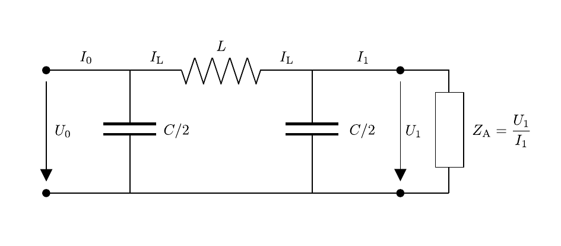
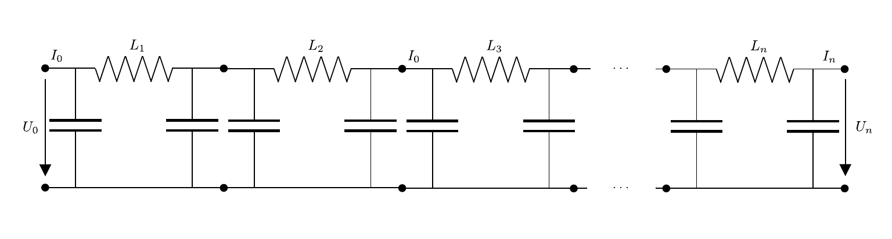

# Hinweise für den Versuch Vierpole und Leitungen

## Aufgabe 3: Drosselkette

### Das $\pi$-Glied

Zur Diskussion der idealen Drosselkette betrachten wir einen idealen Vierpol (ohne ohmsche Widerstände) für den die Leitungskapazität ($C$) symmetrsich rechts und links von der Leitungsimpedanz ($L$) aufgeteilt vorliegt, wie in **Skizze 4** dargestellt: 

**Skizze 4** (Schaltbild eines idealen Vierpols mit symmetrisch aufgeteilter Kapazität ($C$) rechts und links der Leitungsimpedanz ($L$) ($\pi$-Glied))

---

Das rechte Ende der Leitung wird bei der Versuchsdurchführung mit der Lastimpedanz $Z_{\mathrm{A}}=U_{1}/I_{1}$ kurzgeschlossen. Für die Impedanzen der Leitung gilt in diesem Fall: 
$$
\begin{equation}
\begin{split}
&Z_{\mathrm{L}} = i\,\omega\,L; \\
&Z_{\mathrm{C}} = \frac{2}{i\,\omega\,C}; \\
\end{split}
\end{equation}
$$
Aus den [Kirchhoffschen Regeln](https://de.wikipedia.org/wiki/Kirchhoffsche_Regeln) ergibt sich für diese Schaltung:
$$
\begin{equation*}
I_{0} = \frac{U_{0}}{Z_{\mathrm{C}}}+I_{\mathrm{L}}
\end{equation*}
$$
(aus dem Knoten links der Induktivität), 
$$
\begin{equation*}
I_{\mathrm{L}} = \frac{U_{1}}{Z_{\mathrm{C}}}+I_{1}
\end{equation*}
$$
(aus dem Knoten rechts der Induktivität) und
$$
\begin{equation*}
U_{0} = Z_{\mathrm{L}}\,I_{\mathrm{L}}+U_{1} 
\end{equation*}
$$
(aus der Schleife um $Z_{\mathrm{A}}$). Durch Einsetzen lässt sich hieraus der Zusammenhang zwischen dem Eingangssignal ($U_{0}$, $I_{0}$) und dem Ausgangsignal ($U_{1}$, $I_{1}$) herstellen: 
$$
\begin{equation}
\begin{split}
U_{0} &= Z_{\mathrm{L}}\left(\frac{U_{1}}{Z_{\mathrm{C}}}+I_{1}\right)+U_{1} \\
&= \left(\frac{Z_{\mathrm{L}}}{Z_{\mathrm{C}}}+1\right)U_{1}+Z_{\mathrm{L}}\,I_{1};\\
&\\
&\\
I_{0} &= \left(\frac{Z_{\mathrm{L}}}{Z_{\mathrm{C}}}+1\right)I_{\mathrm{L}} + \frac{U_{1}}{Z_{\mathrm{C}}} = \left(\frac{Z_{\mathrm{L}}}{Z_{\mathrm{C}}}+1\right)\left(\frac{U_{1}}{Z_{\mathrm{C}}}+I_{1}\right) + \frac{U_{1}}{Z_{\mathrm{C}}}\\
&=\frac{1}{Z_{\mathrm{C}}}\left(\frac{Z_{\mathrm{L}}}{Z_{\mathrm{C}}}+2\right)U_{1} + \left(\frac{Z_{\mathrm{L}}}{Z_{\mathrm{C}}}+1\right)I_{1}.\\

\end{split}
\end{equation}
$$
Die Impedanz $Z_{\mathrm{E}}$ am Signaleingang hängt von der Lastimpedanz $Z_{\mathrm{A}}$ am Signalausgang ab. Greift man das Ausgangssignal mit der für den in **Skizze 4** dargestellten Vierpol **charakteristischen Impedanz**
$$
\begin{equation}
Z_{0}=\frac{\sqrt{\frac{L}{C}}}{\sqrt{1-\left(\frac{\omega}{\omega_{0}}\right)^{2}}} \qquad \text{mit:}\quad\omega_{0}=\frac{2}{\sqrt{L\,C}}
\end{equation}
$$
ab, gilt $Z_{\mathrm{E}}=Z_{\mathrm{A}}=Z_{0}$, d.h. die Eingangs- und Ausgangsimpedanzen nehmen den gleichen Wert $Z_{0}$ an. Bei $Z_{0}$ handelt es sich um den **Wellenwiderstand** der Vierpolschaltung.

Der Zähler in der Gleichung für $Z_{0}$ leitet sich, für den Spezialfall $R=G=0$, aus Gleichung (**4**) [hier](https://git.scc.kit.edu/etp-lehre/p1-for-students/-/blob/main/Vierpole_und_Leitungen/doc/Hinweise-Leitungen.md) ab. Der Nenner ergibt sich aus der Zeitabhängigkeit eines harmonischen Eingangssignals. Die in **Skizze 4** dargestellte Schaltung zeigt ein $LC$-Glied mit der Induktivität $L$ und zwei in Reihe geschalteten Kapazitäten $C/2$. Für die in Reihe geschalteten Kondensatoren ergibt sich die Gesamtkapazität $C_{\mathrm{}ges}=C/4$, woraus sich der Faktor $2$ in der Definition von $\omega_{0}$ erklärt. Bei $\omega_{0}$ handelt es sich um die Resonanzfrequenz des $LC$-Schwingkreises. Der Faktor 
$$
\begin{equation*}
\frac{1}{\sqrt{1-\left(\frac{\omega}{\omega_{0}}\right)^{2}}}
\end{equation*}
$$
ergibt sich aus der Lösung des Randwertproblems einer erzwungen Schwingung mit der Frequenz $\omega$ nach der Einschwingphase.  

Unter Verwendung von $Z_{0}$ lassen sich die Gleichungen (**2**) wie folgt umformen: 
$$
\begin{equation}
\begin{split}
U_{0} &= \left(\frac{Z_{\mathrm{L}}}{Z_{\mathrm{C}}}+1\right)U_{1}+Z_{\mathrm{L}}\,I_{1};\\
&\\
&\\
I_{0} &=\frac{Z_{\mathrm{L}}}{Z_{0}^{2}}\,U_{1} + \left(\frac{Z_{\mathrm{L}}}{Z_{\mathrm{C}}}+1\right)I_{1}.\\

\end{split}
\end{equation}
$$
Um diesen Schritt nachzuvollziehen bietet es sich an $Z_{0}$ zunächst, unter Verwendung der Gleichungen (**1**), nach $Z_{\mathrm{L}}$ und $Z_{\mathrm{C}}$ auszudrücken:
$$
\begin{equation*}
\begin{split}
&Z_{0}=\frac{\sqrt{\vphantom{\frac{Z_{\mathrm{L}}}{Z_{\mathrm{C}}}}Z_{\mathrm{L}}\,Z_{\mathrm{C}}}}{\sqrt{2+\frac{Z_{\mathrm{L}}}{Z_{\mathrm{C}}}}}\\
\end{split}
\end{equation*}
$$
In Matrixschreibweise gehen die Gleichungen (**4**) in die folgende Form 
$$
\begin{equation}
\begin{split}
&\left(\begin{array}{c}\vphantom{\frac{Z_{\mathrm{L}}}{Z_{\mathrm{C}}}}U_{0}\\\vphantom{\frac{Z_{\mathrm{L}}}{Z_{\mathrm{C}}}}Z_{0}\,I_{0}\end{array}\right) = 
\left(\begin{array}{cc}\frac{Z_{\mathrm{L}}}{Z_{\mathrm{C}}}+1 & \frac{Z_{\mathrm{L}}}{Z_{0}}\\ \frac{Z_{\mathrm{L}}}{Z_{0}} & \frac{Z_{\mathrm{L}}}{Z_{\mathrm{C}}}+1\end{array}\right)\cdot 
\left(\begin{array}{c}\vphantom{\frac{Z_{\mathrm{L}}}{Z_{\mathrm{C}}}}U_{1}\\\vphantom{\frac{Z_{\mathrm{L}}}{Z_{\mathrm{C}}}}Z_{0}\,I_{1}\end{array}\right)\\
&\\
&\left(\begin{array}{c}\vphantom{\frac{Z_{\mathrm{L}}}{Z_{\mathrm{C}}}}U_{1}\\\vphantom{\frac{Z_{\mathrm{L}}}{Z_{\mathrm{C}}}}Z_{0}\,I_{1}\end{array}\right) = 
\left(\begin{array}{cc}\frac{Z_{\mathrm{L}}}{Z_{\mathrm{C}}}+1 & -\frac{Z_{\mathrm{L}}}{Z_{0}}\\ -\frac{Z_{\mathrm{L}}}{Z_{0}} & \frac{Z_{\mathrm{L}}}{Z_{\mathrm{C}}}+1\end{array}\right)\cdot 
\left(\begin{array}{c}\vphantom{\frac{Z_{\mathrm{L}}}{Z_{\mathrm{C}}}}U_{0}\\\vphantom{\frac{Z_{\mathrm{L}}}{Z_{\mathrm{C}}}}Z_{0}\,I_{0}\end{array}\right)\\
\end{split}
\end{equation}
$$
über, in der die Matrix 
$$
\begin{equation*}
\begin{split}
&\mathcal{T} = \left(\begin{array}{cc}\vphantom{\frac{Z_{\mathrm{L}}}{Z_{\mathrm{C}}}}\hphantom{-}\cosh\gamma & \vphantom{\frac{Z_{\mathrm{L}}}{Z_{\mathrm{C}}}}-\sinh\gamma\\ -\sinh\gamma & \hphantom{-}\cosh\gamma\end{array}\right)\\
&\\
&\text{mit:}\\
&\\
&\frac{Z_{\mathrm{L}}}{Z_{\mathrm{C}}}+1\equiv\cosh\gamma;\qquad
\frac{Z_{\mathrm{L}}}{Z_{0}}\equiv\sinh\gamma\\
\end{split}
\end{equation*}
$$
den Übergang
$$
\begin{equation*}
\left(\begin{array}{c}\vphantom{\frac{Z_{\mathrm{L}}}{Z_{\mathrm{C}}}}U_{0}\\\vphantom{\frac{Z_{\mathrm{L}}}{Z_{\mathrm{C}}}}Z_{0}\,I_{0}\end{array}\right) \longrightarrow 
\left(\begin{array}{c}\vphantom{\frac{Z_{\mathrm{L}}}{Z_{\mathrm{C}}}}U_{1}\\\vphantom{\frac{Z_{\mathrm{L}}}{Z_{\mathrm{C}}}}Z_{0}\,I_{1}\end{array}\right).
\end{equation*}
$$
beschreibt. Die komplexwertige Größe $\gamma=\alpha+i\,\beta$ kann mit der **Ausbreitungskonstanten** identifiziert werden.

Für $\omega\to\omega_{0}$ nimmt die Übergangsmatrix die Form
$$
\begin{equation*}
\left(\begin{array}{cc}\vphantom{\frac{Z_{\mathrm{L}}}{Z_{\mathrm{C}}}}\hphantom{-}\cosh\gamma & \vphantom{\frac{Z_{\mathrm{L}}}{Z_{\mathrm{C}}}}-\sinh\gamma\\ -\sinh\gamma & \hphantom{-}\cosh\gamma\end{array}\right)
%\longrightarrow 
\xrightarrow{\omega\to\omega_{0}}
\left(\begin{array}{cc}\vphantom{\frac{Z_{\mathrm{L}}}{Z_{\mathrm{C}}}}-1 & \hphantom{-}0 \\ \hphantom{-}0 & -1\end{array}\right),
\end{equation*}
$$
an, das Ausgangssignal weist gegenüber dem Eingangssignal also eine Phasenverschiebung um $\pi$ auf, welshalb die hier betrachtete Schaltung auch als $\pi$-Glied bezeichnet wird.  

### Ideale Drosselkette

Der Übergang vom Vierpol zur (idealen) Drosselkette erfolgt durch $n$-fache Hintereinanderschaltung von $\pi$-Gliedern, wie in **Skizze 5** dargestellt: 

**Skizze 5** (Schaltbild einer idealen Drosselkette, bestehend aus $n$ $\pi$-Gliedern)

---

Der Transfer
$$
\begin{equation*}
\left(\begin{array}{c}\vphantom{\frac{Z_{\mathrm{L}}}{Z_{\mathrm{C}}}}U_{0}\\\vphantom{\frac{Z_{\mathrm{L}}}{Z_{\mathrm{C}}}}Z_{0}\,I_{0}\end{array}\right) \longrightarrow 
\left(\begin{array}{c}\vphantom{\frac{Z_{\mathrm{L}}}{Z_{\mathrm{C}}}}U_{n}\\\vphantom{\frac{Z_{\mathrm{L}}}{Z_{\mathrm{C}}}}Z_{0}\,I_{n}\end{array}\right).
\end{equation*}
$$
erfolgt durch mehrfache Multiplikation mit $\mathcal{T}$:
$$
\begin{equation*}
\left(\begin{array}{c}\vphantom{\frac{Z_{\mathrm{L}}}{Z_{\mathrm{C}}}}U_{n}\\\vphantom{\frac{Z_{\mathrm{L}}}{Z_{\mathrm{C}}}}Z_{0}\,I_{n}\end{array}\right) = \mathcal{T}^{n}\cdot
\left(\begin{array}{c}\vphantom{\frac{Z_{\mathrm{L}}}{Z_{\mathrm{C}}}}U_{0}\\\vphantom{\frac{Z_{\mathrm{L}}}{Z_{\mathrm{C}}}}Z_{0}\,I_{0}\end{array}\right) = 
\left(\begin{array}{cc}\vphantom{\frac{Z_{\mathrm{L}}}{Z_{\mathrm{C}}}}\hphantom{-}\cosh(n\gamma) & \vphantom{\frac{Z_{\mathrm{L}}}{Z_{\mathrm{C}}}}-\sinh(n\gamma)\\ -\sinh(n\gamma) & \hphantom{-}\cosh(n\gamma)\end{array}\right)
\cdot
\left(\begin{array}{c}\vphantom{\frac{Z_{\mathrm{L}}}{Z_{\mathrm{C}}}}U_{0}\\\vphantom{\frac{Z_{\mathrm{L}}}{Z_{\mathrm{C}}}}Z_{0}\,I_{0}\end{array}\right)
\end{equation*}
$$
 Als Spannungsübertragung ergibt sich also
$$
\begin{equation*}
\frac{U_{n}}{U_{0}} = \cosh(n\gamma)-Z_{0}\frac{I_{0}}{U_{0}}\sinh(n\gamma)
\end{equation*}
$$
und für den Spezialfall $Z_{\mathrm{E}}=Z_{\mathrm{A}}=Z_{0}$
$$
\begin{equation*}
\begin{split}
\frac{U_{n}}{U_{0}} &= \cosh(n\gamma)-\sinh(n\gamma) \\
&= e^{-n\gamma} = e^{-n\alpha}e^{-i\,n\beta}
\end{split}
\end{equation*}
$$
Für eine harmonische Schwingung am Eingang ergibt sich daraus:
$$
\begin{equation*}
\begin{split}
&U_{0}(t) = \hat{U}_{0}e^{i\,\omega t};\\
&\\
&U_{n}(t) = \hat{U}_{0}e^{-n\alpha}e^{i\,\left(\omega t-n\beta\right)},\\
\end{split}
\end{equation*}
$$
$n\alpha$ kann also als **Dämpfungs-** und $n\beta$ als **Phasenkonstante** der Drosselkette aus $n$ $\pi$-Giedern abgelesen werden. 

### Leitungseigenschaften der idealen Drosselkette

Aus der Substitution
$$
\begin{equation*}
\cosh\gamma = \frac{Z_{\mathrm{L}}}{Z_{\mathrm{C}}}+1
\end{equation*}
$$
 folgt
$$
\begin{equation*}
\sinh\frac{\gamma}{2} = \sqrt{\frac{Z_{\mathrm{L}}}{2\,Z_{\mathrm{C}}}} = \sqrt{-\left(\frac{\omega}{\omega_{0}}\right)^{2}} = i\frac{\omega}{\omega_{0}}
\end{equation*}
$$
Andererseits gilt:
$$
\begin{equation*}
\sinh\frac{\gamma}{2} = \sinh\left(\frac{\alpha+i\beta}{2}\right) = \sinh\frac{\alpha}{2}\,\cos\frac{\beta}{2} + i\,\cosh\frac{\alpha}{2}\,\sin\frac{\beta}{2}
\end{equation*}
$$
Die folgenden Gleichungen müssen also gleichzeitig erfüllt sein: 
$$
\begin{equation*}
\begin{split}
&\sinh\frac{\alpha}{2}\,\cos\frac{\beta}{2} = 0; \\
&\\
&\cosh\frac{\alpha}{2}\,\sin\frac{\beta}{2} = \frac{\omega}{\omega_{0}},
\end{split}
\end{equation*}
$$
woaus man die folgenden Lösungen erhält: 
$$
\begin{equation}
\begin{array}{ccl}
\alpha & \beta & \\
0 &2\,\arcsin\left(\frac{\omega}{\omega_{0}}\right) & \text{f\"ur }\omega<\omega_{0}\\
2\,\arccos\left(\frac{\omega}{\omega_{0}}\right) & \pi & \text{f\"ur }\omega>\omega_{0},\\
\end{array}
\end{equation}
$$
d.h. die (ideale) Drosselkette hat die **Eigenschaft eines Tiefpasses**: 

- Für $\omega<\omega_{0}$ weist sie keine Dämpfung auf, d.h. sie ist als Leitung verlustfrei.
- Für $\omega>\omega_{0}$ steigt die Dämpfung mit $\omega$ steil an. Die Phase des Ausgangssignals ist um $\pi$ zum Eingangssignal verschoben. 

### Hinweise zur Durchführung

#### Aufgabe 3.1: Bestimmung von $Z_{0}$

Bestimmen Sie $Z_{0}$ der sechsgliedrigen Drosselkette wie folgt: 

- Legen Sie eine **rechteckförmige** Wechselspannung niedriger Frequenz an. Wir schlagen $\nu\approx 20\,\mathrm{kHz},\,U_{0}\approx 6\,\mathrm{V_{SS}}$ vor. Mit $\mathrm{V_{SS}}$ ist die Spannungsdifferenz von Signalsitze zu Signalspitze gemeint.

- Schließen Sie die Drosselkette mit der regelbaren Lastimpedanz $Z_{\mathrm{A}}$, als Abschlusswiderstand kurz. 

- Beobachten Sie das Eingangssignal am Oszilloskop. Sie nutzen dabei den Umstand aus, dass das Eingangssignal für $Z_{\mathrm{A}}=Z_{0}$ am Ende der Leitung **nicht** reflektiert wird. Treten Reflexionen am Ende der Leitung auf ist das beobachtete Signal eine Superposition aus dem ursprünglichen Signal und ggf. mehrerer Reflexionen in der Leitung. Das Signal kann also nicht unverfälscht beobachtet werden. 

- Regeln Sie $Z_{\mathrm{A}}$ solange, bis Sie das Eingangssignal unverfälscht beobachten können und bestimmen Sie den Wert von $Z_{\mathrm{A}}$. Durch die Wahl eine niedrigen Frequenz bestimmen Sie 
  $$
  \begin{equation*}
  Z_{\mathrm{A}}=Z_{0}\approx\sqrt{\frac{L}{C}}
  \end{equation*}
  $$
   unter der Annahme $\omega\ll\omega_{0}$.

#### Aufgabe 3.2: Bestimmung von $\omega_{0}$

Bestimmen Sie die Grenzfrequenz $\omega_{0}$ der sechsgliedrigen Drosselkette wie folgt:

- Legen Sie eine **harmonische** Wechselspannung an. Wir schlagen $\nu\lesssim 1\,\mathrm{MHz},\,U_{0}\approx 6\,\mathrm{V_{SS}}$ vor. Belassen Sie $Z_{\mathrm{A}}$ auf dem zuvor bestimmten Wert für $\omega\ll\omega_{0}$.
- Beobachten Sie das Eingangssignal und überzeugen Sie sich von der Frequenzunabhängigkeit der Eingangsspannung.
- Beobachten Sie das Ausgangssignal und erhöhen Sie $\omega$ schrittweise. Regeln Sie $Z_{\mathrm{A}}$ bei steigenden Werten von $\omega$ entsprechend Ihrer Erwartung für die Frequenzabhängigkeit von $Z_{0}$ (Gleichung (**3**)) nach, um Reflexionen in der Leitung zu vermeiden. 
- Bestimmen Sie den Frequenzbereich, in dem die Drosselkette Signale mit $\omega>\omega_{0}$ als Tiefpass unterdrückt. Bestimmen Sie $\omega_{0}$ aus der Position für $U_{0}/U_{n}=1/10$. 

#### Aufgabe 3.3: Bestimmung von $C$ und $L$

Bestimmen Sie $C$ und $L$ aus den zuvor bestimmten Werten für $Z_{0}$ (für $\omega<\omega_{0}$) und $\omega_{0}$. Pflanzen Sie die Unsicherheiten Ihrer Messungen von $Z_{0}$ und $\omega_{0}$ entsprechend fort und vergleichen Sie mit den technischen Angaben zu diesem Versuch.  

#### Aufgabe 3.4: Phasendifferenz zwischen Ein- und Ausgangssignal

Für diese Aufgabe betreiben Sie das Oszilloskop in Zweikanalmodus. 

- Bestimmen Sie, für 6–8 Werte von $\nu$ zwischen $10$–$650\,\mathrm{kHz}$, die Phasenverschiebung $\Delta\varphi$ zwischen Eingangs- und Ausgangssignal für eine harmonische Wechselspannung als Funktion von $\omega$. Sorgen Sie für einen reflexionsfreien Abschluss der Messanordnung.
- Führen Sie diese Messreihe sowohl für die **sechsgliedrige Drosselkette**, als auch für ein **einzelnes $\pi$-Glied** durch. 
- Überzeugen Sie sich von den folgenden Eigenschaften:
  - Für $\omega=\omega_{0}$ ist $\Delta\varphi$ zwischen Eingangs- und Ausgangssignal für ein einzelnes $\pi$-Gliedes $\pi$. 
  - Für eine $n$-gliedrige Drosselkette ist $\Delta\varphi$ zwischen Eingangs- uns Ausgangssignal für kleine Werte gegenüber dem einzelnen $\pi$-Glied $n$ mal größer.
- Bestimmen Sie $\omega$ für $\Delta\varphi=\pi,\,2\pi,\,3\pi,\,4\pi,\,5\pi$ und darus erneut $\omega_{0}$ (Gleichung (**6**)). Vergleichen den ermittelten Wert und dessen Unsicherheit mit Ihrem Ergebnis aus Aufgabe 3.2.  

#### Aufgabe 3.5: Reflexion

- Schließen Sie für diesen Versuchsteil das Ende der Drosselkette kurz ($Z_{0}=0\,\Omega$). Dadurch wird das Signal am Kettenende reflektiert. 
- Vermeiden Sie Reflexionen am Leitungsanfang, indem Sie einen Steckwiderstand $Z_{\mathrm{E}}\approx Z_{0}$ zwischen Signalgenerator Kettenanfang schalten. 
- Schließen sie eine rechteckförmige Wechselspannung (von etwa $20\,\mathrm{kHz}$) an. welche Signalform beobachten Sie am Kettenanfang? Entspricht dies Ihrer Erwartung?   

# Navigation

[Zurück](https://git.scc.kit.edu/etp-lehre/p1-for-students/-/blob/main/Vierpole_und_Leitungen/doc/Hinweise-Aufgabe-3.md) | [Main](https://git.scc.kit.edu/etp-lehre/p1-for-students/-/tree/main/Vierpole_und_Leitungen) | [Weiter](https://git.scc.kit.edu/etp-lehre/p1-for-students/-/blob/main/Vierpole_und_Leitungen/doc/Hinweise-Leitungen-a.md)
