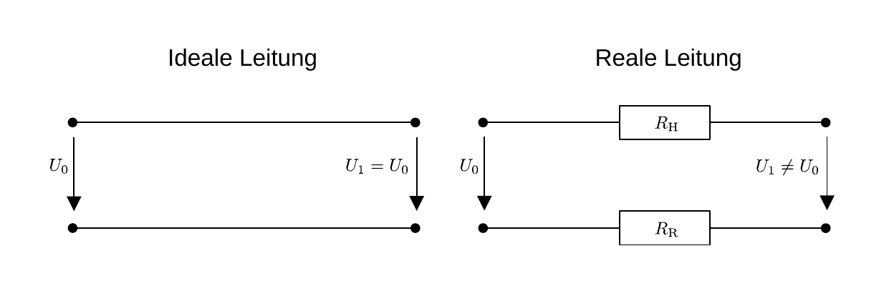
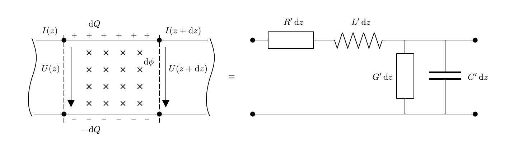
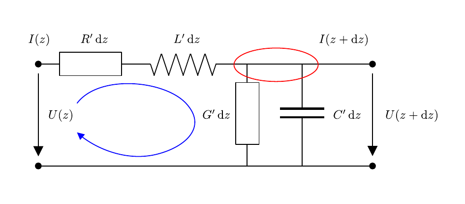

# Hinweise für den Versuch Vierpole und Leitungen

## Einordnung und Leitungsgleichungen

### Signalübertragung in Leitungen

Signale können über leitungsgebundene oder drahtlose Medien übertragen werden. Bei den leitungsgebundenen Medien unterscheidet man zwischen Wellen- und Stromleitern. Wellenleiter basieren auf einem (wie beim [Hohlleiter](https://de.wikipedia.org/wiki/Hohlleiter)) oder gar keinem Leiter (wie beim [Lichtwellenleiter](https://de.wikipedia.org/wiki/Lichtwellenleiter)). Die Signalübertragung erfolgt über die Leitung elektromagnetischer Wellen, Messgrößen sind die elektrische und die magnetische Feldstärke; die Beschreibung erfolgt mit Hilfe der [Maxwell-Gleichungen](https://de.wikipedia.org/wiki/Maxwell-Gleichungen). 

In diesem Versuch beschäftigen wir uns mit der stromleitungsgebundenen Signalübertragung. Stromleiter basieren auf mindestens zwei getrennten Leitern, einem Hin- und einem Rückleiter, wie in **Skizze 1** dargestellt: 

**Skizze 1** (Ersatzschaltbild einer (links) idealen und (rechts) realen Leitung)

---

Die Signalübertragung erfolgt in Form von Strömen und Spannungen. Die Leitung besteht aus einem gut leitenden Material, wie Kupfer oder Aluminium. Idealerweise fällt über die Leitung *keine* Spannung ab. In der Realität besitzen aber sowohl Hin-, als auch Rückleiter einem Widerstand. Zudem kann Spannung über die endliche Isolation zwischen den Leitern abfallen. Beispiele für die stromleitungsgebundene Signalüberstragung sind:

- Die Leitungen, mit denen Sie die Schaltungen im Praktikum stecken.
- Das Koaxialkabel, dessen Eigenschaften Sie in diesem Versuch u.a. untersuchen werden. 
- Telegraphen- und [transatlantische Telefonkabel](https://de.wikipedia.org/wiki/Transatlantisches_Telefonkabel).
- Die Kupfer [Doppelader](https://de.wikipedia.org/wiki/Doppelader) zur Übertragung von Telefon- und DSL-Signalen.
- Leitungen auf Platinen, z.B. in Computern. 

Je nach Länge der Leitung und Periode oder Frequenz der übertragenen Signale unterscheidet man zwei Regime zur Beschreibung des Signalübertragungsprozesses:

- Im Fall von Gleichstrom genügt die Beschreibung mit Hilfe des [spezifischen Widerstands](https://de.wikipedia.org/wiki/Spezifischer_Widerstand), Querschnitts und der Länge, als primäre Eigenschaften der Leitung. 
- Im Fall von Wechselspannung, oder bei der Übertragung getakteter Signale erweist es sich als notwendig, [Kapazitäten](https://de.wikipedia.org/wiki/Elektrische_Kapazit%C3%A4t) und [Induktivitäten](https://de.wikipedia.org/wiki/Induktivit%C3%A4t) der Leitung zusätzlich zu berücksichtigen. In diesem Fall erfolgt die Beschreibung der Signalübertragung durch die **Leitungsgleichungen**. Dies ist der Fall bei harmonischen Signalen deren Wellenlänge ($\lambda$) wesentlich kleiner als die Länge der Leitung ($\ell$) ist, und bei getakteten Signalen, deren Pulsdauer wesentlich kleiner, als die Signallaufzeit ist.  

In einem modernen Computer erfolgt die Signalübertragung mit einer Taktzahl im Bereich von $3\,\mathrm{GHz}$. Auf einer Kupferleitung breitet sich das elektrische Signal mit einer Geschwindigkeit von $0,7-0,9\,c$ aus. Auf Längenskalen einer Platine ($\mathcal{O}(10\,\mathrm{cm})$) ist die Anwendung der Leitungsgleichungen zur adäquaten Beschreibung  der Signalübertragung daher bereits notwendig.   

### Ersatzschaltbild der Leitung

Die Beschreibung einer homogenen Leitung erfolgt über ein infinitesimal kleines Leitungsstück dessen Eigenschaften in ein Ersatzschaltbild, wie in **Skizze 2** gezeigt übertragen werden können: 

**Skizze 2** (Ersatzschaltbild eines infinitesimalen, realen Leitungsstücks)

---

Eine reale Leitung besitzt einen endlichen Widerstand proportional zur Länge der Leitung, der daher zweckmäßigerweise differenziell als $\mathrm{d}R=R'\,\mathrm{d}z$ ausgedrückt wird. Durch den Stromfluss tritt zwischen Hin- und Rückleiter ein magnetischer Fluss $\mathrm{d}\phi$ auf, die Leitung besitzt also auch eine (Längs-)Induktivität $\mathrm{d}L=L'\,\mathrm{d}z$, die ebenfalls proportional zur Länge der Leitung ist. Ähnliches gilt für die (Quer-)Kapazität $\mathrm{d}C=C'\,\mathrm{d}z$ aufgrund der getrennten Ladungen in Hin- und Rückleiter. Schließlich ist die Isolation zwischen Hin- und Rückleiter nur endlich groß, was durch den (Isolations- oder Quer-)[Leitwert](https://de.wikipedia.org/wiki/Elektrischer_Leitwert) $\mathrm{d}G=G'\,\mathrm{d}z$ ausgedrückt wird. Die gestrichenen Größen
$$
\begin{equation*}
\begin{split}
R' = \frac{\mathrm{d}R}{\mathrm{d}z}\qquad&:\text{ Widerstandsbelag;}\\
L' = \frac{\mathrm{d}L}{\mathrm{d}z}\qquad&:\text{ Induktivitätsbelag;}\\
C' = \frac{\mathrm{d}C}{\mathrm{d}z}\qquad&:\text{ Kapazitätsbelag;}\\
G' = \frac{\mathrm{d}G}{\mathrm{d}z}\qquad&:\text{ Leitwertsbelag.}\\\end{split}
\end{equation*}
$$
[Widerstands-](https://de.wikipedia.org/wiki/Leitungsbel%C3%A4ge#Widerstandsbelag_R'), [Induktivitäts-](https://de.wikipedia.org/wiki/Induktivit%C3%A4tsbelag), [Kapazitäts-](https://de.wikipedia.org/wiki/Kapazit%C3%A4tsbelag) und Leitwerts- oder [Ableitungsbelag](https://de.wikipedia.org/wiki/Leitungsbel%C3%A4ge#Ableitungsbelag_G') fasst man als [Leitungsbeläge](https://de.wikipedia.org/wiki/Leitungsbel%C3%A4ge) zusammen und bezeichnet sie als **primäre Leitungsparameter**. Sind diese für eine endliche Leitung bekannt, kann das Verhalten eines über die Leitung übertragenen Signals bei allen Frequenzen exakt beschrieben werden. 

Beim Ersatzschaltbild aus **Skizze 2** handelt es sich um eine spezielle Form eines **Vierpols**. Ein Vierpol besteht aus zwei Polen zum Anlegen eines Eingangssignals und zwei Polen, an denen ein Ausgangssignal abgegriffen werden kann. Zwischen diesen Polen kann sich ein beliebiges elektrisches Netzwerk befinden. Der Begriff stammt aus dem Jahr 1921 und wurde durch den Nachrichteningenieur [Franz Breisig](https://de.wikipedia.org/wiki/Franz_Breisig) geprägt. 

### Leitungsgleichungen

Um die Leitungsgleichungen abzuleiten wenden wir die [Kirchhoffschen Regeln](https://de.wikipedia.org/wiki/Kirchhoffsche_Regeln) auf das Ersatzschaltbild aus **Skizze 2**, so wie in **Skizze 3** dargestellt an:

**Skizze 3** (Ableitung der Leitungsgleichungen)

---

Zunächst folgen wir der durch den blauen Pfeil angedeuteten *Masche* und erhalten:
$$
\begin{equation*}
\begin{split}
&U(z) = R'\,\mathrm{d}z\,I(z) + L'\,\mathrm{d}z\frac{\mathrm{d}I}{\mathrm{d}t} + U(z+\mathrm{d}z); \\
&\\
&\frac{\mathrm{d}U}{\mathrm{d}z}(z) = -R'\,I(z) - L'\frac{\mathrm{d}I}{\mathrm{d}t}(z).
\end{split}
\end{equation*}
$$
Den Strom bestimmen wir aus dem rot eingekreisten *Knoten* und erhalten:
$$
\begin{equation*}
\begin{split}
&I(z) = G'\,\mathrm{d}z\,U(z+\mathrm{d}z) + C'\,\mathrm{d}z\frac{\mathrm{d}U}{\mathrm{d}t}(z+\mathrm{d}z) + I(z+\mathrm{d}z); \\
&\\
&\frac{\mathrm{d}I}{\mathrm{d}z}(z) = -G'\,U(z) - C'\frac{\mathrm{d}U}{\mathrm{d}t}(z).
\end{split}
\end{equation*}
$$
Daraus ergeben sich zusammenfassend die **Leitungsgleichungen**:
$$
\begin{equation}
\begin{split}
&\frac{\partial U}{\partial z}(z, t) = -R'\,I(z, t) - L'\frac{\partial I}{\partial t}(z, t) \\
&\\
&\frac{\partial I}{\partial z}(z, t) = -G'\,U(z, t) - C'\frac{\partial U}{\partial t}(z, t).
\end{split}
\end{equation}
$$
Es handelt sich dabei um zwei gekoppelte partielle Differentialgleichungen erster Ordnung. Partiell wegen der Abhängigkeit in $z$ und $t$; gekoppelt, weil in der Differentialgleichung zur Bestimmung der Spannung $U$ die Stromstärke $I$ auftaucht und umgekehrt.  

### Harmonischer Zeitverlauf

Wir lösen das Gleichungssystem (**1**) für einen harmonischen Zeitverlauf, wir machen also den folgenden Ansatz für $U(z, t)$ und $I(z, t)$:
$$
\begin{equation*}
U(z, t) = U(z)\,e^{-i\,\omega\,t}, \quad 
I(z, t) = I(z)\,e^{-i\,\omega\,t+\varphi},
\end{equation*}
$$
wobei $\omega$ einer am Eingang vorgegebenen Frequenz entspricht. Daraus ergeben sich die "komplexen Leitungsgleichungen": 
$$
\begin{equation}
\begin{split}
&\frac{\mathrm{d} U}{\mathrm{d} z}(z) = -\left(R' + i\,\omega\,L'\right)\,I(z) \\
&\\
&\frac{\mathrm{d} I}{\mathrm{d} z}(z) = -\left(G' + i\,\omega\,C'\right)\,U(z).
\end{split}
\end{equation}
$$
Durch Differentiation der oberen und Einsetzen der unteren Gleichung lässt sich das Gleichungssystem entkoppeln und man erhält eine harmonische Schwingungsgleichung der Form: 
$$
\begin{equation}
\begin{split}
&\frac{\mathrm{d}^{2}U}{\mathrm{d}z^{2}} = -\left(R' + i\,\omega\,L'\right)\,\frac{\mathrm{d}I}{\mathrm{d}z} \\
&\hphantom{\frac{\mathrm{d}^{2}U}{\mathrm{d}z^{2}}} = \hphantom{-}\underbrace{\left(R' + i\,\omega\,L'\right)\,\left(G' + i\,\omega\,C'\right)}\,U(z). \\
&\hphantom{\frac{\mathrm{d}^{2}U}{\mathrm{d}z^{2}} = -\left(R' + i\,\omega\,\right)}\equiv\gamma^{2} \\
\end{split}
\end{equation}
$$
Für die Ausbreitung eines harmonischen Signals in einer Leitung sind also die folgenden Größen
$$
\begin{equation*}
\begin{split}
&\gamma = \alpha + i\beta = \sqrt{\left(R' + i\,\omega\,L'\right)\,\left(G' + i\,\omega\,C'\right)}\\
&\\
&\gamma\quad:\text{ Ausbreitungskonstante}\\
&\alpha\quad:\text{ D\"ampfungskonstante}\\
&\beta\quad:\text{ Phasenkonstante}\\
\end{split}
\end{equation*}
$$
(jeweils in der Einheit $\mathrm{m}^{-1}$) von Relevanz. Die **Dämpfungskonstante** ($\alpha$) beschreibt die Dämpfung des Signals in Ausbreitungsrichtung; die **Phasenkonstante** ($\beta$) die Phasenverschiebung des Signals in Ausbreitungsrichtung. Beide werden in der komplexwertigen **[Ausbreitungskonstanten](https://de.wikipedia.org/wiki/Fortpflanzungskonstante)** ($\gamma$) zusammengefasst.

Die allgemeine Lösung von Gleichung (**3**) lautet: 
$$
\begin{equation*}
\begin{split}
&U(z) = \underbrace{U_{1}\,e^{-\gamma\,z}} + \underbrace{U_{2}\,e^{\gamma\,z}}.\\
&\hphantom{U(z) = U}\equiv U_{\mathrm{H}} \hphantom{+ U}\equiv U_{\mathrm{R}}\\
\end{split}
\end{equation*}
$$
Dabei identifizieren wir $U_{\mathrm{H}}$ mit einer Spannungswelle vom Sender zum Empfänger und $U_{\mathrm{R}}$ mit einer Spannungswelle vom Empfänger zurück zum Sender. Im allgemeinen kann es also zu **Reflexionen** und Überlagerungen aus hin- und rücklaufenden Wellen kommen. 

Den Stromverlauf erhält man durch Einsetzen von 
$$
\begin{equation*}
\frac{\mathrm{d}U(z)}{\mathrm{d}z}
\end{equation*}
$$
in die obere Gleichung des Gleichungssystems (**2**):
$$
\begin{equation}
\begin{split}
&I(z) = \sqrt{\frac{G'+i\,\omega\,C'}{R'+i\,\omega\,L'}}\,\left(U_{1}\,e^{-\gamma\,z}-U_{2}\,e^{\gamma\,z}\right)\equiv\frac{U_{1}\,e^{-\gamma\,z}-U_{2}\,e^{\gamma\,z}}{Z_{0}}\\
&\\
&Z_{0} \equiv \sqrt{\frac{R'+i\,\omega\,L'}{G'+i\,\omega\,C'}} \qquad(\text{Leitungswellenwiderstand}),
\end{split}
\end{equation}
$$
wobei $Z_{0}$ (in der Einheit $\Omega$) den **[Leitungswellenwiderstand](https://de.wikipedia.org/wiki/Wellenwiderstand#Strom-_und_Spannungswellen_auf_Leitungen)** bezeichnet. Dieser hängt nicht von der Länge der Leitung, im allgemeinen aber von der Frequenz $\omega$ des übertragenen Signals ab. Bei den Frequenzen des verwendeten Trägersignals beträgt $Z_{0}$ in der Messtechnik $50\,\Omega$ und in der Fernsehtechnik $75\,\Omega$. Für den Spezialfall der verlustfreien Leitung ist 
$$
\begin{equation*}
Z_{0} = \sqrt{\frac{L'}{C'}}
\end{equation*}
$$
reellwertig und zunächst frequenzunabhängig. Es besteht jedoch im Allgemeinen eine weitere Frequenzabhängigkeit durch die Lösung der Zeitabhängigkeit (als erzwungene Schwingung, [Hinweis zu Aufgabe 3](https://git.scc.kit.edu/etp-lehre/p1-for-students/-/blob/main/Vierpole_und_Leitungen/doc/Hinweise-Aufgabe-3.md)). 

Die Ausbreitungskonstante und der Leitungswellenwiderstand werden auch als **sekundäre Leitungsparameter** bezeichnet.

### Reflexion in Leitungen

Das Amplitudenverhältnis aus hin- und rücklaufender Welle im Fall der Signalreflexion ist durch den Reflexionsfaktor
$$
\begin{equation*}
\rho=\frac{Z_{\mathrm{A}}-Z_{0}}{Z_{\mathrm{A}}+Z_{0}}
\end{equation*}
$$
gegeben. Dabei bezeichnet $Z_{\mathrm{A}}$ die Impedanz des Abschlusswiderstands am Leitungsende. Für die offene Leitung ($Z_{\mathrm{A}}\to\infty$ ) ist $\rho=1$, das Signal wird also unverändert reflektiert. Für die kurzgeschlossene Leitung ($Z_{\mathrm{A}}=0\,\Omega$ ) ist $\rho=-1$, es erfolgt also ein Phasensprung des Signals um $\pi$ am Leitungsende. Je nach Dämpfungskonstante der Leitung kann es zu mehrfachen Reflexionen sowohl am Ende, als auch am Anfang der Leitung kommen, die das Signal negativ beeinflussen. 

# Navigation

[Main](https://git.scc.kit.edu/etp-lehre/p1-for-students/-/tree/main/Vierpole_und_Leitungen) | [Weiter](https://git.scc.kit.edu/etp-lehre/p1-for-students/-/blob/main/Vierpole_und_Leitungen/doc/Hinweise-Leitungen-a.md)

