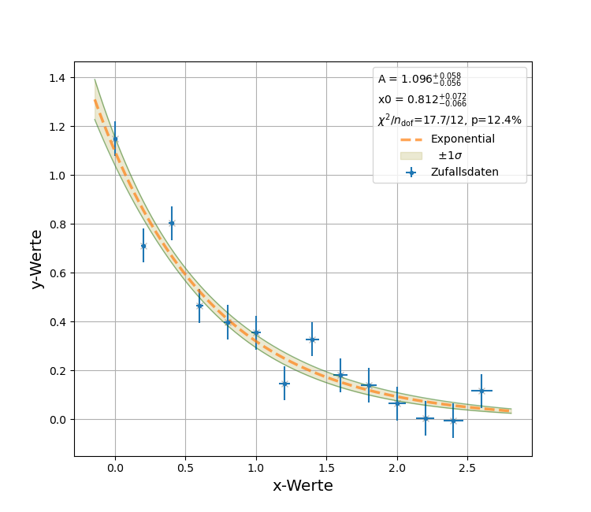

# Vorversuch 

In diesem Verzeichnis finden Sie die Anleitung des P1-Vorversuchs **"Datenverarbeitung am Beispiel des Pendels"**. Wir stellen Ihnen diese Anleitung in drei inhaltsgleichen Formaten zur Verfügung: 

- Markdown (*Vorversuch.md*);
- PDF (*Vorversuch.pdf*), dabei handelt es sich um einen *pdf*-Export der Markdown-Datei;
- Jupyter-notebook (*Vorversuch.ipynb*), dabei handelt es sich um eine Übersetzung der Markdown-Datei.

Ebenfalls finden Sie in diesem Verzeichnis die Daten, die Sie für die Durchführung des Vorversuchs benötigen. Es handelt sich um die folgenden Dateien:  

- *RawData.csv*: Die Originaldatei der aufgezeichneten Daten (Achtung die Dateigröße beträgt 2.4 MB);
- *RawData_down_sampled_500_2200_10_csv*: Die vor-prozessierten Daten, die Sie für die Durchführung des Vorversuchs benötigen; 

Sie können die *ipynb*-Version der Anleitung als Ausgangspunkt für Ihre Auswertung verwenden. Die einfachste Art dies zu tun ist die Bearbeitung auf dem [Jupyter-server](https://jupytermachine.etp.kit.edu/hub/spawn) des ETP, auf dem Sie alle notwendigen Software Pakete bereits vorinstallierten vorfinden. Zugang zum Jupyter-server können Sie über [diesen Link](https://comp.physik.kit.edu/Account/) erhalten. 

Beachten Sie, dass die Bilder in den Anleitungen im *md*- und *ipynb*-Format nicht in die Dokumente integriert sondern verlinkt sind. Sie finden die verlinkten Bilder im **Verzeichnis *figures***.   

# Die Verzeichnisstruktur

Dieses Verzeichnis besitzt vier Unterverzeichnisse: 

Im **Verzeichnis *figures*** finden Sie die Bilder, die wir für die Anleitung und für dieses Dokument verwendet haben. 

Im **Verzeichnis *params*** finden Sie einige Meta-Informationen, die Sie bei der Bearbeitung des Versuchs benötigen werden. Es handelt sich um die folgenden Dateien:  

- *uncertainties_data.py*: Die Unsicherheiten auf die Datenpunkte, die wir für Sie bestimmt haben;
- *parameters_task_3.py*: Die zusätzlichen Parameter, die Sie für die Bearbeitung von Aufgabe 3 benötigen; 
- *parameters_task_4.py*: Die zusätzlichen Parameter, die Sie für die Bearbeitung von Aufgabe 4 benötigen. 

Diese Dateien haben wir in Form einer *zip*-Datei auch auf der Webseite des P1 für Sie verlinkt. 

Im **Verzeichnis *tools*** finden Sie die [PhyPraKit/tools](PhyPraKit/tools), die für diesen Vorversuch von  Relevanz sein werden. Wir haben Ihnen diese tools aus dem [PhyPraKit](https://git.scc.kit.edu/yh5078/PhyPraKit) Repository direkt dorthin kopiert, damit Sie sie während des Versuchs leichter finden und ausführen können. Es handelt sich um die Skripte: 

- [*csv2yml.py*](https://git.scc.kit.edu/yh5078/PhyPraKit/-/blob/master/tools/csv2yml.py): Dieses Skript können Sie verwenden, um Daten vom *csv*- ins *yaml*-Format zu konvertieren. 
- [*plotCSV.py*](https://git.scc.kit.edu/yh5078/PhyPraKit/-/blob/master/tools/plotData.py): Dieses Skript können Sie verwenden, um sich die rohen Daten, wie sie im *csv*-Format vom Smartphone übertragen wurden direkt bildlich darzustellen. 
- [*plotData.py*](https://git.scc.kit.edu/yh5078/PhyPraKit/-/blob/master/tools/plotData.py): Dieses Skript können Sie verwenden, um sich die Daten nach der Konversion in *yaml*-Format anzuschauen. Beachten Sie, dass dieses Skript die Daten in einem speziellen *yaml*-Format erwartet. Eine Beispieldatei, mit der Sie das Skript ausführen können finden Sie im **Verzeichnis *yaml***. Dieses Skript werden Sie vermutlich nicht oft in Verwendung haben.
- [*run_phyFit.py*](https://git.scc.kit.edu/yh5078/PhyPraKit/-/blob/master/tools/run_phyFit.py): Hierbei handelt es sich um das Skript, dass Sie in erster Linie zur Anpassung physikalischer Modelle an die Daten verwenden können. Beachten Sie, dass dieses Skript die Daten in einem speziellen *yaml*-Format erwartet. Eine Beispieldatei, mit der Sie das Skript ausführen können finden Sie im **Verzeichnis *yaml***.

Im **Verzeichnis *yaml*** können Sie ihre selbst-erzeugten *yaml*-Dateien ablegen. Sie finden dort auch eine Beispieldatei für die Verwendung mit den Skripten *plotData.py* und *run_phyFit.py*. 

# Arbeiten auf dem Jupyter-server

Zugang zum Jupyter-server erhalten Sie über die Webadresse: [https://jupytermachine.etp.kit.edu/](https://jupytermachine.etp.kit.edu/). Als Login verwenden Sie Ihren Studenten Account am KIT. Wählen Sie, wenn Sie danach gefragt werden die Option *Python* aus und starten sie den Server. 

Falls der Zugang zum Server nicht für Sie freigeschaltet sein sollte können Sie die Freischaltung [hier](https://comp.physik.kit.edu/Account/) veranlassen. Stellen Sie bitte **vor Praktikumsbeginn** fest, dass Sie einen gültigen Account haben und sich entsprechend auf dem Jupyter-server einlogen können. 

Nach dem Start sollten Sie einen zweigeteiltes Fenster in Ihrem Browser vorfinden: 


Auf der linken Seite befindet sich ein Navigationsfenster mit der Verzeichnisstruktur Ihrer Jupyter-Umgebung, rechts daneben befindet sich ein Fenster (der sog. Launcher) in dem Sie auswählen können, welche Art von Notebook Sie öffnen möchten. Sie können, wenn Sie möchten, die Option **Notebook** und  **Phython 3** (das erste Icon oben links im Launcher) anwählen.   

Die aktuellste Version des Vorversuchs finden Sie auf dem gitlab-Server des SCC unter der Webadresse: [https://git.scc.kit.edu/etp-lehre/p1-for-students](https://git.scc.kit.edu/etp-lehre/p1-for-students):


Um dieses Repository in Ihre Jupyter-Umgebung zu laden, gehen Sie z.B. wie folgt vor: 

- Gehen Sie im Menü Ihrer Jupyter-Umgebung auf das Verzeichnis **Git** und wählen Sie die Option **Clone a Repository** aus. 
- In einem neuen Fenster werden Sie daraufhin aufgefordert die URI-Adresse des zu klonenden Repositorys anzugeben. Diese finden Sie im [SCC Gitlab Repository](https://git.scc.kit.edu/etp-lehre/p1-for-students/-/tree/main/Vorversuch). 
- Öffnen Sie das [SCC Gitlab Repository](https://git.scc.kit.edu/etp-lehre/p1-for-students/-/tree/main/Vorversuch) in einem neuen Reiter Ihres Browers und klicken Sie den Knopf **Clone** (blauer Knopf, rechts im obigen Bild). Wählen Sie aus dem sich öffnenden Untermenü die Option **Clone with HTTPS** aus. Die entsprechende Webadresse wird in den Arbeitsspeicher Ihres Computers geladen.
- Wechseln Sie wieder in den Reiter mit Ihrer Jupyter-Umgebung und geben Sie die Webadresse des zu klonenden SCC Gitlab Repositorys in Ihrer Jupyter-Umgebung an. 
- Sie werden darauf hin nochmal gebeten sich dem SCC Gitlab Server gegenüber zu identifizieren. Verwenden Sie hierzu erneut Ihren KIT Account. 

Nach erfolgreicher Durchführung sollten Sie eine Verzeichnis-Struktur **p1-for-students/Vorversuch** auf Ihrem Account vorfinden. Im Verzeichnis **Vorversuch** können Sie die Durchführung und Auswertung des Versuchs beginnen.

# Arbeiten mit dem Jupyter-notebook

Das Jupyter-notebook wird in Zellen bearbeitet. Es kann sich dabei um Textzellen (z.B. in Markdown) oder um Code-Zellen handeln, in die Sie direkt Python-Code eingeben können. Eine kurze Einführung in Jupyter-notebook können Sie [hier](https://www-ekp.physik.uni-karlsruhe.de/~quast/jupyter/jupyterTutorial.html) finden. Ein Jupyter-cheat sheet finden Sie z.B. [hier](https://www.edureka.co/blog/wp-content/uploads/2018/10/Jupyter_Notebook_CheatSheet_Edureka.pdf). Für die Durchführung des Versuchs sind die folgenden Jupyter-*features* von Bedeutung/Nutzen: 

- *Esc+m*: Wechsele Zellenmodus zu Markdown

- *Esc-y*: Wechsele Zellenmodus zu Code (d.h. Python)

- Befindet sich eine Zelle im Code-Modus können Sie direkt Kommandos in Python eingeben. Das folgende Beispiel importiert eine Variable aus der Datei *parameters_task_3.py* aus dem *params*-Verzeichnis ihrer Jupyter-Umgebung und gibt den Wert der Variablen auf dem Bildschirm aus, sobald Sie die Zelle ausführen. 

  ```python
  from params.parameters_task_3 import l
  print(l)
  ```

- *strg+enter*: Ausführen eine Zelle.

- Sie sollten außerdem wissen, dass Sie jede der in der Verzeichnisstruktur Ihrer Jupyter-Umgebung befindlichen Dateien per Doppelklick im rechten Fenster Ihres Browsers öffnen, bearbeiten und nach der Bearbeitung abspeichern können. 

- Möchten Sie ein Skript aus Ihrer Jupyter-Umgebung direkt aus dem Jupyter-notebook ausführen tun Sie dies in einer Code-Zelle mit dem  [Magic command](https://ipython.readthedocs.io/en/stable/interactive/magics.html) *%run*. Im Folgenden ist z.B. gezeigt, wie man das Skript *run_phyFit.py* aus dem *tools*-Verzeichnis Ihrer Jupyter-Umgebung direkt aus einer Code-Zelle eines Jupyter-notebooks aufrufen kann: 

  ```python
  %run ./tools/run_phyFit.py --help
  ```

-  Es empfiehlt sich alle angegebenen Skripte zunächst, wie oben demonstriert mit der Option *–help* aufzurufen. Zum einen erfahren Sie, ob sich das entsprechende Skript grundsätzlich fehlerfrei aufrufen lässt. Zum anderen erfahren Sie, wie und mit welchen weiteren Konfigurationsparametern Sie das jeweilige Skript aufrufen können. Zum Beispiel können Sie mit den folgenden weiteren Parametern das Bild der konfigurierten Anpassung direkt im Arbeitsverzeichnis Ihrer Jupyter-Umgebung abspeichern:

  ```python
  %run ./tools/run_phyFit.py -s -f png yaml/data.yaml
  ```

# Parameteranpassung mit dem Skript  *run_phyFit.py*

Es empfiehlt sich, bevor Sie mit der Auswertung des Versuchs beginnen, sich mit der Nutzung des Skripts *run_phyFit.py* und der Struktur der notwendigen *yaml*-Datei ein wenig vertraut zu machen. Im Folgenden ist die Durchführung einer Anpassung an einen Beispieldatensatz, bestehend aus 14 datenpunkten, mit Hilfe der Datei [*yaml/data.yml*](https://git.scc.kit.edu/etp-lehre/p1-for-students/-/blob/main/Vorversuch/yaml/data.yaml) gezeigt: 

Die wichtigsten Strukturelemente der *yaml*-Datei sind in den folgenden Kommentarzeilen kurz erklärt: 

```yaml
# Das ist eine Kommentarzeile schreiben Sie so viele Kommentare in Ihre yaml-Dateien, wie sie möchten! 

# Hier geben Sie den Titel des plots an, der nach der Anpassung des Modells and die Daten angezeigt werden wird.
title: "Beispiel aus Datei 'data.yaml'"
# Hier geben Sie den Titel auf der x-Achse an.
x_label: 'x-Werte'
# Hier geben Sie den titel auf der y-Achse an.
y_label: 'y-Werte'
# Dieses Label wird in der Legende angezeigt. 
label: Zufallsdaten
# Dieses sind die Werte der Beispieldaten auf der x-Achse.
x_data: [0., 0.2, 0.4, 0.6, 0.8, 1., 1.2, 1.4, 1.6, 1.8, 2., 2.2, 2.4, 2.6]
# Dieses hier sind die Unsicherheiten der Werte auf der x-Achse. Geben Sie nur eine einzige Zahl an, gilt diese als Unsicherheit für alle Werte. Dies wird die Verwendung in diesem Versuch sein. 
x_errors: [0.01,0.015,0.02,0.025,0.03,0.035,0.04,0.045,0.05,0.055,0.06,0.065,0.07,0.075]
# Dieses sind die Werte der Beispieldaten auf der y-Achse.  
y_data: [ 1.149, 0.712, 0.803, 0.464, 0.398, 0.355, 0.148,
          0.328, 0.181, 0.140, 0.0651, 0.005, -0.005, 0.116 ]
# Hier sehen Sie nur einen Eintrag für die Unsicherheiten der Werte auf der y-Achse. Das entspricht der Verwendung in diesem Versuch.
y_errors: 0.07
# Dieses ist ein Namenslabel für das Modell, das Sie an die Daten anpassen möchten.
model_label: 'Exponential'
# Dieses ist die Modell-Funktion, die Sie an die Daten anpassen möchten. Beachten Sie das "|"-Symbol nach dem yaml-Schlüsselwort "model_function". Danach folgt die definition der Funktion in Python. Sie können alle vor-installerten Bibliotheken, wie z.B. Numpy (np) verwenden. 
model_function: |
    def exp_model(x, A=1., x0=1.):
      return A*np.exp(-x/x0)
```

Führen Sie das Skript mit der Konfigurationsdatei *yaml/data.yaml* aus einer Code-Zelle eines Jupyter-notebook in Ihrer Jupyter-Umgebung aus, sollten Sie das folgende Bild erhalten: 

```python
%run ./tools/run_phyFit.py yaml/data.yaml
```



Das Modell einer Exponentialfunktion mit den Parametern $A$ und $x_{0}$ wurde an die Datenpunkte angepasst.

Sie sollten die angepassten Parameter $A$ und $x_{0}$ der Modellfunktion, Das Datenlabel, das Label der Modellfunktion und die Achsenbeschriftungen wiedererkennen. 

## Ein paar Tipps für Anfänger auf diesem Gebiet: 

- *yaml* ist eine Struktursprache, die aus beliebigen "Schlüsselworten" und "Werten" besteht. Diese sind durch einen Doppelpunkt voneinander getrennt. 
- Die Schlüsselworte, die wir in der oben gezeigten Datei verwenden haben nichts mit der Sprache *yaml* selbst zu tun. Die Sprache ist nur das Medium, um das Skript *run_phyFit.py* zu konfigurieren. Es handelt sich um Schlüsselworte, die das Programm **erwartet**. 
- Sie können keine Anpassung an Daten durchführen, wenn Sie dem Skript die Daten als Werte zu den Schlüsselworten *x_data* und *y_data* bekannt machen. Ebenso erwartet das Skript Unsicherheiten auf die Datenpunkte, die man mit dem Schlüsselworten *x_errors* und *y_errors* übergibt und eine Modellfunktion.
-  Halten Sie sich exakt an die Schlüsselworte. Die Worte *x-data*, *x_Data* oder *x_data* sind nicht identisch. Beachten Sie Groß- und Kleinschreibung.
- Wenn Sie für einen Wert Anführungsstriche öffnen, müssen Sie diese auch wieder schließen. Sowas sind klassiche Tippfehler für einen Anfänger. 

Sie werden sehen, dass Sie den Bogen mit etwas Übung ganz gut rausbekommen werden. Falls Sie im Laufe des Versuchs mit Ihren eigenen *yaml*-Dateien mal nicht klarkommen sollten vergleichen Sie sie mit der Beispieldatei oder jeder anderen funktionierenden Datei. 

**Anm.:** Mit der gleichen *yaml*-Datei können Sie das Skript *plotData.py* ausführen.  

# Durchführung und Auswertung

 Zur Durchführung und Auswertung des Versuchs können Sie entweder Ihr eigenes Jupyter-notebook starten (siehe Abschnitt "Arbeiten auf dem Jupyter-server"), oder Sie öffnen die Anleitung als Jupyter-notebook per Doppelklick in Ihrer Jupyter-Umgebung. 

Im lezteren Fall verwenden Sie einfach die Zellen, mit den Überschriften **"Lösung"**. Sie können den kursiv-gestellten Text aus den Zellen löschen. 

Vergessen Sie nicht das Jupyter-notebook bevor Sie den Kontakt zum Server schließen zu speichern (*strg+s*). Andernfalls wäre Ihre Arbeit verloren.

Sie sollten die fertige Auswertung zur Abgabe in ein nicht weiter editierbares Format bringen, das Sie dann als Gruppe auf der ILIAS-Seite des P1 hochladen können. Hierzu empfehlen sich derzeit die folgenden Schritte: 

- Exportieren Sie das Jupyter-notebook nach *html*. 
- Laden Sie sich hierzu gegebenenfalls die Bilder, die in das Jupyter-notebook eingebunden werden sollen, vom Jupyter-server auf Ihren lokalen Rechner. Die einzubinden Bilddateien sollten sich im gleichen Verzeichnis, wie die exportierte *html*-Datei befinden.
- Sie können die *html*-Datei dann von Ihrem Browser aus z.B. nach *pdf* formatieren. Wenn das *pdf*-Format nicht ganz einwandfrei die Seiten umbricht, ist das für uns kein Problem. 
- Je nach Absprache mit dem Tutoren können Sie auch das Jupyter-notebook zusätzlich auf ILIAS hochladen.  

