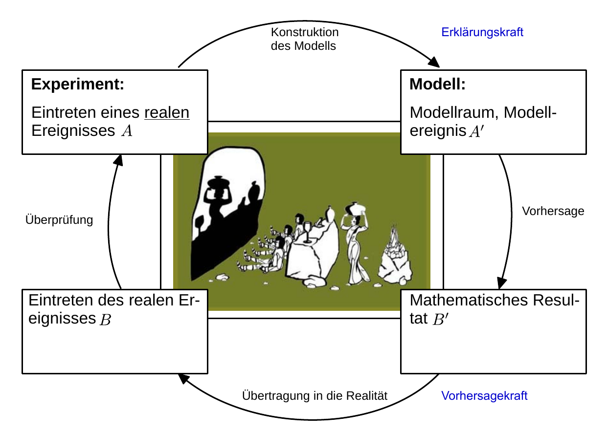

# Hinweise für den Versuch Datenverarbeitung am Beispiel des Pendles

## Messung und Parameterschätzung

### Experiment und Zufall

Für eine Messung mit wissenschaftlichem Anspruch versucht der/die Experimentator:in möglichst alle für den Ausgang der Messung relevanten Randbedingungen zu kontrollieren, d.h. entweder auszuschalten, oder festzuhalten und zu dokumentieren. Man bezeichnet dieses Vorgehen als **Messen unter Laborbedingungen**. 

*A posteriori* ist jeder Ausgang einer wissenschaftlich erfolgreich durchgeführten Messung ein unveränderliches Resultat. Vor dem Akt der Messung ist ihr Ausgang jedoch ungewiss. Das liegt daran, dass sich nicht alle Randbedingungen einer Messung mit beliebiger Präsizion kontrollieren lassen. 

Unterliegt eine Beobachtung einer unbekannten Menge unkontrollierter Randbedingungen handelt es sich um ein [Zufallsexperiment](https://de.wikipedia.org/wiki/Zufallsexperiment). Die zu beobachtende Größe ist eine [Zufallsgröße](https://de.wikipedia.org/wiki/Zufallsvariable). Die Aussage, dass man in einer exakten Wissenschaft, wie der Physik, Zufallsexperimente durchführt klingt zunächst überraschend und vielleicht unbefriedigend. Dieser Umstand liegt aber bereits in den Begrifflichkeiten des Alltags begründet: In der Physik führen wir Experimente durch. **Experiment bedeutet "Versuch". Wenn Sie etwas versuchen, ist der Ausgang zunächst ungewiss.** 

### Klassische und moderne Wissenschaft

Als Begründer der klassich-antiken wissenschaftlichen Methode gilt [Aristoteles](https://de.wikipedia.org/wiki/Aristoteles). Er dokumentierte als erster, dass die Durchführung kontrollierter Experimente (unter Laborbedingungen) zu reproduzierbaren Ergebnissen führen kann. Der Ausgang eines Experiments war *a posteriori* eine Gewissheit. Die wissenschaftliche Methode bestand darin die Ausgänge einzelner wissenschaftlicher Experimente und ihrer Randbedingungen so gewissenhaft wie möglich zu dokumentiern. Dadurch wurde das Experiment selbst, im Rahmen gewisser Erwartungen, reproduzierbar.

Aritoteles griff bereits zu einem Mittel, das wir erst seit der [Neuzeit](https://de.wikipedia.org/wiki/Neuzeit) systematisch entwickelt und durchschaut haben: zur [Modellvorstellung](https://de.wikipedia.org/wiki/Statistisches_Modell).

Es ist offenbar, dass eine Fülle unzähliger Einzelmessungen schnell unkontrollierbar wird. Zudem besteht unser Streben als Menschen nicht darin, die Vergangenheit so exakt wie möglich zu dokumentieren. Unser Streben ist in die Zukunft gerichtet. Unser Wunsch ist es aus der Beobachtung der Vergangenheit, Aussagen über die Zukunft abzuleiten. Die Strategie der Modellvorstellung ist es, **eine Fülle unzählbarer Beobachtungen auf das handhabbare Maß einiger weniger Gesetze und Parameter zu reduzieren**. 

So unterteilte Aristoteles in einer Modellvorstellung der Realität, die Bewegungen von Körpern in natürliche und erzwungene Bewegungen. Eine natürliche Bewegung ist es, wenn ein Stein sich zur Erde hin bewegt, sobald ein:e Experimentator:in ihn loslässt. Eine erzwungene Bewegung ist, wenn der/die Experimentator:in den Stein von der Erde weg, gen Himmel wirft. Die Gesetzmäßigkeit in diesem Bild besteht darin, dass die erzwungene stets in die natürliche Bewegung übergeht. Als Parameter können die Geschwindigkeit und Richtung angesehen werden, mit denen der Stein geworfen wird. Mit diesem Modell ist es möglich qualitativ den schiefen Wurf eines Steins zu beschreiben. Mit unserer heutigen Vorstellung der Vorgänge beim schiefen Wurf hat diese Modellvorstellung, in all ihrer Tiefe, allerdings sehr wenig gemein. 

Der Erfolg von Aristoteles klassisch-antiker Modellvorstellung natürlicher und erzwungener Bewegungen von Körpern endete bei der **Beschreibung der Bewegung des Pendels**, eines entscheidenden Experiments, bei dem der Übergang von einer erzwungenen zu einer natürlichen Bewegung nicht auszumachen war, und das so den Weg in die wissenschaftliche Methodik der Neuzeit ebnete. Alle Grundsteine zu dieser Umschreibung der Welt wurden allerdings durch Aristoteles und dessen Lehrer [Platon](https://de.wikipedia.org/wiki/Platon) bereits gelegt. Sie spiegeln sich in Platons [Höhlengleichnis](https://de.wikipedia.org/wiki/H%C3%B6hlengleichnis) wieder, das beschreibt, wie wir Menschen die Welt wahrnehmen: wir sitzen gefesselt und unbeweglich mit dem Rücken zu einem Feuer in einer Höhle. Hinter unsrem Rücken spielt sich die Wahrheit ab. Wir erkennen allerding nur die schattenhaften Abbilder dieser Wahrheit an der Höhlenwand uns gegenüber, die wir als unsere Realität wahrnehmen. Plato erkannte, dass es die Wahrheit ([Idee](https://de.wikipedia.org/wiki/Ideenlehre)) eines mathematischen Kreises gab, auch wenn seine kläglichen Versuche selbst einen Kreis zu zeichnen unvollkommene Abbilder dieser Wahrheit bleiben mussten. 

Dieses Gleichnis ist zentraler Baustein der Vorstellung unseres heutigen Erkenntnisgewinns, wie in **Abbildung 1** dargestellt:   

**Abbilding 1** (Darstellung des modernen wissenschaftlichen Erkenntnisgewinns)

---

Diese Vorstellung ist untrennbar mit den Namen großer Denker der neuzeitlichen Wissenschaften und der Physik, wie [René Descartes](https://de.wikipedia.org/wiki/Ren%C3%A9_Descartes), [Isaak Newton](https://de.wikipedia.org/wiki/Isaac_Newton), und [Galileio Galilei](https://de.wikipedia.org/wiki/Galileo_Galilei) verbunden, die alle fast Zeitgenossen und regelrechte Revolutionäre und Abteneurer ihrer Zeit waren! Auf Galileio Galilei sind z.B. die [Einführung der Mathematik als universale Sprache der Natur](https://de.wikipedia.org/wiki/Galileo_Galilei#Hochschullehrer_in_Pisa,_1589%E2%80%931592) in die Physik, oder die Entdeckung der Energieerhaltung zurückzuführen. Bis dato beschrieben Wissenschaftler und Philosophen Naturvorgänge seitenweise in lateinischer Sprache. Vor Galilei war ein einfacher Zusammenhang, wie 
$$
\begin{equation*}
m\,g\,h = \frac{1}{2}m\,v^{2};\qquad v = \sqrt{2g\,h},
\end{equation*}
$$
wie Sie ihn bereits aus der Mittelstufe der Schule kennen das Objekt mehrerer Buchseiten umfassender Reflexionen. Aus heutiger Sicht erscheint uns eine solche Vorstellung unvorstellbar weit entfernt. 

### Das mathematische Modell

**Abbilding 1** zeigt die Rolle des Experiments im Erkenntnisgewinn: Aus wiederholten reproduzierbaren Experimenten extrahieren wir Gesetzmäßigkeiten und konstruieren ein **mathematisches Modell**. Die physikalische Beobachtung der äußeren Welt wird in die Welt der Mathematik *übersetzt*. Die mathematisch strengen Gesetze des Modells suggierieren Verständnis der beobachteten Vorgänge. Diese Eigenschaft bezeichnet man als [Erklärungskraft](https://en.wikipedia.org/wiki/Explanatory_power) eines Modells, das Vorgänge *a posteriori* nicht anhand unzähliger, dokumentierter Einzelfälle, sondern anhand einiger, weniger Parameter zu erklären vermag. Die Gesetze des Modells erlauben zudem Vorhersagen über zukünftige Beobachtungen. Diese Eigenschaft bezeichnet man als [Vorhersagekraft](https://en.wikipedia.org/wiki/Predictive_power). Die Parameter des Modells sind Anknüpfungspunkte des abstrakt-mathematischen Modells an die Realität. Zukünftige Beobachtungen erlauben es schließlich das Modell zu bestätigen oder als unzureichend zu disqualifizieren. 

Wirklich verblüffend für uns ist es, wenn ein Modell zunächst unbeabsichtigte, manchmal abwegig wirkende Vorhersagen trifft, die zum Zeitpunkt seiner Einführung nicht absehbar oder äußerst umstritten sind und später durch Experimente als "unveränderliche Resultate" bestätigt werden.

Ein Beispiel für ein Modell aus der Antike, das nicht bestätigt werden konnte und mit der Zeit an Bedeutung verlor, ist die oben diskutierte Modellvorstellung natürlicher und erzwungener Bewegungen von Körpern, des Aristoteles. 

Ein ungleich erfolgreicheres Beispiel liefert das Wechselspiel zwischen [Galilei-](https://de.wikipedia.org/wiki/Galilei-Transformation) und [Poincarré-Transformation](https://de.wikipedia.org/wiki/Poincar%C3%A9-Gruppe) für den [Wechsel von Bezugssystemen](https://de.wikipedia.org/wiki/Bezugssystem). Die Vorhersagen der speziellen und später allgemeinen Relativitätstheorie, bewegen sich in der reinen Welt der Mathematik, in die wir die uns umgebende Natur übersetzen. Sie sind zuweilen hochgradig nicht-intuitiv, wirken zum Teil abwegig und lassen sich in kinematische Bereiche weit jenseits unseres Alltagserlebens extrapolieren. Dennoch lassen sich solche Bereiche nicht nur indirekt, z.B. durch die Beobachtung ferner Himmelsobjekte, sondern auch direkt und leiblich, mit den Mitteln der heutigen Technik erreichen, so dass wie getroffene Vorhersagen aus eigener Erfahrung und mit einer Exaktheit experimentell bestätigen können, die uns schwindeln lässt. **Dennoch würde kein vernünftiger Mensch zur Beschreibung eines schiefen Wurfs Newton's Axiome gegen das Kalkül der allgemeinen Relativitätstheorie eintauschen.**     

Ein hervorragendes, drittes Beispiel aus der jüngeren Geschichte der Physik ist die Revolution der [Quantenmechanik](https://de.wikipedia.org/wiki/Quantenmechanik). Es handelt sich dabei um ein hochgradig mathematisches Konstrukt, das viele Jahre angezweifelt wurde, und um dessen Interpretation namhafte Pioniere der Quantenmechanik Jahrzehnte lang gerungen haben, dessen teilweise abwegige, nicht-intuitive, und überraschende Vorhersagen, ein ums andere mal, und inzwischen auch mit atemberaubender Präzision bestätigt werden konnten und können. 

Geht man noch einen Schritt weiter in Richtung der [relativitischen Quantenmechanik](https://de.wikipedia.org/wiki/Dirac-Gleichung), entfernt man sich noch weiter aus der Komfortzone der alltäglichen Intuition. Die von [Paul Dirac](https://de.wikipedia.org/wiki/Paul_Dirac) entdeckte und nach ihm benannte Dirac-Gleichung war die Antwort der kanonischen Quantisierung auf die Einsteinsche relativistische Energie-Impuls-Beziehung:
$$
\begin{equation*}
E^{2} = \vec{p}^{2}+m^{2}; \qquad E=\sqrt{\vec{p}^{2}+m^{2}}.
\end{equation*}
$$
Die Lösungen der Dirac-Gleichungen führte zur Einführung eines neuartigen physikalischen Objekts neben ([Pseudo-](https://de.wikipedia.org/wiki/Pseudoskalar))[Skalar](https://de.wikipedia.org/wiki/Skalar_(Mathematik)), ([Axial-](https://de.wikipedia.org/wiki/Pseudovektor))[Vektor](https://de.wikipedia.org/wiki/Vektor) und [Tensor](https://de.wikipedia.org/wiki/Tensor): dem [Spinor](https://de.wikipedia.org/wiki/Spinor). Der Spinor ist Bestandteil der Beschreibung der quantenmechanischen Ausbreitung eines Teilchenzustands mit positiver Energie **und zur gleichen Zeit** die Ausbreitung eines Teilchenzustands mit negativer Energie. Dies ist eine direkte mathematische Konsequenz der relativistischen Energie-Impuls-Beziehung, in der $E$ quadratisch auftritt. In anderen Zusammenhängen ist von andern nahmhaften Physikern die Aussage überliefert, "wer sowas bestellt" habe. Diese Aussage ist sicher gleichermaßen auf den Spinor, als Bestandteil der allgemeinen Lösung der Dirac-Gleichung anwendbar. Paul Dirac entwickelte die Vorstellung eines Teilchen-Loch-Modells, wie man es heute aus der Festkörperphysik kennt. Ein Modell, das ebenfalls nicht mehr viel mit unserer heutigen **physikalischen Interpretation der Lösungen der Dirac-Gleichung** zu tun hat. Heute Interpretieren wir die Lösungen der Dirac-Gleichung im Bild von [Stückelberg](https://de.wikipedia.org/wiki/Ernst_Carl_Gerlach_St%C3%BCckelberg)-[Feynman](https://de.wikipedia.org/wiki/Richard_Feynman), haben eine sogenannte [zweite Quantisierung](https://de.wikipedia.org/wiki/Zweite_Quantisierung) eingeführt und besitzten im Rahmen der [Quantenfeldtheorie](https://de.wikipedia.org/wiki/Quantenfeldtheorie) mathematische Kalküle, mit deren Hilfe wir die Entstehung von Teilchen aus dem Nichts und deren Annihilation beschreiben können, Vorgänge, die wir täglich expermentell nachweisen. 

Diese Entwicklung berührt einen weiteren wichtigen Aspekt heutiger mathematischer Modelle zur Beschreibung physikalischer Vorgänge. Bei all den triumphalen Erfolgen der Mathematik handelt es sich um eine Schwäche dieser Strategie des Erkenntnisgewinns, die auch in **Abbildung 1** prominent abgebildet zu erkennen ist: das mathematische Modell erfordert die Übersetzung der Beobachtung in die Welt der Mathematik und —wichtiger noch—, die **Rückübersetzung der Vorhersagen aus der Welt der Mathematik in die Realität – die Interpretation**. Letztere kann sich – jenseits unserer Alltagsintuition – also sowohl schwierig, als auch uneindeutig herausstellen. Paul Diracs Interpretation der Lösungen der Dirac-Gleichung erwies sich als ebenso unzureichend, wie Aristoteles Interpretation der natürlichen und erzwungenen Bewegung von Körpern. Die Bewegung eines Transatlantikfluges kann sowohl mit den Methoden der speziellen Relativitätstheorie, als mit Hilfe der Newtonschen Axiome beschrieben werden. Die Bestimmung des Schwerefelds der Erde kann auf Grundlage der Newtonschen Mechanik, der allgemeinen Relativitätstheorie oder der Annahme, dass die Erde flach und die Erdbeschleunigung $g$ eine Konstante sei erfolgen. Sie kann ein detailliertes Modell über die Massenbelegung der Erde beinhalten, die Erde als homogene, massive Kugel oder als Massepunkt beinhalten. Modernste Diskussionen zur Erzeugung von Modellen in der Quantenkosmologie beziehen den Einfluss des Beobachters auf die Beobachtung mit ein.    

### Was also ist exakte Wissenschaft?

In diesem Vorversuch bestimmen Sie $g$ auf Grundlage verschiedener einfacher Modelle: einmal vernachlässigen Sie die endliche Ausdehnung der Messapparatur, einmal nicht. Dennoch gelangen Sie innerhalb einer abgeschätzten Konfidenz immer wieder zu ähnlichen Ergebnissen. Nicht immer, aber im besten Fall, stimmen diese verschiedenen Ergebnisse, im Rahmen der abgeschätzten Konfidenz in sie, überein. 

Wann ist dies der Fall? – Wenn Sie nach best-möglichem Kenntnisstand, alle Unabwägbarkeiten, von außen einfließender Modellparameter (Informationen) in eine seriöse Abschätzung Ihrer Konfidenz in das ermittelte Ergebnis haben einfließen lassen. 

Epistemologisch scheint dem Messvorgang eine unveränderliche Wahrheit zugrunde zu liegen, der wir uns mit Hilfe des mathematischen Modells nähern. Das Modell wird aber immer eine Näherung bleiben. Befinden Sie sich mit Ihrem Experiment in Bereichen der Wahrnehmung, in denen die zu machende Beobachtung klar hervortritt, verliert die Modellfrage an Relevanz: unabhängig davon, ob Sie $g$ aus dem Modell eines physikalischen Pendels, eines mathematischen Pendels, mit oder ohne Berücksichtigung der Dämpfung, Auftrieb in Luft, der Besonderheiten der Auflage des Keils, oder unter Berücksichtigung der genauen geographischen Lage in Karlsruhe bestimmen, werden Sie inneralb von 5–15% immer einen Wert um $g=9,81\hspace{0.05cm}\mathrm{m/s^{2}}$ bestimmen. **An den Grenzen der Erkenntnis, d.h. zum Beispiel auch dann, wenn Sie die Genauigkeit einer Messung an die Grenzen des Machbaren führen, tritt Modellabhängigkeit zutage.** Es ist diese Grenze des Machbaren, wo die Modellvorhersagen sich wirklich unterscheiden, wo sich die Spreu vom Weizen trennt, wo der Erkenntnisgewinn einsetzt. Es ist ein zu tiefst experimenteller Prozess. 

Was also ist exakte Wissenschaft in der heutigen Zeit? – Es ist die Suche nach einem Surrogat einer uns unbekannten, möglichen Wahrheit, reduziert auf ein für uns handhabares Maß an Parametern und unsere sorgfältig abgeschätzte Konfidenz, in diese Paremeter. Je weiter wir diese Surrogate, diese Modelle innerhalb der Grenzen des Machbaren ausleuchten und auf den Prüfstand intelligenter Experimente stellen, desto näher werden wir dieser unfassbaren Wahrheit kommen, die wir doch nie erreichen werden. An den Grenzen der Erkenntnis wird die exakte Wissenschaft zur Kunst. Zur **experimentellen Kunst**. Zur Kunst **Parameter auf geschickte Weise zu bestimmen die Konfidenz in sie weder zu groß noch zu klein abzuschätzen**.  
