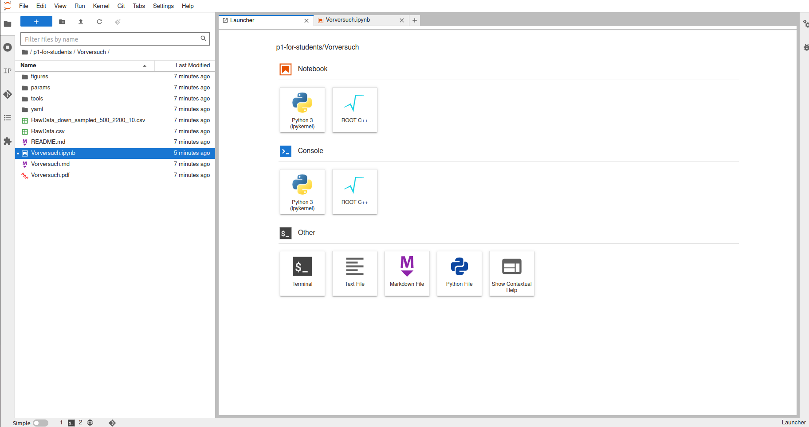
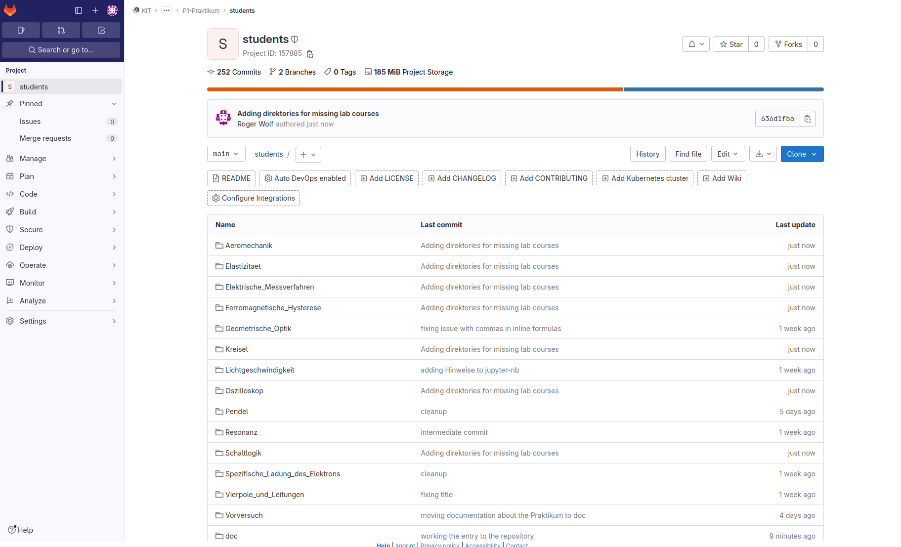
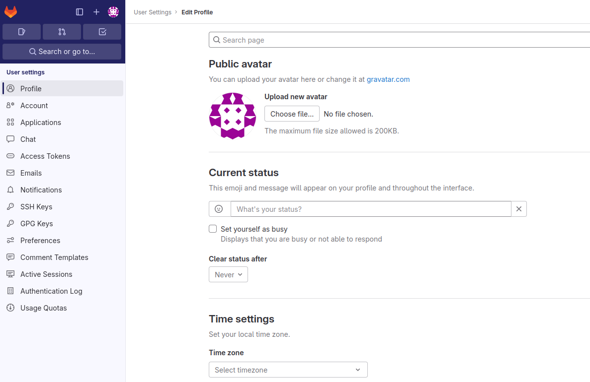
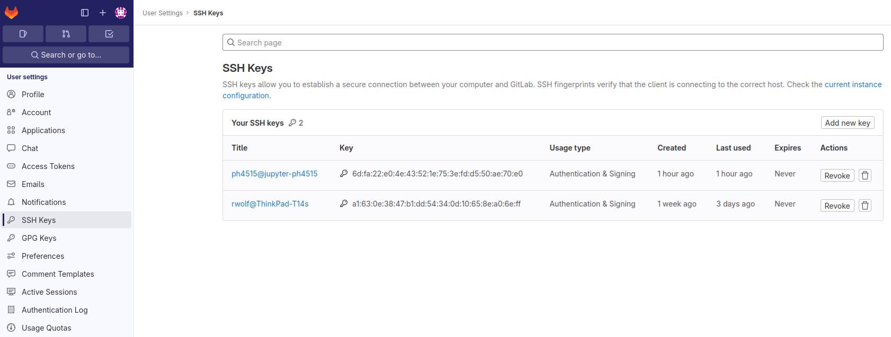
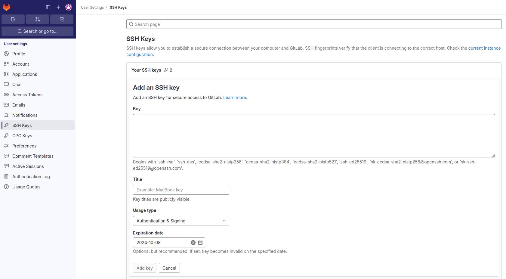
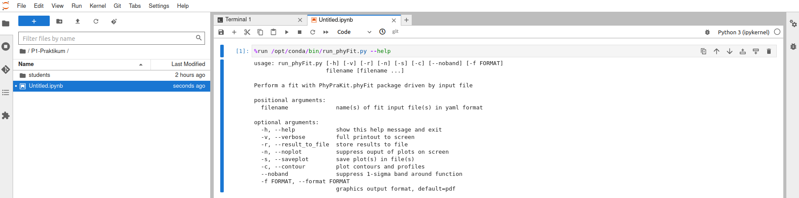

# Arbeiten auf dem Jupyter-Server

## Zugang zum Jupyter-Server

Zugang zum Jupyter-Server der Fakultät erhalten Sie über die Webadresse: 

[https://jupytermachine.etp.kit.edu/](https://jupytermachine.etp.kit.edu/). 

Als Login verwenden Sie Ihren Studierenden-Account am KIT. Wählen Sie, wenn Sie danach gefragt werden, die Option **Python** aus und starten Sie den Server. 

Falls der Zugang zum Server nicht für Sie freigeschaltet sein sollte, können Sie die Freischaltung [hier](https://comp.physik.kit.edu/Account/) veranlassen. Stellen Sie bitte **vor Praktikumsbeginn** sicher, dass Sie einen gültigen Account auf dem Jupyter-Server der Fakultät inne halten und sich entsprechend auf dem Jupyter-Server einlogen können. 

## Einrichten der Versuche

### Die Arbeitsumgebung auf dem Jupyter-Server

Nach dem Start sollten Sie ein zweigeteiltes Fenster in Ihrer Arbeitsumgebung auf dem Jupyter-Server vorfinden, wie im **Bild 1** gezeigt: 



**Bild 1** (Arbeitsumgebung nach dem Start es Jupyter-Servers der Fakultät)

---

Auf der linken Seite befindet sich ein Navigationsfenster mit der Verzeichnisstruktur Ihrer Arbeitsumgebung, rechts daneben befindet sich ein Fenster (der sog. *Launcher*), in dem Sie auswählen können, welche Art von Notebook Sie öffnen möchten. Sie können, wenn Sie möchten, die Option **Notebook** und **Python 3** (das erste Icon oben links im *Launcher*) anwählen. Das rechte Fenster der Arbeitsumgebung kann mehrere Register enthalten.  

### Der gitlab-Server des SCC

Die jeweils aktuelle Version aller Versuchsanleitungen und die dazugehörigen Daten finden Sie auf dem [gitlab-Server des SCC](https://gitlab.kit.edu/) unter den Webadressen: 

* [https://gitlab.kit.edu/kit/etp-lehre/p1-praktikum/students](https://gitlab.kit.edu/kit/etp-lehre/p1-praktikum/students). 

* [https://gitlab.kit.edu/kit/etp-lehre/p2-praktikum/students](https://gitlab.kit.edu/kit/etp-lehre/p2-praktikum/students). 

Das folgende Bild gibt Ihnen eine Vorstellung, wie die Webseite des SCC gitlab-Servers für das Repository des P1-Praktikums in etwa aussieht. Beachten Sie, dass dieses Bild nicht den aktuellen Zustand des Servers widerspiegeln muss.  



**Bild 2** (Das **students** Repository des P1-Praktikums auf dem SCC gitlab-Server)

---

#### Hinterlegen des SSH Key

Um das Repository aller Versuche (hier als Beispiel für die P1-Versuche) in Ihre Arbeitsumgebung vom SCC gitlab-Server auf dem Jupyter-Server laden zu können benötigen Sie einen *SSH Key*, den Sie unter Ihrem Account auf dem SCC gitlab-Server **einmalig zur Authentifizierung** hinterlegen müssen. 

Gehen Sie dabei beim allerersten *Download* eines Repository vom SCC gitlab-Server in Ihre Arbeitsumgebung auf dem Jupyter-Server, wie folgt vor: 

- Öffnen Sie ein Terminal.

- Wechseln Sie im Terminal mit `cd` ins Verzeichnis `~/.ssh/`, wie im folgenden gezeigt:

  ```shell
  USER@jupyter-USER:~$ cd ~/.ssh/
  ```

- Erzeugen Sie dort einen *SSH Key*, wie im folgenden gezeigt:

  ```shell
  USER@jupyter-USER:~/.ssh$ ssh-keygen -b 2048 -t rsa
  ```

- Sie werden daraufhin um einige optionale Angaben gebeten, die Sie alle mit der `Enter`-Taste überspringen können.

- Nach diesen Schritten sollte Ihr *.ssh*-Verzeichnis wie folgt aussehen: 

  ```shell
  USER@jupyter-USER:~/.ssh$ ls
  id_rsa  id_rsa.pub  known_hosts
  ```

- In der Datei `id_rsa.pub` befindet sich der *SSH Key* zu Ihrem Account auf dem Jupyter-Server. 

- Den Inhalt der Datei `id_rsa.pub` können Sie z.B. mit dem Befehl *less*, wie im folgenden gezeigt im Terminal des Jupyter-Servers ausgeben lassen: 

  ```shell
  USER@jupyter-USER:~/.ssh$ less id_rsa.pub 
  ```

- Öffnen Sie in einem anderen Reiter Ihres Browsers den [SCC gitlab-Server](https://gitlab.kit.edu/). 

- Wechseln Sie auf Ihr Profil, z.B. über den Link oben rechts, im linken Teilfenster in **Bild 2**. Gehen Sie dazu über den Menüpunkt "Edit profile". Ihr Browser-Fenster sollte daraufhin in etwa, wie in **Bild 3** gezeigt, aussehen:

  

  **Bild 3** (Ein Profil auf dem SCC gitlab-Server)

  ---

- An 8. Stelle im linken Teilfenster finden Sie den Menü-Punkt *SSH Keys*, den Sie anklicken sollten. Sie sollten damit auf ein Bild, wie in **Bild 4** gezeigt, geführt werden: 

  

  **Bild 4** (Auf dem SCC gitlab-Server hinterlegte *SSH Keys*)

  ---

- Klicken Sie auf das Feld "Add new key" (oben rechts in **Bild 4**). Sie sollten damit auf ein Bild, wie in **Bild 5** gezeigt, geführt werden:  

  

  **Bild 5** (*Upload* eines *SSH Key* auf den gitlab-Server des SCC)

  ---

- Fügen Sie per *copy & paste* den *SSH Key* aus der Datei `id_rsa.pub` aus dem *.ssh*-Verzeichnis Ihrer Arbeitsumgebung auf dem Jupyter-Server in das Feld *Key* ein. 

- Sie können das Ablaufdatum (*Expiration-date* im **Bild 5**) für diesen *SSH Key* löschen. Löschen Sie es nicht läuft der *Key* zum eingestellten Datum aus und muss neu angelegt werden. 

- Klicken Sie zum Abschluss des Vorgangs auf das Feld "Add key".

Diesen Vorgang müssen Sie nur ein einziges mal beim ersten *Download* vom SCC gitlab-Server in Ihre Arbeitsumgebung auf dem Jupyter-Server durchführen.  

#### Download aus dem SCC gitlab-Server 

Um z.B. das **students** Repository des P1-Praktikums vom [SCC gitlab-Server](https://gitlab.kit.edu/kit/etp-lehre/p1-praktikum/students) in Ihre Arbeitsumgebung auf dem Jupyter-Server zu laden gehen Sie wie folgt vor:

- Gehen Sie im Menü Ihrer Arbeitsumgebung auf dem Jupyter-Server auf das Verzeichnis **Git** und wählen Sie die Option **Clone a Repository** aus.
- In einem neuen Fenster werden Sie daraufhin aufgefordert die URI-Adresse für das Repository anzugeben, das Sie *clonen* möchten. Diese finden Sie im entsprechenden [SCC gitlab-Repository](https://gitlab.kit.edu/kit/etp-lehre/p1-praktikum/students) (hier verlinkt für das P1-Praktikum).
  - Öffnen Sie dazu das SCC Gitlab Repository für das [P1-Praktikum](https://gitlab.kit.edu/kit/etp-lehre/p1-praktikum/students) z.B. in einem neuen Reiter Ihres Browsers und klicken Sie auf das blaue Feld mit der Aufschrift **Clone** (rechts in **Bild 2**). Wählen Sie aus dem sich öffnenden Untermenü die Option **Clone with SSH** aus. Die entsprechende Webadresse wird in die Zwischenablage Ihres Computers geladen.
  - Wechseln Sie in Ihrem Browser wieder in den Reiter mit Ihrer Arbeitsumgebung auf dem Jupyter-Server und geben Sie die Webadresse für das zu klonende SCC-gitlab Repository an. 
  - Das Repository wird nun in Ihre Arbeitsumgebung geladen. Diese Vorgang kann einige Zeit dauern. 


Nach erfolgreicher Durchführung sollten Sie eine Verzeichnis-Struktur **students** in Ihrer Arbeitsumgebung auf dem Jupyter-Server vorfinden. In diesem Verzeichnis befinden sich alle Versuche des P1-Praktikums. Sie können in diesem Ordner die Durchführung und Auswertung des jeweiligen Versuchs beginnen.

Vor jedem weiteren Versuch bietet es sich an, nochmal eventuelle Änderungen in den noch ausstehenden Versuchsbeschreibungen vom *Main*-Repository auf dem gitlab-Server des SCC zu laden. Wählen Sie dazu wieder den Menüpunkt **Git** und das Untermenü **Pull from Remote** aus. Die Aktualisierung sollte nun ausgeführt werden.

## Arbeiten mit dem Jupyter-notebook

Das Jupyter-notebook wird in Zellen bearbeitet. Es kann sich dabei um **Textzellen** (Markdown) oder **Code-Zellen** handeln, in die Sie direkt Code in der Prorammiersprache python eingeben können. Eine kurze Einführung in Jupyter-notebook können Sie [hier](https://www-ekp.physik.uni-karlsruhe.de/~quast/jupyter/jupyterTutorial.html) finden. Ein Jupyter-cheat sheet finden Sie z.B. [hier](https://www.edureka.co/blog/wp-content/uploads/2018/10/Jupyter_Notebook_CheatSheet_Edureka.pdf). Für die Durchführung der Versuche des P1- (oder P2-)Praktikums können die folgenden Jupyter-*features* von Bedeutung/Nutzen für Sie sein: 

- *Esc+m*: Wechsele Zellenmodus zu Markdown

- *Esc-y*: Wechsele Zellenmodus zu Code (python)

- Befindet sich eine Zelle im Code-Modus können Sie direkt Kommandos in python eingeben. Das folgende Beispiel importiert die Variable $l$ aus der Datei [*parameters_Aufgabe_2.py*](https://gitlab.kit.edu/kit/etp-lehre/p1-praktikum/students/-/blob/main/Vorversuch/params/parameters_Aufgabe_2.py) aus dem *params*-Verzeichnis ihrer Jupyter-Umgebung für den **Vorversuch Datenverarbeitung** des P1-Praktikums und gibt den Wert der Variablen auf dem Bildschirm aus, sobald Sie die Zelle ausführen. 

  ```python
  from params.parameters_Aufgabe_2 import l
  print(l)
  ```

- *Strg+Enter*: Ausführen einer (Code-)Zelle.

- Sie sollten außerdem wissen, dass Sie jede in der Verzeichnisstruktur Ihrer Arbeitsumgebung auf dem Jupyter-Server befindliche Datei per Doppelklick im rechten Fenster der Umgebung öffnen, bearbeiten und nach der Bearbeitung abspeichern können. 

- Möchten Sie ein python-Skript aus Ihrer Arbeitsumgebung auf dem Jupyter-Server direkt aus dem Jupyter-notebook ausführen, tun Sie dies in einer Code-Zelle mit Hilfe des [Magic command](https://ipython.readthedocs.io/en/stable/interactive/magics.html) **%run**. Im Folgenden ist z.B. gezeigt, wie man das Skript *run_phyFit.py* aus Ihrer Jupyter-Umgebung direkt aus einer Code-Zelle eines Jupyter-notebooks (hier mit der Option `–-help`) aufrufen kann: 

  ```python
  %run /opt/conda/bin/run_phyFit.py --help
  ```

  Ein Beispiel für Die Ausführung diese *Magic command* können Sie in **Bild 6** sehen:

   

  **Bild 5** (*Upload* eines *SSH Key* auf den gitlab-Server des SCC)

  ---

- Es empfiehlt sich alle angegebenen Skripte zunächst, wie oben demonstriert mit der Option `--help` aufzurufen (beachten Sie die zwei Minuszeichen). Zum einen erfahren Sie, ob sich das entsprechende Skript grundsätzlich fehlerfrei aufrufen lässt. Zum anderen erfahren Sie, wie und mit welchen weiteren Konfigurationsparametern Sie das jeweilige Skript aufrufen können. Zum Beispiel können Sie mit den folgenden weiteren Parametern das Bild der konfigurierten Anpassung direkt im Arbeitsverzeichnis Ihrer Arbeutsumgebung auf dem Jupyter-Server in *png*-Format abspeichern:

  ```python
  %run /opt/conda/bin/run_phyFit.py -s -f png yaml/data.yaml
  ```

  Dabei steht die Option *-s* (beachten Sie das einfache Minuszeichen) für "save", also Abspeichern und die Option *-f png* für das Datenformat *png*. Alle Bilder, die Sie in einer Code-Zelle des Jupyter-notebook erzeugen werden allerdings auch direkt ins Jupyter-notebook eingebunden.   

## Export von Jupyter-notebook nach *pdf*

Nach Bearbeitung sollten Sie Ihr Jupyter-notebook ins *pdf*-Format exportieren und auf ILIAS hochladen. Wir empfehlen den direkten Export nach *pdf* auf dem Jupyter-Server. Falls sich dies als problematisch erweisen sollte versuchen Sie den Export über *html*. Stellen Sie vor dem Export ins *pdf*-Format sicher, dass alle Zellen ausgeführt wurden, so dass alle erzielten (Teil-)Ergebnisse im *pdf*-Export sichtbar sind. 

### Direkter Export nach *pdf*

Um Ihr Jupyter-notebook ins *pdf*-Format zu exportieren gehen Sie wie folgt vor: 

- Gehen Sie über den Menüpunkt *File* des Hauptmenüs des Jupyter-Servers und wählen Sie den Menüpunkt *Save and Export Notebook As…* und dann den Unterpunkt *PDF* aus. Nach dem Export sollte sich eine *pdf*-Datei in Ihrem Browser öffnen, die Sie lokal abspeichern und auf ILIAS hochladen können. 
- Beachten Sie, dass Abbildungen, die über Hyperlinks in die Anleitung eingebunden wurden nicht in der erzeugten *pdf*-Datei angezeigt werden. Falls Sie im Verlauf Ihrer Durchführung Bilder direkt aus einer Code-Zelle ins Jupyter-notebook eingebunden haben sollten werden diese zusammen mit dem Jupyter-notebook exportiert und angezeigt.

### Export über *html* nach *pdf*

Falls beim direkten Export Ihres Jupyter-notebooks nach *pdf* Probleme auftreten sollten, sollte es immer noch möglich sein das Jupyter-notebook über *html* und schließlich Ihren Webbrowser nach *pdf* zu exportieren. Hierfür empfehlen wir das folgende Vorgehen: 

- Erzeugen Sie ein Verzeichnis mit dem Namen des Versuchs auf Ihrem lokalen Rechner.
- Exportieren Sie das Jupyter-notebook nach *html* und laden Sie es in das zuvor erstellte Verzeichnis herunter. Gehen Sie hierzu über den Menüpunkt *File* des Hauptmenüs des Jupyter-Servers und wählen Sie die den Menüpunkt *Save and Export Notebook As…* und dann den Unterpunkt *HTML* aus. 
- Laden Sie sich die Bilder, die im Jupyter-notebook verlinkt wurden, zusätzlich vom Jupyter-Server in das gleiche Verzeichnis herunter. Die einzubindenden Bilddateien sollten sich in der gleichen Verzeichnisstruktur, wie auf dem Jupyter-Server befinden. Gegebenenfalls benötigen Sie ein entsprechendes Unterverzeichnis *figures*. Beachten Sie eventuelle Änderungen in den Dateiendungen (z.B. von *jpg* nach *jpeg*), die beim Herunterladen automatisch durch Ihren Browser vorgenommen worden sein könnten. 
- Sie können die *html*-Datei dann lokal, in Ihrem Browser, öffnen und von dort aus nach *pdf* exportieren. Wenn die so erzeugte *pdf*-Datei die Seiten nicht einwandfrei umbricht, ist das für uns ***kein Problem***.   

## Einbettung externer Bilder ins Jupyter-notebook

Beim direkten Export von Jupyter-notebook ins *pdf*-Format, wie oben beschrieben ist es nicht möglich externe Grafiken, die per Link mit dem Jupyter-notebook verknüpft sind ins *pdf*-Format zu exportieren. 

Sie können externe Grafiken aber über *matplotlib* direkt ins Jupyter-notebook einbetten. **Auf diese Weise funktioniert der Export für die Bildformate *png* und *jpg* ins *pdf*-Format, ohne Probleme**. 

Ein Beispiel, wie Sie externe Graphiken in Jupyter-notebook einbetten können finden Sie in der Datei [add_figures.ipynb](https://gitlab.kit.edu/kit/etp-lehre/p1-praktikum/students/-/blob/main/tools/add_figure.py). 

# Navigation

[Zurück zu P1-Praktikum](https://gitlab.kit.edu/kit/etp-lehre/p1-praktikum/students)

